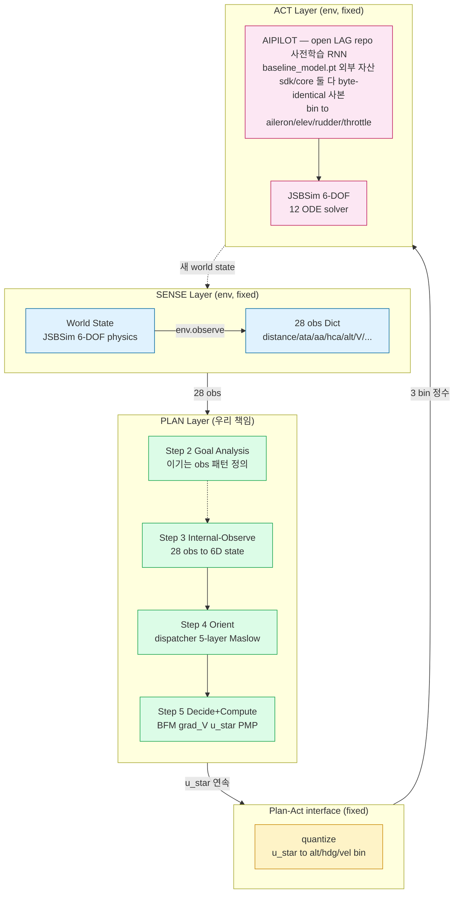
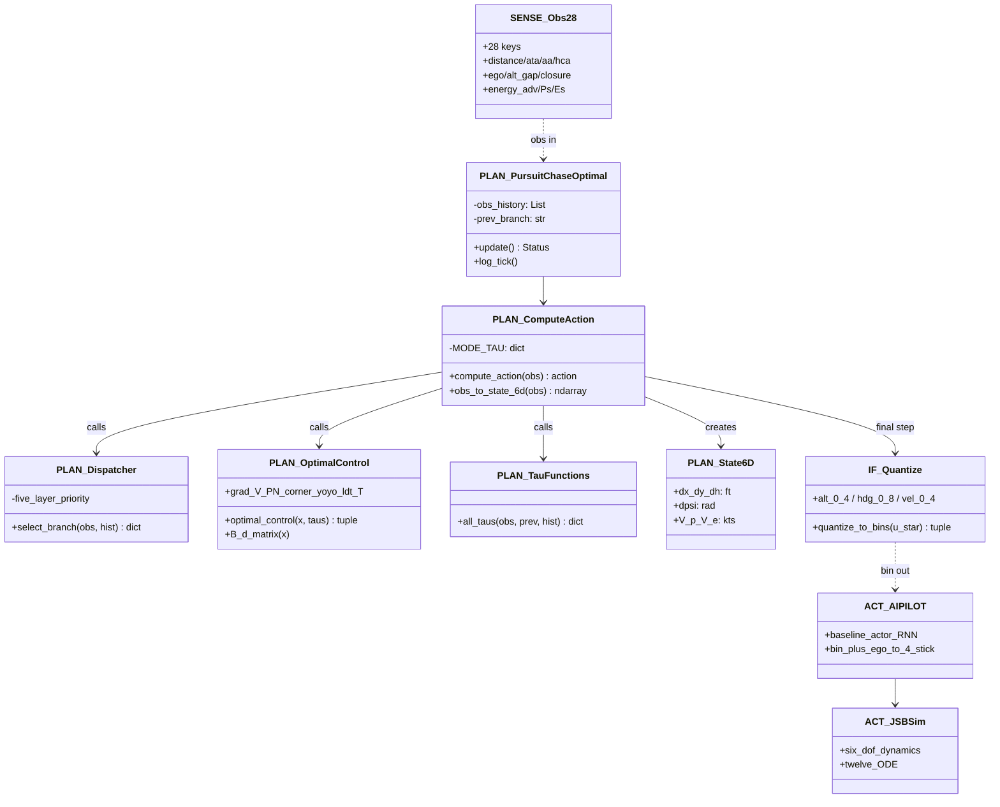
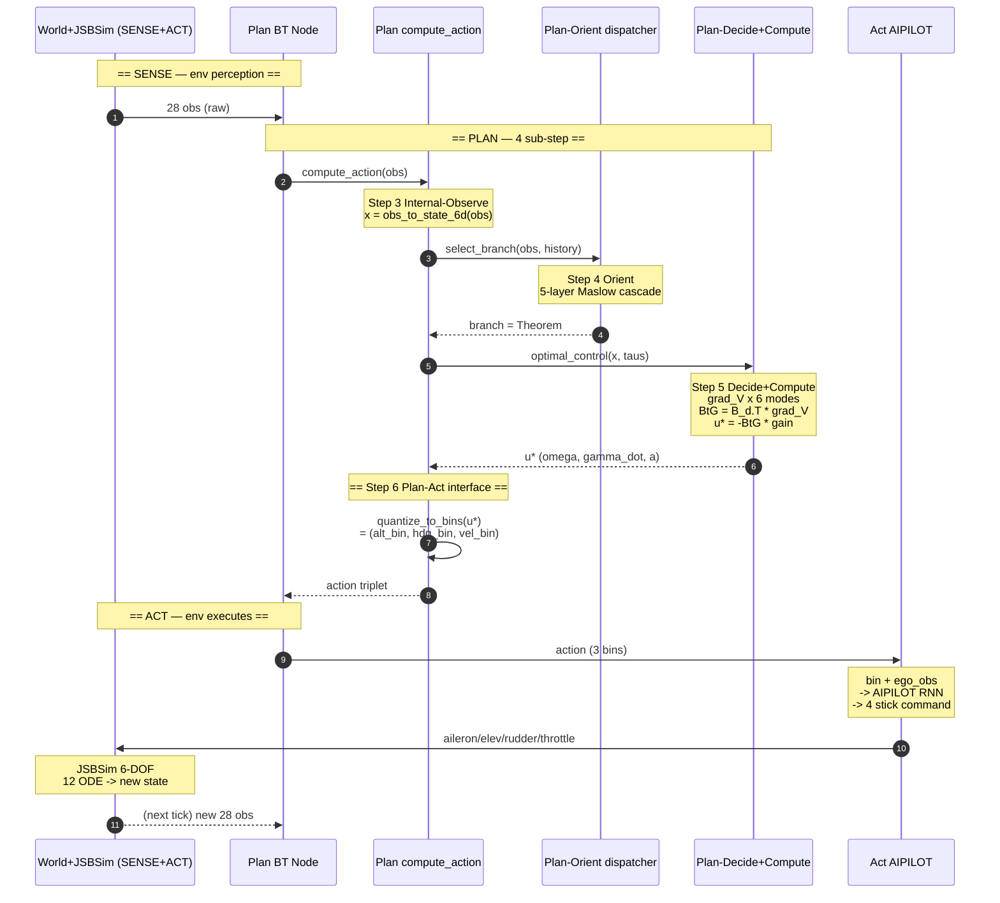
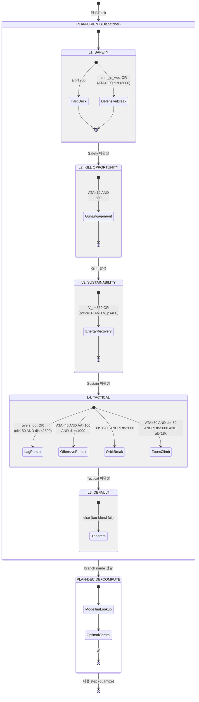
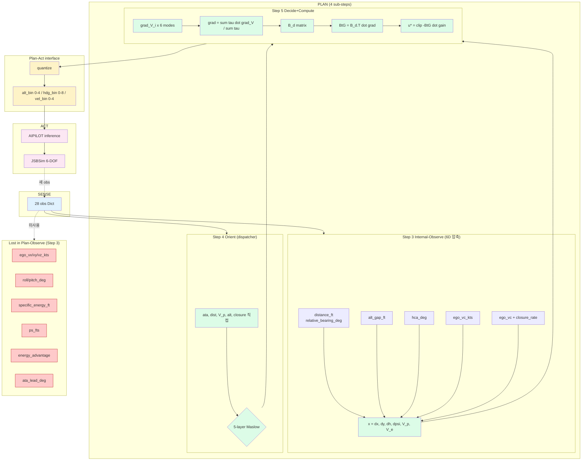
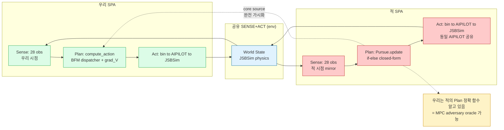
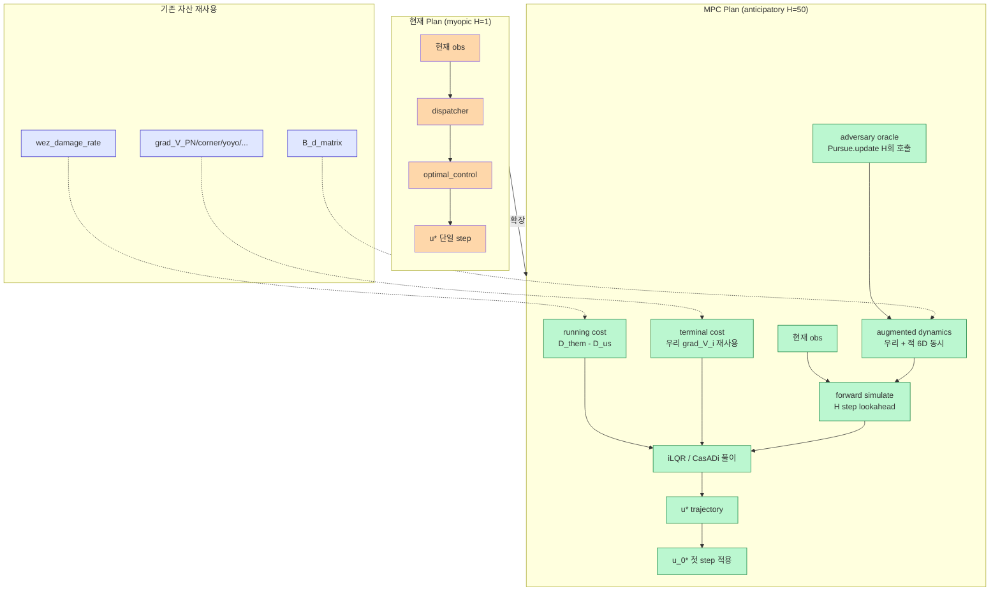

# 우리 모델 학생용 완전 설명서

> 도그파이트가 처음인 사람도 읽을 수 있게 작성. 비유 → 구조 → 수식 순서.

---

## 1부 — 이 게임이 무엇인가

### 1.1 비유: 보드게임으로 풀어보기

**한 줄 요약**: F-16 두 대가 5분 동안 하늘에서 서로 사격하려고 추격하는 게임. 우리는 *우리 비행기를 조종하는 AI* 를 만들고 있다.

상상해 보자:
- 두 비행기 A, B 가 공중에서 서로 마주보지 *않은 채* (옆구리 마주) 약 1km 떨어진 곳에서 시작.
- 매 0.05초 (`env.step` 한 번) 마다 *둘 다 동시에* 한 가지 행동을 결정:
  - 고도 명령 (5단계): 급강하 / 강하 / 유지 / 상승 / 급상승
  - 방향 명령 (9단계): 급좌 / 강좌 / 중좌 / 약좌 / 직진 / 약우 / 중우 / 강우 / 급우
  - 속도 명령 (5단계): 급감속 / 감속 / 유지 / 가속 / 급가속
- 환경 (JSBSim 물리엔진) 이 두 행동을 받아 *진짜 비행 물리* 계산 → 새 위치/속도 갱신
- 두 비행기가 *충분히 가깝고 (500~3000ft)* 한쪽이 다른쪽을 *정조준 (ATA<12°)* 하면 → 사격 → 적 HP 감소
- 5분 (6000 step) 후 또는 한쪽 HP=0 → 게임 종료, HP 많은 쪽 WIN

### 1.2 핵심 챌린지

비행기는 *물리적 제약* 이 있다:
- 너무 천천히 날면 → 추락 (stall)
- 빠르게 돌면 → 속도 떨어짐 (energy bleed)
- 가장 빠르게 돌 수 있는 속도 = corner speed (~438 kts)
- 더 빠르면 → 반경 커짐 (못 돌음)

→ "속도 잘 관리하면서 적 뒤로 가서 사격" — 정확히 *제 2차 세계대전부터 정립된 BFM (Basic Fighter Maneuvers) 이론*.

### 1.3 적은 누구인가

우리에겐 *3 종류 적 BT* 있음:
- **simple**: "그냥 적 따라간다" (단순 Pursue)
- **defensive**: "위험 (AA>120°) 이면 break, 평소엔 Pursue"
- **aggressive**: "가까우면 (dist<5km) Pursue+가속, 멀어도 Pursue" — 가장 끈질김

**적의 결정 함수도 우리가 source code 로 알고 있음** (실행은 sdk `.pyd` 안의 컴파일된 BT, 가시화는 core `src/behavior_tree/nodes/actions.py`):
```python
def Pursue.update(obs):
    if abs(rel_bearing) < 5°:  return (alt=2, hdg=4, vel=2)   # 직진
    elif rel_bearing > 60°:    return (alt=?, hdg=8, vel=?)   # 급우회전
    ...
    if speed > 800 kts:        return (vel=0)  # 안전 감속
    elif ata > 60°:            return (vel=0)  # 코너스피드 회복
    elif distance > 13123 ft:  return (vel=4)  # 급가속 추격
    ...
```

즉 **적은 *if-else 트리* — 우리가 정확히 알고 있음**. RL/NN 아님.

---

## 2부 — 우리 모델 (pursuit_chase_v1) 의 전체 흐름

### 2.1 한 번의 결정 사이클 — Sense-Plan-Act 흐름 (매 0.1초)

자율주행 SPA framework 그대로 적용. **Plan layer 내부 4 단계 (목표→변수→BFM→명령)** 가 핵심.

> 💡 동일 흐름의 *최상위 architecture 뷰* 는 [3.1 SPA Overview](#31-spa-overview--최상위-architecture), *시간 순 BT tick* 은 [3.3 Sequence](#33-sequence-diagram--한-bt-tick-의-시간-흐름) 참조.

```mermaid
flowchart TB
    subgraph SENSE["SENSE 단계 (env, fixed)"]
        S1[Step 1. env.observe<br/>28 obs 전체 수신<br/>위치/속도/각도/에너지/HP<br/>축약 없이 전부 Plan 으로]
    end

    subgraph PLAN["PLAN 단계 — 4 sub-step (우리 책임)"]
        direction TB
        P2["Step 2. 목표 분석 Goal analysis<br/>이기려면 어떤 obs 가 어디로?<br/>- 사격 가능: ATA to 0, dist 1000-2000ft, closure>0<br/>- 안 맞기: AA 0-90<br/>- 추락 회피: alt>1200ft, V_p>stall 200kts<br/>- 추격 능력: V_p approx V_corner 438kts"]
        P3["Step 3. 변수 선정 + 6D 압축<br/>x = (dx, dy, dh, dpsi, V_p, V_e)<br/>적과의 기하 + 양쪽 속도<br/>나머지 22 obs 는 dispatcher 에서 직접 사용"]
        P4["Step 4. BFM tool 선택 (Dispatcher)<br/>5-layer Maslow 우선순위:<br/>- L1 SAFETY: HardDeck / DefensiveBreak<br/>- L2 KILL: GunEngagement<br/>- L3 SUSTAIN: EnergyRecovery<br/>- L4 TACTICAL: Lag/Off/Orbit/Zoom<br/>- L5 DEFAULT: Theorem (tau-blend)<br/>(상세 FSM: 3.4 참조)"]
        P5["Step 5. 명령 산출 optimal_control<br/>grad_V_i = V_i 줄이는 방향<br/>B_d = 비행기 동역학<br/>BtG = B_d.T dot grad_V<br/>u* = -BtG dot gain (연속)<br/>= (omega, gamma_dot, a)<br/>= PMP optimal control closed-form"]
        P2 -.->|"기준 제공"| P3
        P3 --> P4
        P4 --> P5
    end

    subgraph IF["Plan to Act interface"]
        Q["Step 6. quantize (연속 to 이산 bin)<br/>omega 0.23 rad/s to hdg_bin 5 (약우, 9단계)<br/>gamma_dot 0.10 rad/s to alt_bin 3 (상승, 5단계)<br/>a 10 kts/s to vel_bin 4 (급가속, 5단계)<br/>출력: (alt_bin, hdg_bin, vel_bin) 3 정수"]
    end

    subgraph ACT["ACT 단계 (env, fixed)"]
        A1["Step 7. env.step((alt, hdg, vel))<br/>1) AIPILOT — open LAG repo 사전학습 RNN<br/>   baseline_model.pt 외부 자산, 양쪽 공유<br/>   sdk/core 둘 다 byte-identical 복사본만<br/>   bin 3 to (aileron, elev, rudder, throttle)<br/>2) JSBSim 6-DOF<br/>   조종간 4 to 12 ODE to 새 state<br/>3) 28-key dict 계산<br/>   (core combat_geometry.to_dict)<br/>   gym box(15)와 별개"]
    end

    S1 --> P2
    P5 --> Q
    Q --> A1
    A1 -.->|다음 tick| S1

    classDef sense fill:#E0F2FE,stroke:#0369A1
    classDef plan fill:#DCFCE7,stroke:#16A34A
    classDef intf fill:#FEF3C7,stroke:#CA8A04
    classDef act fill:#FCE7F3,stroke:#BE185D
    class S1 sense
    class P2,P3,P4,P5 plan
    class Q intf
    class A1 act
```



#### 📝 "bin" 용어 정의

> **bin = "이산 등급 번호"**.
>
> **비유**: 시험 점수 0~100 (연속) → 등급 A/B/C/D/F (5 단계, 5 bins). 점수 87 → 등급 B (bin = 1).
>
> **우리**: 회전 명령 ω ∈ [-90°, +90°] (연속) → 9 단계 (9 bins). ω = +13° → "약우" (bin = 5).
>
> *idx, level, 단계, 등급* 모두 같은 의미 — *bin* 으로 통일.

#### 🎯 SPA layer 매핑 요약

| Step | SPA layer | 우리 코드 | 비유 |
|---|---|---|---|
| 1 | **Sense** | env → obs | 카메라/센서로 보기 |
| 2-3 | **Plan: 분석/표현** | (목표 분석 + 6D 압축) | "지금 상황 뭐고 뭐가 중요한가?" |
| 4 | **Plan: 결정** | dispatcher | "어떤 전술 쓸까?" |
| 5 | **Plan: 출력** | optimal_control | "전술을 *수학 명령* 으로 번역" |
| 6 | **Plan↔Act interface** | quantize | "게임 룰 형식으로 *bin 화*" |
| 7 | **Act** | env (AIPILOT + JSBSim) | "AIPILOT 이 진짜 비행" |

→ **우리가 자유롭게 설계 가능한 부분 = Step 2~6** (Plan 전체). Step 1, 7 은 *환경 fixed*.

### 2.2 BFM mode 7종 (V 함수)

각 mode 는 "이상적 상태" 가 다름. 그 이상적 상태 *까지의 거리* 가 `V_i` (작을수록 좋음). 우리 정책은 V_i 줄이는 방향으로 가속/회전/상승 결정.

| Mode | 약어 | 이상적 상태 | 비유 |
|---|---|---|---|
| Pure Pursuit | PN | 적 정조준 + WEZ 안 + V_e 매칭 | "적 향해 가속" (가장 직관적) |
| Corner | 2c | V_p = V_c (코너 속도) | "최대 회전 속도 유지" |
| 1-Circle | 1c | 작은 회전 반경 + ATA 정렬 | "내가 더 작은 원으로 → inside" |
| LDT (Lag) | ldt | 약간 빗나간 각도 | "오버슈트 회피로 변위 누적" |
| YoYo | yoyo | 적과 같은 alt | "수직 BFM (climb-dive)" |
| Capture-time | T | dist + closure 종합 | "언제 잡을 수 있나" |
| Energy Recovery | corner | V_p=V_c, 직진 가속 | "에너지 회복 (Boyd EM)" |

Comment: Lead Pursuit 어디감? --> 이게 적 방향 예측하면서 가는거라, 좀더 효율적일텐데. core에 코드도 있어서, custom Lead Pursuit을 만들 수도 있고. 그리고 나머지 BFM에 대해서도, core 코드의 비효율성이 보이면, optimising 할 수 있을 것 같은데. 

### 2.3 BT dispatcher — *어느* mode 를 *언제* 쓰나

```
입력: obs (현재 상태) + 직전 분기 (히스테리시스)
                            │
                            ▼
        if alt < 1200ft → HardDeck (안전 상승)
                            │
                            ▼
        if 적이 우리 뒤 + 위험 → DefensiveBreak (escape)
                            │
                            ▼
        if ATA<12° + 사거리 안 → GunEngagement (사격!)
                            │
                            ▼
        if V_p<360 → EnergyRecovery (에너지 회복)
                            │
                            ▼
        if 오버슈트 위험 → LagPursuit
                            │
                            ▼
        if 적이 등돌림 + 근거리 → OffensivePursuit
                            │
                            ▼
        if 30°<ATA<110° + parallel → OrbitBreak
                            │
                            ▼
        if 적 도주 + 장거리 → ZoomClimb (수직 PE 축적)
                            │
                            ▼
        else → TheoremAdaptive (τ-blend default)
```

위에서 아래로 *우선순위*. 첫 번째 매칭이 발화.
---

## 3부 — UML 다이어그램 (Mermaid)

> **renderer 안내**: 본 섹션의 모든 diagram 은 Mermaid 형식. 다음 도구에서 자동 렌더링:
> - **GitHub**: `.md` push 시 자동 (v11)
> - **VSCode**: extension "Markdown Preview Mermaid Support" 설치 후 `Ctrl+Shift+V`. extension 이 *구 mermaid 6.x* 인 경우 v10 이상으로 업데이트 필요
> - **Obsidian / Notion / Typora**: 자동 지원
> - raw text 로 보인다면 위 도구 중 하나로 열기
>
> 본 doc 의 8 diagram 은 **Mermaid v9.4 ~ v11 폭넓게 호환**. `namespace`, `rect rgb()` 등 v10+ 한정 syntax 제거.

#### 🎨 색 코드 (전 다이어그램 일관)

| 색 | hex | SPA 의미 |
|---|---|---|
| 🌍 파랑 | `#E0F2FE` | **Sense** — env 책임, 우리 통제 밖 |
| 🧠 녹색 | `#DCFCE7` | **Plan** — 우리 책임, 자유 설계 |
| ⚙️ 노랑 | `#FEF3C7` | **interface** — game protocol, fixed |
| ✈️ 분홍 | `#FCE7F3` | **Act** — env 책임, 우리 통제 밖 |
| ❌ 빨강 | `#FECACA` | **Lost / Unused** |

### 3.1 SPA Overview — 최상위 architecture



→ **순환 구조** (Act → Sense). 매 BT tick (0.1s) 마다 1 사이클. **Plan 만 우리 책임**.

### 3.2 Class Diagram — SPA Layer 별 swimlane



> **prefix 가 SPA layer 표현**: `SENSE_*` = Sense, `PLAN_*` = Plan, `IF_*` = interface, `ACT_*` = Act. (`namespace` 미지원 renderer 호환 위해 prefix 사용)

### 3.3 Sequence Diagram — 한 BT tick 의 시간 흐름



### 3.4 State Diagram — Plan-Orient 의 5-layer Maslow



→ **5-layer Maslow** = 시급도 우선순위. Safety > Kill > Sustainability > Tactical > Default. 위에서 매칭되면 그 layer 발화, 나머지 무시.

### 3.5 Data Flow — SPA 경계 명시 28 obs → action



→ **빨강 = Step 3 (Plan-Internal-Observe) 에서 *버린* obs**. *MPC 도입 시 회수 권장* (특히 Ps, energy_advantage).

### 3.6 Adversary — parallel SPA



→ ***양쪽 모두 SPA*** + **공유 Sense+Act**. 우리 white-box advantage = 적의 *Plan 함수 가시화* → MPC oracle 가능.

### 3.7 BFM Mode Catalog — 우리 7 vs core 30+

Plan-Decide+Compute 의 **도구 카탈로그** 비교. *어느 BFM 도구가 가용*한지, *어느 것이 누락*인지 시각화.

```mermaid
flowchart TB
    subgraph CORE["core BFM 카탈로그 (actions.py 30+)"]
        direction TB

        subgraph Pursuit["Pursuit (4)"]
            P1[Pursue]
            P2[PurePursuit]
            P3["LeadPursuit star"]
            P4[LagPursuit]
        end

        subgraph YoYo["YoYo (2)"]
            Y1[HighYoYo]
            Y2[LowYoYo]
        end

        subgraph Geom["Combat Geometry (2)"]
            G1[OneCircleFight]
            G2[TwoCircleFight]
        end

        subgraph Energy["Energy mgmt (3)"]
            E1["EnergyFight star"]
            E4[AltitudeAdvantage]
            E5[MaintainAltitude]
        end

        subgraph Tactical["Tactical (3)"]
            TC1["TCFight star"]
            TC2["GunAttack star"]
            TC3["OvershootAvoidance star"]
        end

        subgraph Aero["Aerobatic (4) — 수직 BFM"]
            A1[Loop]
            A2[ImmelmannTurn]
            A3["SplitS star"]
            A4[HammerHead]
        end
    end

    subgraph OURS["우리 사용 7 (pursuit_chase_v1)"]
        direction TB
        O1[PN to PurePursuit]
        O2[Corner / 2c 자체 정의]
        O3[1c 자체 정의]
        O4[ldt to LagPursuit]
        O5[yoyo to HighYoYo 단축]
        O6[T capture-time 자체 정의]
        O7[Energy Recovery to Corner]
    end

    MISSING[누락 BFM 22+<br/>aggressive Nash 깨기 후보]

    P2 -.->|우리 매핑| O1
    P4 -.->|우리 매핑| O4
    Y1 -.->|부분 매핑| O5

    P3 -.->|누락 5star| MISSING
    E1 -.->|누락 4star| MISSING
    A3 -.->|누락 4star| MISSING
    A2 -.->|누락 3star| MISSING
    A4 -.->|누락 3star| MISSING
    TC2 -.->|누락 3star| MISSING
    TC3 -.->|누락 3star| MISSING
    TC1 -.->|누락 2star| MISSING

    classDef priority fill:#FBBF24,stroke:#92400E,color:#000
    classDef used fill:#86EFAC,stroke:#15803D,color:#000
    classDef missing fill:#FCA5A5,stroke:#B91C1C,color:#000
    classDef ours fill:#DCFCE7,stroke:#16A34A

    class P3,E1,A3,A2,A4,TC1,TC2,TC3 priority
    class P2,P4,Y1 used
    class MISSING missing
    class O1,O2,O3,O4,O5,O6,O7 ours
```



#### 우선 도입 권고

| 우선 | BFM | 이유 |
|---|---|---|
| ★★★★★ | **LeadPursuit** | Pure Pursuit → Lead 정통화. 적 turn 예측 → ATA 빠르게 |
| ★★★★ | **EnergyFight** | Boyd EM 직접 활용 (Ps, Es) — sustained turn 우위 |
| ★★★★ | **SplitS / Immelmann** | 수직 분리 — aggressive parallel chase Nash 깸 후보 |
| ★★★ | OvershootAvoidance | dist 닫고도 못 잡는 상황 회피 |
| ★★★ | GunAttack | WEZ 내 damage 효율 ↑ |
| ★★ | HammerHead, SpiralDive/Climb | PE↔KE 변환 다양화 |

### 3.8 MPC variant — Plan layer 시간 horizon 확장



→ **MPC = Plan-Compute step 의 시간 horizon 확장**. 23 사이클 자산 (grad_V_i, B_d, damage_rate) *그대로* terminal cost / linearization / running cost 로 재사용. **폐기 없음**.

### 3.9 diagram 종류 정리 (SPA 관점)

| # | 종류 | SPA 표현 | 학생doc 매핑 |
|---|---|---|---|
| 3.1 | SPA Overview (flowchart) | 3 layer 큰 그림 | 2.1 의 7-step flow |
| 3.2 | Class diagram (swimlane) | Layer 별 클래스 그룹화 | 2.1 각 step 의 코드 구현 |
| 3.3 | Sequence diagram | 시간 순 + layer 라벨 | 2.1 의 시간 진행 |
| 3.4 | State diagram (FSM) | Plan-Orient 5-layer Maslow | 2.3 dispatcher |
| 3.5 | Data flow (boundaries) | obs → action SPA 경계 | 4부 28→6 손실 |
| 3.6 | Adversary (parallel SPA) | 양쪽 SPA + 공유 env | 적 white-box 의미 |
| 3.7 | BFM Catalog (우리 7 vs core 30+) | Plan 도구 비교 | 2.2 의 BFM gap 시각화 |
| 3.8 | MPC variant | Plan-Compute horizon 확장 | 미래 path |

→ **각 diagram 이 다른 SPA 관점**. 8개 합치면 전체 시스템의 *완전 표현*.

### 3.10 prior comment 처리 audit

| user comment | 어디 반영 | 상태 |
|---|---|---|
| 1.1 단계 수치 조정 가능? | 학생doc 1.1 (env hardcoded, 양쪽 동일 명시) | ✅ |
| 2.1 abstraction gap | SPA Sense → Plan boundary 명시 | ✅ |
| 2.1 BFM 갑자기 점프 | 4 sub-step 분해 (Goal→Variable→Orient→Compute) | ✅ |
| 2.1 4/5/6 자세히 | Step 4-7 각 상세 + 수학 의미 | ✅ |
| 2.1 bin 헷갈림 | "bin 용어 정의" 박스 + 시험점수 비유 | ✅ |
| 2.2 LeadPursuit 어디감 | core 30+ vs 우리 7 비교, LeadPursuit 코드 분석 | ✅ |
| 2.2 다른 BFM 도 | EnergyFight, SplitS, Immelmann 우선순위 표 (3.7) | ✅ |
| 2.3 SPA 관점 재구성 | 5-layer Maslow + Plan-Orient (3.4) | ✅ |
| baseline_model.pt 정정 | AIPILOT = **open LAG repo 사전학습 RNN** (외부 자산). sdk/core byte-identical 사본만 보유 (SHA256 일치). 우리/core 둘 다 *load only* | ✅ |
| core 수치 정렬 | wez 선형, HardDeck 1000ft, 목표 table | ✅ |
| Sense Plan Act 제대로 | OODA 통합 + Layer 책임 분리 + SPA-aligned 8 diagram | ✅ |
| UML Mermaid + SPA | 본 3부 전체 SPA-aligned Mermaid 8 diagram | ✅ |

---

## 4부 — 28 관측값 → 6D 변환 *왜* + *정말 필요 없는지*

### 4.0 ⚠️ "28 obs" 의 *진짜 출처* + sdk 실행 / core 참조 구분 (2026-05-17 정정)

> **실행되는 것 = 본 sdk 폴더** (`src/simulation/envs/JSBSim/tasks/*.pyd` 컴파일된 바이너리 + 우리 `src/match/runner_core.py` + 우리 BT). 매치 돌릴 때 import 되는 코드 = *sdk 안의 것 만*.
>
> **core (`ai-combat-core-main/`) = white-box reference** — `.pyd` 안에 무엇이 들어있나 *읽을 수 있는 Python source*. 우리가 매치 돌릴 때 core 코드는 *import 안 됨*. 그러나 **core 가 있어서 tick 마다**:
> 1. `bin (5/9/5)` → AIPILOT RNN → `(aileron, elev, rudder, throttle)` 변환 *내부* 가시화 가능
> 2. `4-축 stick` → JSBSim 12-ODE → *새 state* 변환 가시화 가능
> 3. `damage rate = 25·(3000-d)/2500·(1-ata/12)` 같은 *정확 공식* 확인 가능
>
> **`LAG/` 폴더** = 또 다른 reference (open repo git clone) — 마찬가지로 *실행 안 됨*.
>
> → 결론: **sdk 만으로 동작**. core/LAG 는 *백서* 역할 (이전 black-box → white-box).

#### 각 항목의 실행처 vs 참조처

| 무엇 | 실행 (sdk) | 참조 (core) | 차원 / 값 |
|---|---|---|---|
| **gym `observation_space`** | `src/simulation/envs/JSBSim/tasks/singlecombat_task.cp314-...pyd` | `tasks/singlecombat_task.py:75` | `Box(shape=(15,))` |
| **28-key obs *dict*** | sdk 의 `.pyd` 내부에 컴파일된 `CombatGeometry.to_dict()` | `src/control/combat_geometry.py:447+` | dict 28 key |
| **action space `[5/9/5]`** | sdk `.pyd` 의 `HierarchicalSingleCombatTask` | `tasks/singlecombat_task.py:325` | MultiDiscrete([5,9,5]) |
| **reward / termination** | sdk `.pyd` 내부 | `tasks/singlecombat_task.py:9-28` | (다수) |
| **AIPILOT (low-level RNN)** | sdk 의 `.pyd` 가 `src/simulation/envs/JSBSim/model/baseline_model.pt` load + 매 step 추론 | core 도 *byte-identical* 사본 보유 (SHA256 = `54e9c996...`, 558,234 bytes). **origin = open LAG repo (외부 자산)** — core/sdk 둘 다 단순 복사본, *학습/소유 어느 쪽도 아님* | 사전학습 GRU RNN, `load_state_dict + eval`, 양쪽 비행기 공유 |
| **damage rate (25 HP/s 공식)** | sdk `.pyd` 의 `HealthGauge` | `src/control/health_manager.py:25-76` | 선형, 가까울수록 max |
| **HP=100 init + WIN/LOSE 판정** | **우리** `src/match/runner_core.py:95,193-200` (소스 그대로) | core 의 `HealthGauge` 위에서 우리가 wrap | HP=0 → WIN, 6000 step → tie |
| **Plan layer (BFM 디스패처 + ∇V)** | **우리** `examples/pursuit_chase_v1/*.py` (소스 그대로) | — | **순수 우리 작업** |

→ **우리 BT 가 받는 "28 obs"** = gym Box (15) 가 *아님*. sdk 의 `.pyd` 안 `CombatGeometry.to_dict()` 가 만드는 *helper dict*. 우리 `runner_core.py` 가 매 tick 그것을 BT 에 넘김.

→ **우리가 *짠 코드* = sdk 의 *비-`.pyd` 소스***:
- `src/match/runner_core.py` — 매치 룰 (HP=100, WIN 판정, hook 시스템)
- `examples/pursuit_chase_v1/*.py` — Plan layer (dispatcher + ∇V + τ-blend)
- `tools/basis/*.py` — BFM 도구 (∇V_i, B_d, wez_damage_rate)

**그 외 sdk 의 자산**:
- **`.pyd` (singlecombat_task, multiplecombat_task, ...)** = **core 의 Python source 가 빌드된 컴파일 바이너리**. core source 덕분에 그 안의 로직을 *읽을 수 있음* (white-box).
- **`model/baseline_model.pt`** = **open LAG repo 에서 가져온 사전학습 RNN 가중치** (외부 자산). core 가 만든 것도, 우리가 만든 것도 *아님*. sdk 와 core 양쪽 다 *byte-identical 사본만 보유* + `load_state_dict()` 로 추론만.

### 4.1 28 obs 전부 살펴보기

| # | obs key | 의미 | 단위 | 우리 사용? | MPC 필요? |
|---|---|---|---|---|---|
| 1 | ego_altitude_ft | 우리 고도 | ft | ✅ HardDeck용 | ✅ |
| 2 | ego_vc_kts | 우리 속도 (calibrated) | kts | ✅ V_p | ✅ |
| 3 | ego_vx_kts | body-X 속도 | kts | ❌ | △ |
| 4 | ego_vy_kts | body-Y 속도 | kts | ❌ | △ |
| 5 | ego_vz_kts | body-Z 속도 | kts | ❌ | △ |
| 6 | roll_deg | bank 각 | deg | ❌ | △ (3.5-DOF 시 필요) |
| 7 | pitch_deg | 피치 각 | deg | ✅ (덜 중요) | △ |
| 8 | specific_energy_ft | 총 에너지 (PE+KE) | ft | ❌ | ★ Boyd EM 핵심 |
| 9 | ps_fts | 비초과력 (energy 변화율) | ft/s | ❌ | ★ Boyd EM 핵심 |
| 10 | distance_ft | 적과 거리 | ft | ✅ | ✅ |
| 11 | ata_deg | 우리 nose↔적 각 | deg | ✅ | ✅ |
| 12 | aa_deg | 적 nose↔우리 각 | deg | ✅ | ✅ |
| 13 | hca_deg | 헤딩 차이 | deg | ✅ Δψ | ✅ |
| 14 | tau_deg | roll-aware target 각 | deg | ❌ | △ |
| 15 | relative_bearing_deg | 적이 우리 좌/우 어디 | deg | ✅ | ✅ |
| 16 | alt_gap_ft | 적-우리 alt 차이 | ft | ✅ Δh | ✅ |
| 17 | closure_rate_kts | 거리 변화율 | kts | ✅ | ✅ |
| 18 | turn_rate_degs | 우리 회전율 ω | deg/s | ⚠️ 로깅만, **dispatcher/V 미사용** | ★ **즉시 추가 권장** |
| 19 | in_39_line | "3-9 line" 진입 (BFM) | bool | ❌ | △ |
| 20 | overshoot_risk | 오버슈트 위험 | bool | ✅ LagPursuit | △ |
| 21 | tc_type | 시간-충돌 분류 | str | ❌ | △ |
| 22 | ata_lead_deg | lead point 까지 각 | deg | ❌ | △ (Heron 핵심) |
| 23 | tau_lead_deg | lead point tau | deg | ❌ | △ |
| 24 | side_flag | 적 좌/우 (이진) | int | ❌ | ❌ (rel_bearing 으로 대체) |
| 25 | energy_advantage | 적 대비 PE 우위 | bool | ❌ | ★ |
| 26 | energy_diff_ft | 적 대비 PE 차이 | ft | ❌ | ★ |
| 27 | alt_advantage | 적 대비 alt 우위 | bool | ❌ | ★ |
| 28 | spd_advantage | 적 대비 속도 우위 | bool | ❌ | ★ |
| - | enm_in_wez | 적 사거리 진입 | bool | ✅ DefensiveBreak | ✅ |

**범례**: ✅ 사용/필요, ❌ 미사용/불필요, △ 선택, ★ 추천 추가

### 4.2 우리가 *왜* 6D 만 사용했나

학생 비유: 보드게임에서 *말의 위치만* 추적하고 *플레이어의 표정/심리* 는 무시하는 것과 비슷.

**6D state = (Δx, Δy, Δh, Δψ, V_p, V_e)** 선택 이유:

| 변수 | 왜 포함 |
|---|---|
| Δx (적 우측 위치) | 우리 좌표계에서 적의 위치. 회전 결정의 기본 |
| Δy (적 전방 위치) | 적이 앞/뒤 |
| Δh (적 alt 차이) | 수직 BFM 결정 |
| Δψ (heading 차이) | 두 비행기 같은 방향인지 (HCA 핵심) |
| V_p (우리 속도) | 코너스피드 판단 |
| V_e (적 속도) | 추월/추격 판단 (단, *추정값*) |

**왜 *축약* 했나** (= 28 → 6):
1. **PLAN §2.5 HJI value function 정의** 가 6D state 위에 정의됨 — V*(x), ∇V* 가 6D 함수
2. **수학적 단순성** — closed-form ∇V_i 유도 가능 (G1 검증)
3. **6D LUT** (logs/hji/V6d_wez_v3.npz) — 12⁶ = 3M cells. 8D 면 16⁸ ≈ 4.3B cells (불가)
4. ⚠️ **"point-mass" 는 *문자 그대로* 가 아니라 *은유*** — 행성 궤도역학의 *점 질량 2체 문제* 와 *수학적 구조가 비슷* 하다는 비유. 실제 비행기는 roll/pitch 가 결정적 (bank angle 이 lift vector 방향 결정 → 회전반경 직결). 본 6D 표현은 *기하/에너지 dynamics 만 추적*, roll/pitch transient 는 *AIPILOT 의 빠른 inner loop* 가 처리한다는 *시간 척도 분리 (singular perturbation)* 가정.

#### ⚠️ 6D 의 *실제* 큰 약점 — 회전 동역학 누락 (2026-05-17 정정)

| 빠진 것 | 본 게임에서의 의미 | obs 가용 여부 |
|---|---|---|
| **선회율 (turn rate, ω_turn)** | 어느 방향으로 *얼마나 빨리* 돌고 있나. 도그파이트의 1차 지표. *내가 더 빠르게 도는가 vs 적이* | ✅ **`turn_rate_degs` (obs #18) 직접 가용** — 우리는 *로깅에만* 사용, dispatcher / V 함수 *어느 곳에도 안 씀* |
| **선회반경 (turn radius, R = V/ω)** | 작은 원으로 도는 쪽이 1-circle fight 에서 inside. 적의 R 보다 작으면 lap (한 바퀴 차이) 가능 | ⚠️ **간접 derive 가능** — `V_p / turn_rate_degs` (rad/s 변환 후). 우리 derive 안 함 |
| **roll_deg / pitch_deg** | bank 각이 lift 방향 결정 → 회전 시작 *지연* (rolling-in time). 6D 는 *0 지연* 가정 = 비현실 | ✅ obs #6, #7 직접 가용. 우리 미사용 |
| **roll rate (p), pitch rate (q)** | rolling-in dynamics 의 1차 지표. AIPILOT 의 *내부 상태* 와 직접 연관 | ❌ obs 에 없음 — JSBSim 내부에만 |

**결과**: 우리 V 함수는 *현재 회전율 ω* 를 변수로 받지 않음. "내가 *지금* 얼마나 빨리 돌고 있나" 를 모르고 명령 산출 → **transient (rolling-in) 손실 무시**. 따라서:
- *순간 정렬 (snapshot ATA, dist)* 은 잘 잡지만
- *rolling 중 적이 도주* 같은 *dynamics 에 민감* 한 상황 (= aggressive 매치) 에 약함

**개선 방향**:
1. **즉시 (코드 변경 작음)**: `turn_rate_degs` 를 dispatcher branch 조건에 추가 (e.g., "내 ω 너무 낮으면 corner 강제"), 7D state `x = (..., ω_turn)` 으로 확장
2. **MPC 도입 시**: roll/pitch 를 augmented dynamics 에 포함 (3.5-DOF) — 14D + 4D = 18D

### 4.3 잃어버린 것 (정보 손실)

| 손실 obs | 가치 |
|---|---|
| **★ turn_rate_degs (ω_turn)** | **도그파이트의 1차 지표** — 내가 *지금* 얼마나 빠르게 도는가. 적의 ω 와 비교해 *누가 inside* 결정. ✅ obs 가용, 로깅 외 미사용 |
| **★ turn_radius (R = V/ω, derive)** | 작은 R = 1-circle inside. V_p, turn_rate_degs 로 직접 계산. *우리 derive 안 함* |
| **specific_energy_ft (Es)** | Boyd EM diagram 의 *현 위치*. PE+KE 총합. *지속 가능 turn 평가의 1차 변수* |
| **ps_fts (specific excess power)** | 매 순간 *에너지 변화율*. > 0 = 가속 가능, < 0 = 에너지 손실 중. **sustained turn = 0Ps 조건**. |
| **roll_deg / pitch_deg** | bank 각도가 lift vector 방향 결정 → 회전 시작 *지연* (rolling-in). 6D 는 *0 지연* 가정 = 비현실 |
| **ego_vx/vy/vz_kts** | 3D 속도 벡터. closure 의 *정확한* 값 계산 가능 (우리는 closure_rate_kts 만 → V_e 추정 폭주 위험) |
| **energy_advantage / energy_diff_ft** | *적 대비* PE 위상. 우리는 V_e 만 보고 V_p 와 비교 — 적의 *진짜* energy 모름 |
| **ata_lead_deg / tau_lead_deg** | Lead pursuit aim point. **Heron Systems AlphaDogfight 의 forward-quarter gun shot** 의 핵심 |

> **★ = 우선 도입**. turn rate 는 *코드 한 줄* (`x = obs['turn_rate_degs']`) 로 가용 — *왜 그동안 안 썼는지가 더 큰 의문*.

### 4.4 정말 필요 없는지 — *솔직한 평가*

**Model A (현재) 안에서**: 6D 가 *충분* (PLAN §0.5 D 정합). simple/defensive 매치 우리가 이긴다.

**aggressive 매치 안 풀리는 이유와의 연관**:
- aggressive 의 deadlock 은 *parallel chase Nash* — 6D 가 *충분* 한 게 아니라, 어떤 dimensionality 든 *부족할 수* 있음 (게임 구조)
- 그러나 *missing 신호* 중 일부 (Ps, energy_diff) 가 *enable 가능* 한 path:
  - Ps > 0 일 때 *sustained turn 가능* → 적보다 더 오래 turn → 결국 추월
  - energy_diff > 0 일 때 *공격적 mode* OK, < 0 일 때 *방어적 mode*

→ **6D 만으론 *판단 기준* 부족**. *Ps + energy_advantage* 추가 시 *adaptive* 결정 가능성.

### 4.5 MPC 로 변환할 때 *진짜* 필요한 것

MPC 의 *augmented dynamics* state:
```
z = (우리 6D state, 적 6D state)  = 12D
또는
z = (우리 6D state, 적 6D state, Es_us, Es_them)  = 14D  ← Boyd EM 통합
```

**추천 14D state** (Boyd EM 통합):
| 변수 | 단위 | 의미 |
|---|---|---|
| x_us, y_us, h_us | ft | 우리 절대 위치 (또는 상대) |
| ψ_us | rad | 우리 헤딩 |
| V_us | kts | 우리 속도 |
| Es_us | ft | 우리 specific energy |
| (위 6개 적도 동일) | | |
| (그러나 Es 가 V, h 의 함수 → 사실 7+7=14, 또는 6+6=12+추가 2) | | |

MPC running cost:
```
L(z) = D_them(z) - D_us(z)         # WEZ damage rate 차이
     + λ_E · max(0, -Ps_us)        # 우리 에너지 손실 페널티
     + λ_S · 1[V_us < 200]         # 안전 (스톨)
```

MPC 의 control:
```
u = (delta_alt, delta_hdg, delta_vel)  ∈ R^3  (discrete or continuous)
```

→ **MPC 에 *Ps, energy_diff 도입 시* Boyd EM 자동 활용**. 우리 현 6D state 의 *주요 약점 보완*.

### 4.6 어떤 obs 가 *MPC 에 진짜 필요한가*

**필수**:
- distance, ata, aa, hca, alt_gap, closure, ego_vc, ego_altitude (8개) — *기하 + ego 상태*

**강력 추천**:
- **specific_energy_ft (Es)** — Boyd EM 핵심
- **ps_fts** — sustained turn 평가
- **energy_advantage / energy_diff_ft** — 적 대비

**선택**:
- roll_deg, pitch_deg, ego_vx/vy/vz_kts — 3.5-DOF / 4-DOF 정밀 시
- ata_lead_deg, tau_lead_deg — lead pursuit 정밀 시

**불필요**:
- in_39_line, tc_type, side_flag — 다른 obs 로 derive 가능
- turn_rate_degs — control u 의 결과 (입력 아닌 출력)

---

## 5부 — 실제 코드 mapping (학생용 reference)

| 파일 | 역할 | line 핵심 |
|---|---|---|
| `examples/pursuit_chase_v1/nodes/custom_actions.py` | BT 노드 wrap (py_trees), update() | 220-450 |
| `examples/pursuit_chase_v1/nodes/continuous_policy.py:81` | `obs_to_state_6d()` — 28→6 변환 | dx, dy, dh 계산 |
| `examples/pursuit_chase_v1/nodes/continuous_policy.py:225+` | `compute_action()` — 전체 pipeline | branch dispatch + optimal_control |
| `examples/pursuit_chase_v1/nodes/branch_dispatcher.py:77+` | `select_branch()` — 우선순위 트리 | if-else |
| `tools/basis/gradient_approximators.py:71+` | `grad_V_PN(x)`, `grad_V_corner`, ... | closed-form ∇V |
| `tools/basis/gradient_approximators.py:525+` | `optimal_control(x, taus)` | τ-blend + B_d 계산 |
| `tools/basis/dynamics_f16_6d.py:158+` | `dynamics(x, u_p, u_e)` — 6D ODE | small-angle 가정 |
| `tools/basis/wez_damage_rate.py` (B'-0) | `damage_rate(ata, dist)` | PLAN §0.8 |
| `tools/basis/tau_functions.py` | `all_taus(obs, obs_prev, obs_history)` | τ_i 계산 |
| **(core source 확보)** `src/behavior_tree/nodes/actions.py:195` | `Pursue.update()` — 적 BT 정확 함수 | **MPC oracle 직접 사용 가능** |
| **(core source 확보)** `src/control/combat_geometry.py:75+` | `CombatGeometry` — 모든 obs 의 source | ATA/AA/HCA 정확 정의 |

---

## 6부 — 한 줄 요약 (학생용 take-home)

> "비행기 28 가지 측정값에서 *위치/속도/방향 관계* 만 6개 추려서, *어떤 BFM mode 가 좋은지* 7개 후보 중 가중평균하고, 결과 *방향/고도/속도* 명령 한 세트를 매 0.1초마다 결정하는 시스템. 적 BT 의 결정 함수를 *완전히* 알고 있으므로 MPC 로 *미래 5초* 시뮬레이션하여 최적 명령을 *직접 계산* 가능. 추가로 **Boyd EM (Ps, energy_diff)** 변수 도입 시 *지속 가능 vs 일시적* 기동 구분 가능 → 진짜 BFM 정밀화 가능."

---

*문서 끝.*
