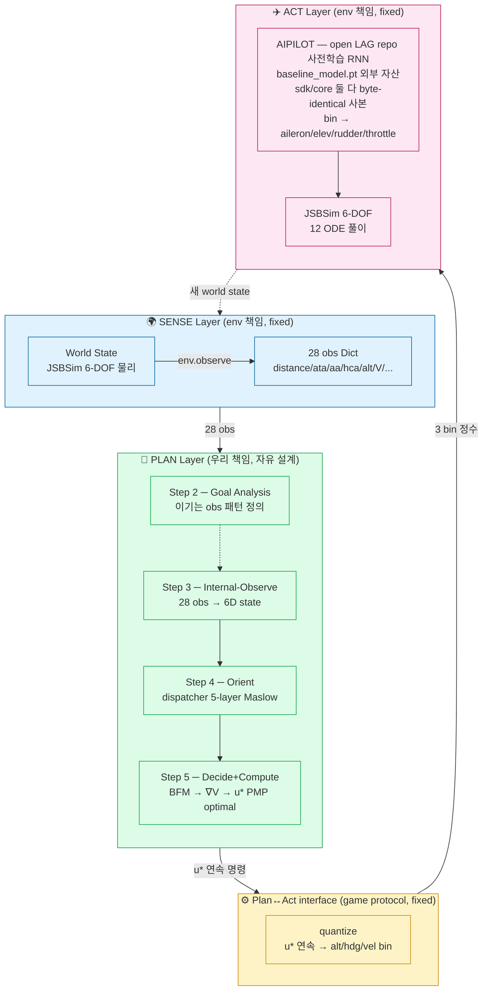
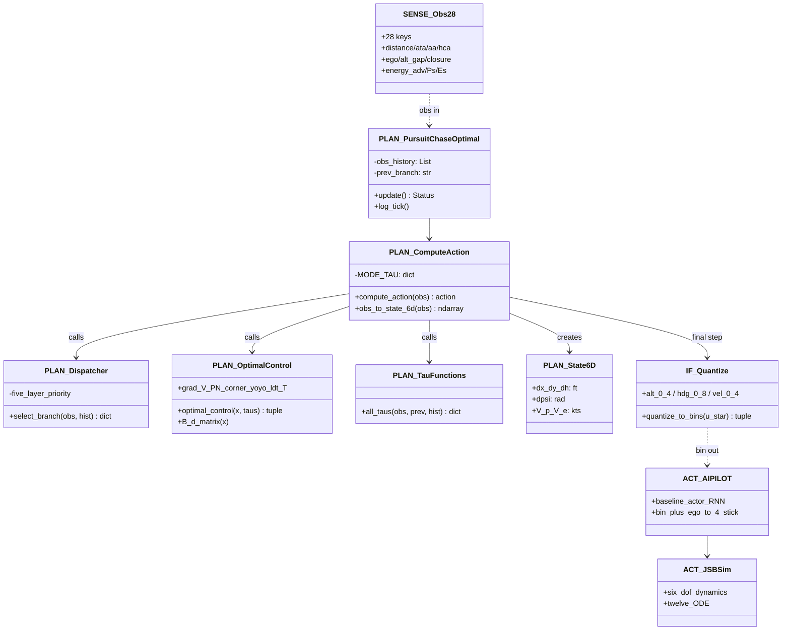
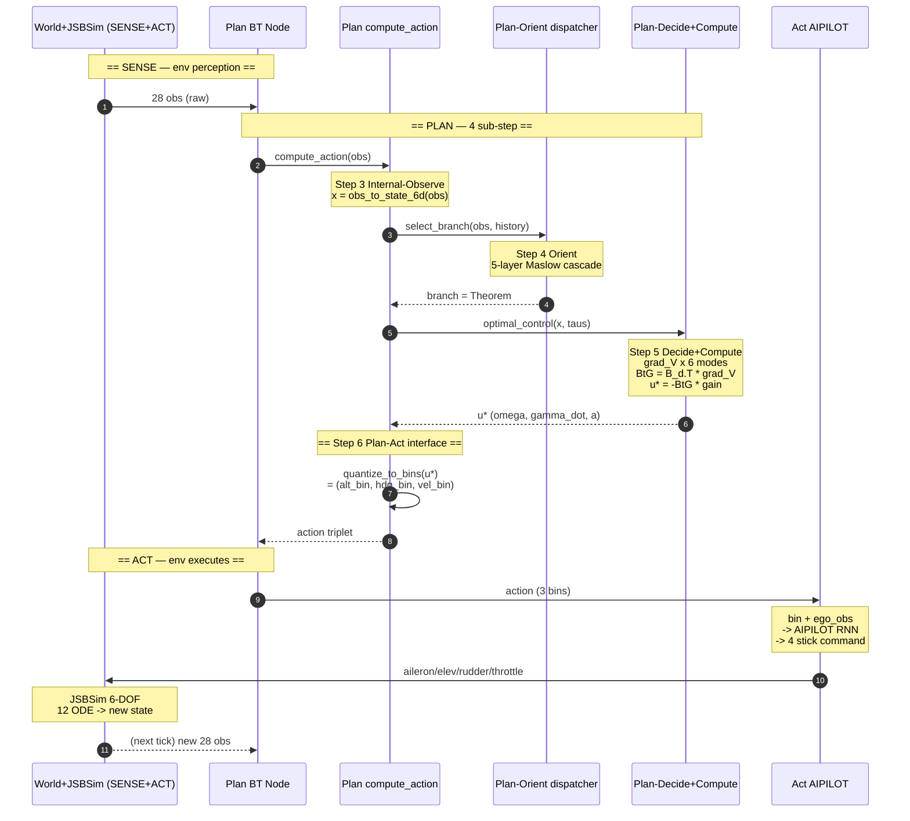
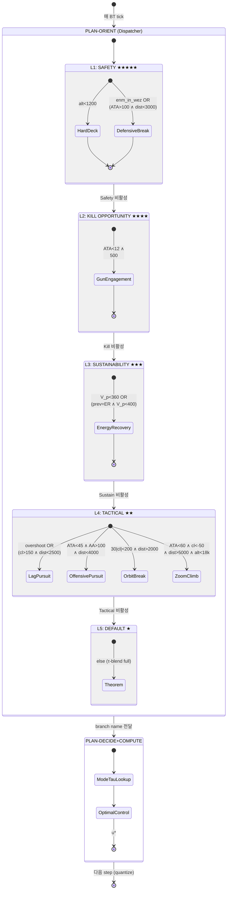
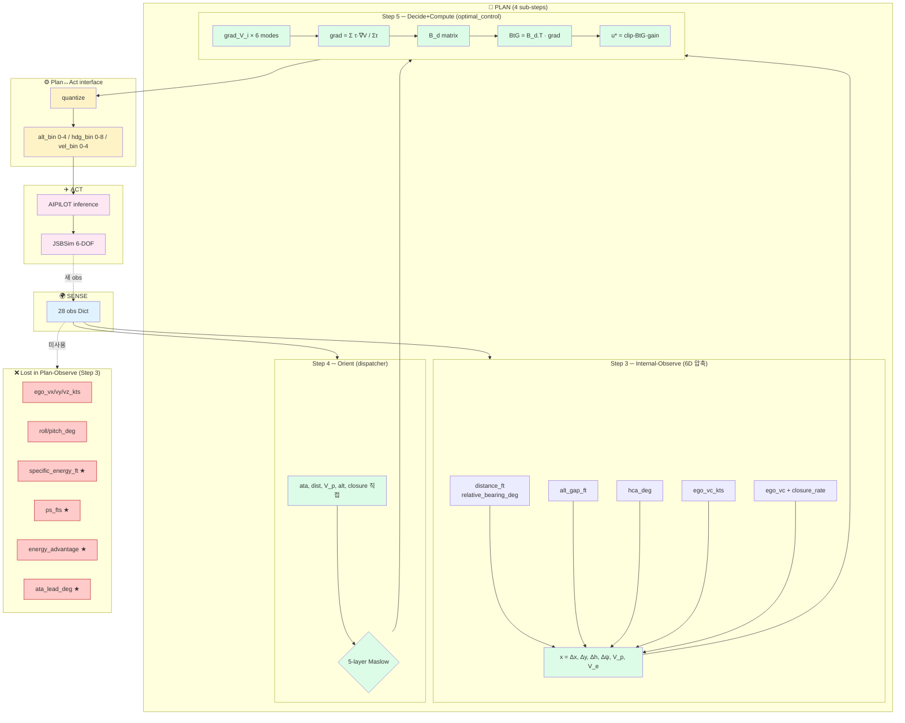
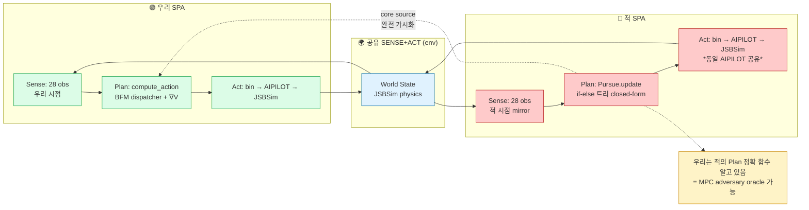
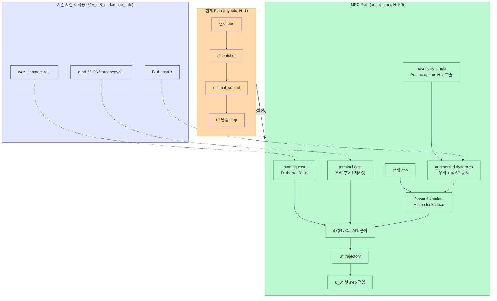

# pursuit_chase_v1 모델 UML — SPA Framework 정렬 (Mermaid)

> **renderer 호환성 (2026-05-17 정정)**: 본 문서의 Mermaid 는 **v9.4 ~ v11 폭넓게 호환** 되도록 정돈됨.
> - 제거됨: `classDiagram` 의 `namespace { }` (Mermaid v10+ 만 지원) → 클래스명 prefix (`SENSE_*`, `PLAN_*`) 로 대체
> - 제거됨: `sequenceDiagram` 의 `rect rgb()` (구버전 미지원) → `Note over` 만 사용
> - 유지: `flowchart` `subgraph`, `stateDiagram-v2`, `classDef` (모두 v9.4 이상 표준)
> - **VSCode**: Extension "Markdown Preview Mermaid Support" 가 *구 mermaid 6.x* 를 쓸 수 있으니 v10.x 로 업데이트 권장
> - **GitHub**: 자동 v11 — 모두 정상 렌더
>
> **구조**: 모든 diagram 이 **Sense-Plan-Act framework** 로 정렬됨. `docs/MODEL_EXPLANATION_학생용.md` 의 2-3부 와 1:1 대응.
>
> **색 코드** (전 문서 일관):
> - 🌍 **Sense** = `#E0F2FE` (파랑) — env 책임, fixed
> - 🧠 **Plan** = `#DCFCE7` (녹색) — 우리 책임, 자유 설계
> - ⚙️ **interface** = `#FEF3C7` (노랑) — game protocol, fixed
> - ✈️ **Act** = `#FCE7F3` (분홍) — env 책임, fixed
> - ❌ **Lost/Unused** = `#FECACA` (빨강)

---

## SPA 매핑 reference table

| Step | SPA | OODA 세부 | 우리 코드 | INPUT → OUTPUT | 자유도 |
|---|---|---|---|---|---|
| 1 | **SENSE** | Observe | env.observe() | world state → 28 obs | env fixed |
| 2 | **PLAN** | (Goal) | 목표 분석 (설계) | 게임 룰 → 이기는 패턴 | 우리 자유 |
| 3 | PLAN | Internal-Observe | obs_to_state_6d | 28 obs → 6D state | 우리 자유 |
| 4 | PLAN | **Orient** | dispatcher (5-layer Maslow) | 6D+28 obs → branch | 우리 자유 |
| 5 | PLAN | **Decide+Compute** | optimal_control | branch → mode-τ → ∇V → u* | 우리 자유 |
| 6 | **interface** | (Decide-out) | quantize_to_bins | u* (연속) → bin (이산) | game fixed |
| 7 | **ACT** | Act | env.step | bin → AIPILOT → JSBSim → 새 state | env fixed |

---

## 1. SPA Overview — 최상위 architecture

→ **순환 구조** (Act → Sense). 매 BT tick (0.1s) 마다 1 사이클. **Plan 만 우리 책임**.

---

## 2. Class Diagram — SPA Layer 별 *Swimlane*

> **prefix 가 SPA layer 표현**: `SENSE_*` = 파랑, `PLAN_*` = 녹색, `IF_*` = 노랑, `ACT_*` = 분홍 (`namespace` 제거로 일부 renderer 에서도 호환).

→ **Plan layer 가 클래스 *대부분***. Sense/Act 각 2 클래스 (external). **우리 차별화 영역 = Plan namespace 의 6 클래스**.

---

## 3. Sequence Diagram — *SPA layer 명시* 한 BT tick

> **rect rgb() 제거**: 구 mermaid 미지원. 색대신 `==` 마커로 SPA 단계 구분. 색 시각화는 [1. SPA Overview](#1-spa-overview--최상위-architecture) flowchart 에서 제공.

→ 색깔 = SPA layer (파랑 Sense, 녹색 Plan, 노랑 interface, 분홍 Act). **각 처리 단계가 *어느 layer* 인지 시각적 명확**.

---

## 4. State Diagram — *Plan-Orient* 의 5-layer Maslow

→ **dispatcher 의 5 layer = Plan-Orient 내부 구조**. Maslow 시급도 우선순위. Plan-Decide+Compute 는 *별도 sub-step*.

---

## 5. Data Flow — *SPA 경계* 명시 28 obs → action

→ **빨강 = Step 3 (Plan-Internal-Observe) 에서 *버린* obs**. ★ 표시는 *MPC 도입 시 회수 권장*.

---

## 6. Adversary 도 *parallel SPA*

적의 BT 도 동일 SPA 구조. 양쪽이 *대칭 SPA pipeline*:

→ ***양쪽 모두 SPA*** + **공유 Sense+Act**. 우리 white-box advantage = 적의 *Plan 함수 가시화*.

---

## 7. BFM Mode Catalog — *우리 7 vs core 30+* (학생doc 2.2 시각화)

Plan-Decide+Compute 의 **도구 카탈로그** 비교. Plan layer 의 *어느 BFM 도구가 가용*한지, *어느 것이 누락*인지 시각화.

```mermaid
flowchart TB
    subgraph CORE["📚 core BFM 카탈로그 (src/behavior_tree/nodes/actions.py 30+)"]
        direction TB

        subgraph Pursuit["Pursuit (5)"]
            P1[Pursue]
            P2[PurePursuit]
            P3["⭐ LeadPursuit"]
            P4[LagPursuit]
        end

        subgraph Turn["Turning primitive (5)"]
            T1[TurnLeft]
            T2[TurnRight]
            T3[Straight]
            T4[ClimbingTurn]
            T5[DescendingTurn]
        end

        subgraph YoYo["YoYo (2)"]
            Y1[HighYoYo]
            Y2[LowYoYo]
        end

        subgraph Defense["Defensive (4)"]
            D1[Evade]
            D2[DefensiveManeuver]
            D3[BreakTurn]
            D4[DefensiveSpiral]
        end

        subgraph Geom["Combat Geometry (2)"]
            G1[OneCircleFight]
            G2[TwoCircleFight]
        end

        subgraph Energy["Energy mgmt (5)"]
            E1["⭐ EnergyFight"]
            E2[Accelerate]
            E3[Decelerate]
            E4[AltitudeAdvantage]
            E5[MaintainAltitude]
        end

        subgraph Tactical["Tactical (3)"]
            TC1["⭐ TCFight"]
            TC2["⭐ GunAttack"]
            TC3["⭐ OvershootAvoidance"]
        end

        subgraph Aero["Aerobatic (4) — 수직 BFM 핵심"]
            A1[Loop]
            A2[ImmelmannTurn]
            A3["⭐ SplitS"]
            A4[HammerHead]
        end

        subgraph EConv["Energy conversion (2)"]
            EC1[SpiralDive]
            EC2[SpiralClimb]
        end
    end

    subgraph OURS["🟢 우리 사용 7 (pursuit_chase_v1)"]
        direction TB
        O1[PN ← PurePursuit]
        O2[Corner / 2c ← 자체 정의]
        O3[1c ← 자체 정의]
        O4[ldt ← LagPursuit]
        O5[yoyo ← HighYoYo 단축]
        O6[T capture-time ← 자체 정의]
        O7[Energy Recovery ← Corner mode]
    end

    P2 -.->|"우리 매핑"| O1
    P4 -.->|"우리 매핑"| O4
    Y1 -.->|"부분 매핑 (LowYoYo 없음)"| O5

    P3 -.->|"❌ 누락 ★★★★★"| MISSING
    E1 -.->|"❌ 누락 ★★★★"| MISSING
    A3 -.->|"❌ 누락 ★★★★"| MISSING
    A2 -.->|"❌ 누락 ★★★"| MISSING
    A4 -.->|"❌ 누락 ★★★"| MISSING
    TC2 -.->|"❌ 누락 ★★★"| MISSING
    TC3 -.->|"❌ 누락 ★★★"| MISSING
    TC1 -.->|"❌ 누락 ★★"| MISSING

    MISSING[❌ 우리 미사용 22+ BFM<br/>aggressive Nash 깸 후보]

    classDef priority fill:#FBBF24,stroke:#92400E,color:#000
    classDef used fill:#86EFAC,stroke:#15803D,color:#000
    classDef missing fill:#FCA5A5,stroke:#B91C1C,color:#000
    classDef ours fill:#DCFCE7,stroke:#16A34A
    classDef core fill:#FEE2E2,stroke:#B91C1C

    class P3,E1,A3,A2,A4,TC1,TC2,TC3 priority
    class P2,P4,Y1 used
    class MISSING missing
    class OURS,O1,O2,O3,O4,O5,O6,O7 ours
    class CORE core
```

#### 우선 도입 권고 (★ 표시)

| 우선 | BFM | 이유 | 효과 |
|---|---|---|---|
| ★★★★★ | **LeadPursuit** | Pure Pursuit → Lead 정통화 | 적 turn 예측 → ATA 빠르게 |
| ★★★★ | **EnergyFight** | Boyd EM 직접 (Ps, Es 활용) | sustained turn 우위 |
| ★★★★ | **SplitS / Immelmann** | 수직 분리 (aggressive Nash 깸 후보) | parallel chase 깸 가능 |
| ★★★ | OvershootAvoidance | 오버슈트 예방 | dist 닫고도 못 잡는 상황 회피 |
| ★★★ | GunAttack | 사격 정조준 정밀 | WEZ 내 damage 효율 ↑ |
| ★★ | HammerHead, SpiralDive/Climb | PE↔KE 변환 다양화 | 옵션 ↑ |

→ ⭐ = ★★★ 이상 우선순위. **8개 BFM 우선 도입 권장**.

---

## 8. MPC variant — Plan layer 의 *시간 horizon 확장*

→ **MPC = Plan 의 *Compute step 시간 horizon 확장***. 23 사이클 자산 (∇V_i, B_d, damage_rate) *그대로* terminal cost / linearization / running cost 로 재사용. **폐기 없음**.

---

## diagram 종류 정리 (SPA 관점)

| # | 종류 | SPA 표현 | 학생 doc 매핑 |
|---|---|---|---|
| 1 | SPA Overview (component) | 3 layer 큰 그림 | 2.1 의 7-step flow |
| 2 | Class diagram (swimlane) | Layer 별 클래스 그룹화 | 2.1 각 step 의 *코드 구현* |
| 3 | Sequence diagram (annotated) | 시간 순 + layer 색 | 2.1 의 *시간 진행* |
| 4 | State diagram (FSM) | Plan-Orient 의 5-layer Maslow | 2.3 dispatcher |
| 5 | Data flow (boundaries) | obs → action 의 SPA 경계 | 4부 의 28→6 손실 |
| 6 | Adversary (parallel SPA) | 양쪽 SPA + 공유 env | 적 white-box 의미 |
| **7** | **BFM Catalog (우리 7 vs core 30+)** | Plan-Decide+Compute 의 도구 비교 | **2.2 의 BFM gap 시각화** |
| 8 | MPC variant (proposal) | Plan-Compute 의 horizon 확장 | 미래 path |

→ **각 diagram 이 *다른 SPA 관점***. 8개 합치면 *전체 시스템* 의 *완전 표현*.

---

## 모든 prior comment 처리 확인

| user comment | 어디 반영 | 상태 |
|---|---|---|
| 1.1 단계 수치 조정 가능? | 학생doc 1.1 (env hardcoded, 양쪽 동일 명시) | ✅ |
| 2.1 abstraction gap | SPA Sense → Plan boundary 명시 (Step 1 vs 3 분리) | ✅ |
| 2.1 BFM 갑자기 점프 | 4 sub-step (Goal→Variable→Orient→Compute) 분해 | ✅ |
| 2.1 4/5/6 자세히 | Step 4-7 각 상세 설명 + 수학 의미 | ✅ |
| 2.1 bin 헷갈림 | "bin 용어 정의" 박스 + 시험점수 비유 | ✅ |
| 2.2 LeadPursuit 어디감 | core 30+ BFM vs 우리 7 비교, LeadPursuit code 전수 분석 | ✅ |
| 2.2 다른 BFM 도 | EnergyFight, SplitS, Immelmann, HammerHead 등 우선순위 표 | ✅ |
| 2.3 SPA 관점 재구성 | 5-layer Maslow + Plan-Orient 정확 위치 | ✅ |
| baseline_model.pt 정정 | AIPILOT = **open LAG repo 사전학습 RNN** (외부 자산). sdk/core byte-identical 사본만 보유, 둘 다 *load only* | ✅ |
| core 수치 정렬 | wez_damage_rate 선형, HardDeck 1000ft, 목표 table 2-tier | ✅ |
| Sense Plan Act 제대로 | OODA 통합 매핑 + Layer 책임 분리 + SPA-aligned UML 7종 | ✅ |
| **UML Mermaid + SPA** | **본 파일 (`MODEL_UML.md`) 전체 SPA-aligned Mermaid 로 재작성** | ✅ (지금) |

---

## 보는 방법

| 도구 | 설정 |
|---|---|
| **VSCode** | Extension "Markdown Preview Mermaid Support" 설치 후 `Ctrl+Shift+V` |
| **GitHub** | `.md` commit 후 자동 native 렌더링 |
| **Obsidian / Notion / Typora** | 자동 지원 |
| **PNG/SVG export** | `npm i -g @mermaid-js/mermaid-cli; mmdc -i MODEL_UML.md -o diagram.png` |

raw text 보고 있다면 → 위 도구 중 하나로 열면 mermaid 블록이 *그림* 으로 렌더링.
