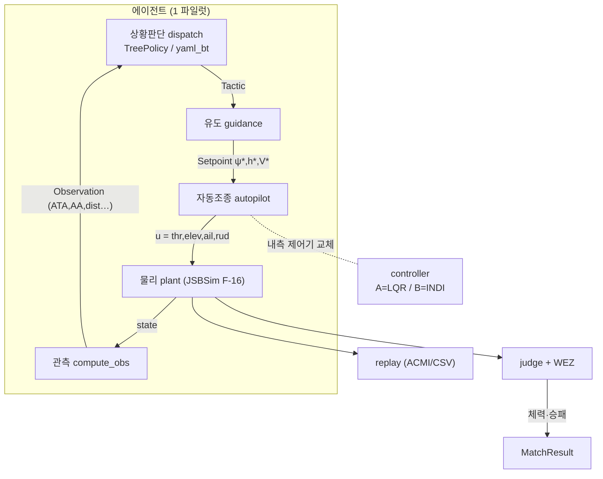
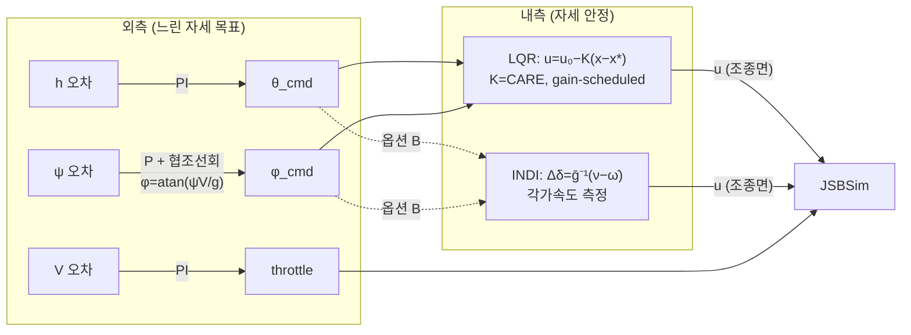
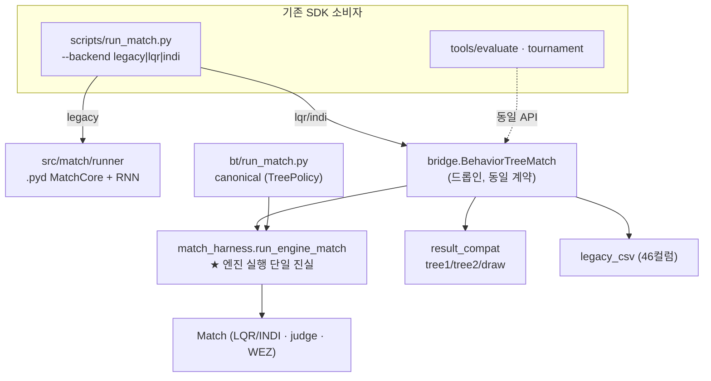
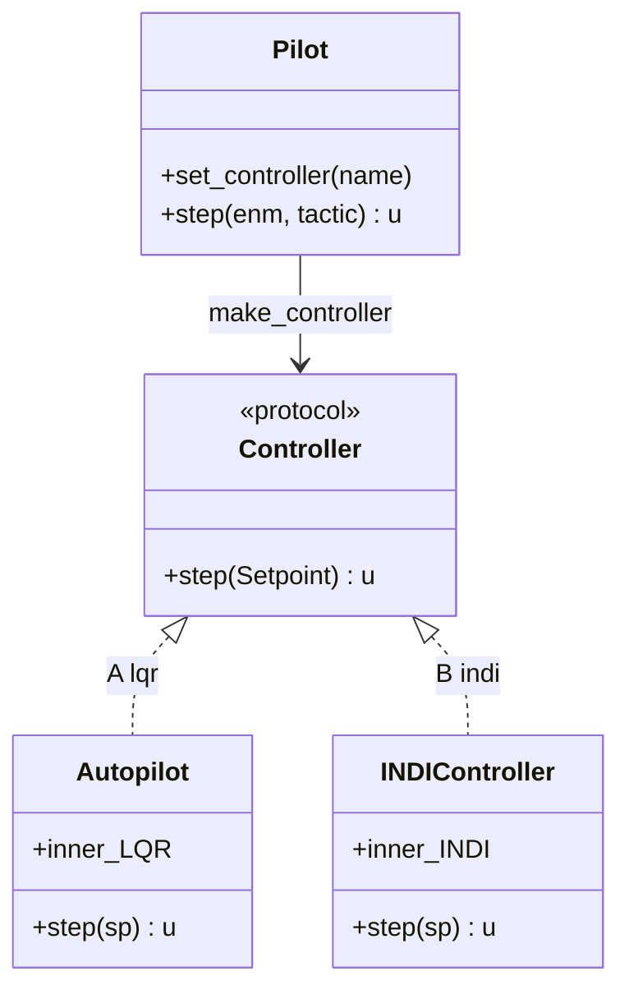

# new_match_engine 아키텍처 다이어그램

> **목적**: 새 엔진의 *구조·데이터 흐름·통합 지점*을 한눈에 본다. 직관은
> [학생용 입문서](NEW_ENGINE_STUDENT_GUIDE.md), 이론은 [LQR 리포트](NEW_ENGINE_LQR_CONTROL_REPORT.md).
> 다이어그램은 Mermaid(마크다운 뷰어에서 렌더). 모듈 경로는 `new_match_engine/` 기준.

---

## 1. 모듈 맵 (디렉토리 → 역할)

| 디렉토리 | 모듈 | 역할 |
|---|---|---|
| `control/` | `tactic` | Tactic enum + 모든 상수·단위(단일 진실) |
| | `guidance` | Tactic + obs → Setpoint(ψ\*,h\*,V\*) |
| | `plant` | JSBSim F-16 6-DOF 래퍼 (load/trim/step/state) |
| | `linearize` | 운영점 유한차분 (A,B) |
| | `lqr` | CARE → 게인 K, gain-scheduled 3×3 |
| | `indi` | 증분 비선형 동적 역변환 (옵션 B) |
| | `autopilot` | 외측 PI/P + 내측 LQR (단위 변환 전담) |
| | `controller` | 엔진 레지스트리 A=lqr / B=indi |
| `engine/` | `obs` | compute_obs → Observation(기하) |
| | `judge` | WEZ 데미지 + 승패 (원본 100% 복제) |
| | `match` | 매치 루프 (multi-rate) |
| | `match_harness` | ★ 엔진 실행 **단일 진실** run_engine_match |
| | `pilot` | obs→tactic→guidance→autopilot→u 체인 |
| | `replay` | ACMI(Tacview) + CSV 기록 |
| | `scenarios` | spawn_adt_neutral(beam) 등 초기조건 |
| `bt/` | `tree_policy` | 상황 독립 dispatch (우리 정책) |
| | `yaml_bt` | legacy `.yaml` BT 해석 → Tactic |
| | `situation` | 상황 분류(offensive/defensive/neutral) |
| | `run_match` | canonical 평가 진입점 |
| `bridge/` | `core_adapter` | legacy `BehaviorTreeMatch` 드롭인 |
| | `result_compat` | 결과 형태 변환(tree1/tree2/draw) |
| | `legacy_csv` | legacy 46컬럼 CSV 재현 |
| | `verify_swap` | 교환 검증(3 백엔드 패리티) |
| `validation/` | `aerobench_testbed` | TP-1538 고AoA INDI-vs-LQR |
| | `tradeoff_sweep` | 게인 Pareto 곡선 |
| | `formal_verify` | Z3 형식 검증(명령한계·ROA) |

---

## 2. 큰 그림 — 4계층 + 인접 시스템



---

## 3. 매치 1틱 — 시퀀스 (multi-rate)

```mermaid
sequenceDiagram
    participant M as Match.run
    participant O as compute_obs
    participant P as Pilot(×2)
    participant C as autopilot+LQR/INDI
    participant J as JSBSim plant
    participant W as judge/WEZ

    loop 제어틱 20Hz
        M->>O: obs12, obs21 (양방향 기하)
        Note over M: BT 10Hz마다 tactic 갱신 + dwell(0.3s)
        M->>P: pilot.step(tactic)
        P->>C: guidance→Setpoint→autopilot.step(sp)
        C-->>P: u = [thr,elev,ail,rud]
        M->>J: set_input(u); step ×6 (물리 120Hz)
        M->>W: wez_damage(ATA,dist,dt) → 체력 차감
        M->>W: judge(고도,체력,step) → 승패?
    end
```

**rate 구조 (정수비 6:2:1)**: 물리 120Hz · 제어 20Hz · BT 10Hz · dwell 0.3s · 로그 60–120Hz.

---

## 4. 제어 cascade — 외측 PI/P + 내측 LQR/INDI



- 외측은 LQR·INDI 공통. **내측만 교체**(공정 비교: 외측 동일).
- 단순기동은 둘 다 정상상태 <0.1°. 복합+모델오차에서 INDI ~4× 정밀(검증).

---

## 5. bridge 통합 — legacy ↔ new, 단일 진실



**핵심**: `run_engine_match`가 *엔진 역학 단일 진실*. bridge(일반 대전)와 canonical(정책 평가)이
둘 다 이걸 호출 → 누가 플레이하는지·cfg·산출물만 다르고 **엔진은 같다**(drift 방지).

---

## 6. 컨트롤러 교체 (옵션 A/B)



---

## 7. 단위·rate 한눈에

| 경계 | 단위/값 |
|---|---|
| obs / guidance | °, ft, kts |
| autopilot 내부 | fps, ft, rad (변환 전담) |
| 물리 (plant) | 120 Hz |
| 제어 (autopilot/WEZ/judge) | 20 Hz |
| BT 결정 | 10 Hz (+ dwell 0.3s) |
| 로그 | 60–120 Hz |
| WEZ | ATA<12°, 500–3000ft, ≤25 HP/s |
| Hard Deck | <1000 ft = 패배 |
| 매치 | 300 s (= 6000 제어틱) |

---

## 8. 재현·검증 진입점

```bash
python new_match_engine/bt/run_match.py ace          # canonical 평가
python -m new_match_engine.bridge.verify_swap         # 교환 3-백엔드 검증
python new_match_engine/validation/formal_verify.py   # Z3 형식 검증
python new_match_engine/validation/tradeoff_sweep.py  # 게인 Pareto
```
