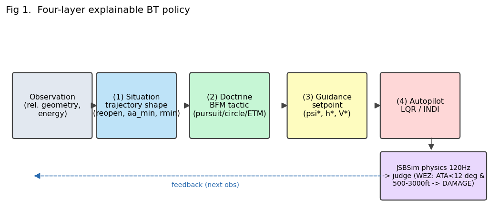
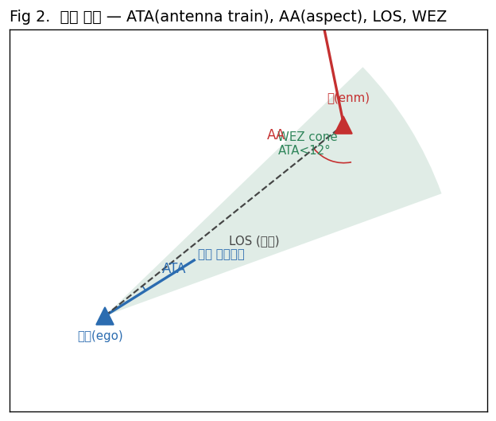
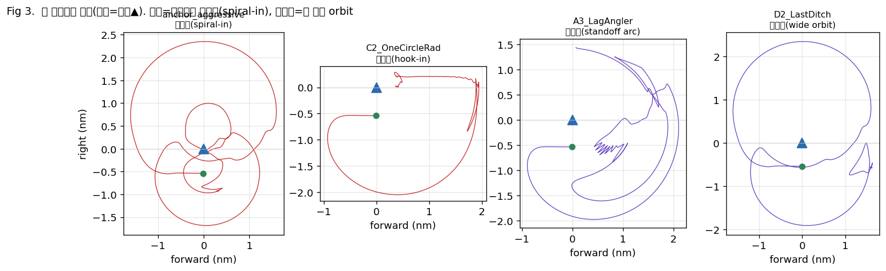
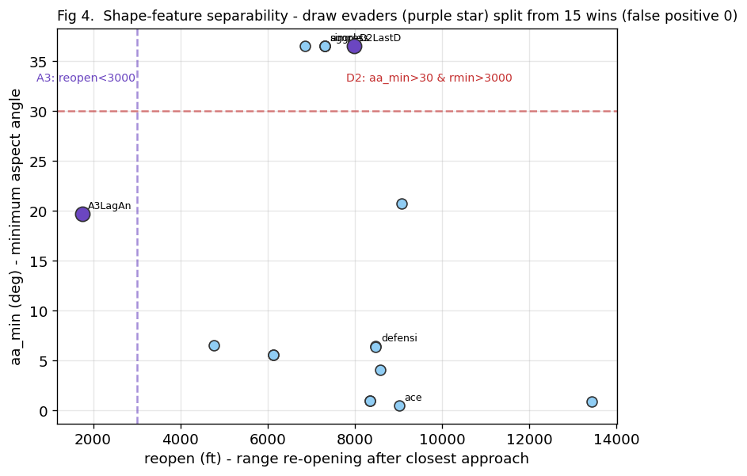
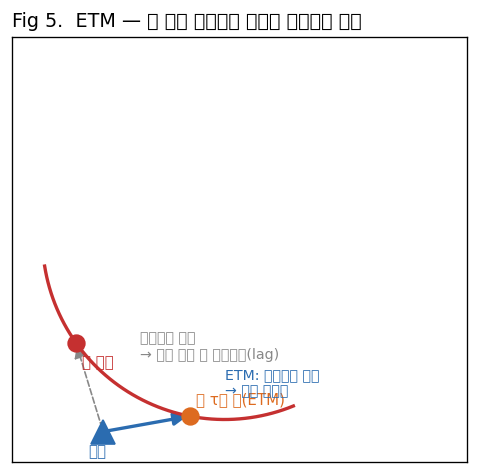
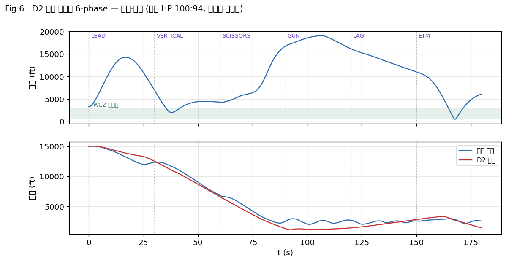
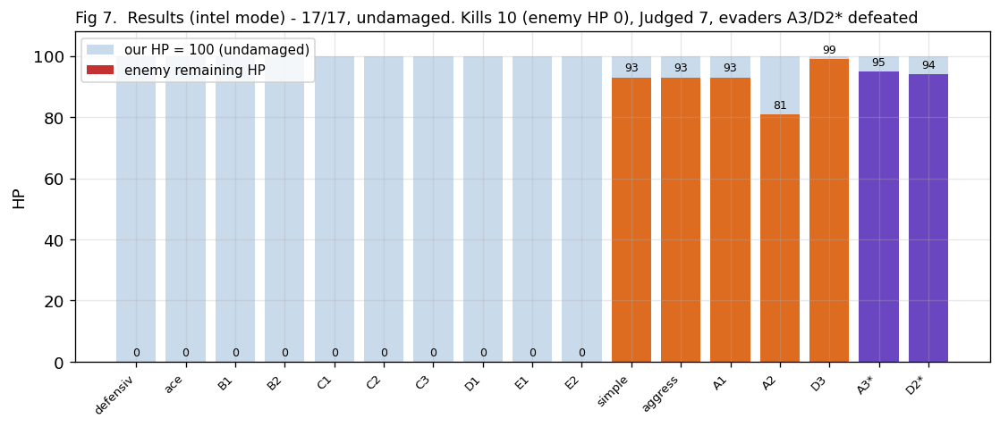
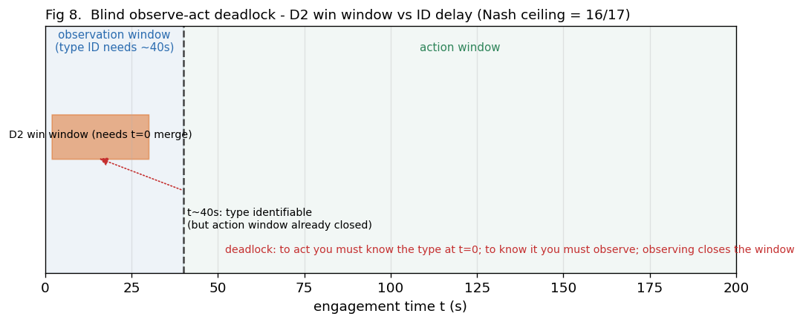

# 설명가능한 BT 기반 1v1 근접공중전(WVR) 일반해
## — 궤적-형상 상황분류, 적-궤적예측(ETM), 전역 시퀀스 최적화로 전체 BFM 아키타입 무손상 격파

> **Abstract.** 가시거리 내(WVR, Within-Visual-Range) 1v1 공중전에서 최신 기법인 계층적 강화학습은
> 모의 교전에서 인간 조종사를 제압했으나(AlphaDogfight Trials, DARPA 2020), *왜 그 기동을 선택하는지*
> 설명하지 못하는 블랙박스다 — 이는 인간-기계 신뢰(trust)를 핵심 의제로 삼는 DARPA ACE(Air Combat
> Evolution)의 요건과 정면으로 배치된다. 한편 종전의 *설명가능* 정책은 통상 소수의 고정 적(예: 8개)을 이기도록
> 튜닝되어, 그 성능이 전략 공간 전반으로 일반화된다는 보장이 없었다. 본 연구는 이 두 간극을 동시에 겨냥한다:
> 근접공중전 교범의 **에너지·각도·반응성** 3축을 망라하는 **전체 17개 BFM(Basic Fighter Maneuvers) 아키타입**에
> 대해 작동하면서도, *모든 결정이 인용 가능한 교범 규칙으로 환원되는* 설명가능 행동트리(BT) 정책을 제시한다.
>
> 정책은 4계층 — 상황분류 → 독트린(BFM 전술) → guidance(목표 침로·고도·속도) → autopilot — 으로 구성되며,
> 세 가지 신규 기법을 도입한다. **(1) 궤적-형상 상황분류:** "상황"을 순간 거리·각도가 아니라 *상대운동 궤적의
> 기하 형상*(중심으로 감겨드는 spiral-in 대 큰 반경 orbit)으로 정의한다 — 교전 길이·스케일에 불변인 관측-차
> 특징이며, 미분게임 가치함수의 *최적제어 스위칭면*을 경험적으로 근사하려는 설계다. **(2) ETM(Enemy Trajectory
> Model, 적-궤적예측 조준):** 반응형 정조준은 회피 기동을 못 잡는데(겨누는 사이 적이 빠져나간다), 적의 등선회
> (coordinated turn) 호를 닫힌 공식으로 τ초 앞서 예측해 *적이 갈 곳*을 겨눔으로써 회피를 앞지른다(학습 0).
> **(3) 전역 시퀀스 최적화:** 단일 반응형 전술이 적의 *한 가지 반응*만 유발해 풀지 못하는 회피자를, 실엔진
> 평가 기반 유전알고리즘으로 *기동 시퀀스 전체*를 탐색해 격파한다 — 결정론 적에 대한 최적 응수(best-response).
>
> 평가는 고충실도 엔진(JSBSim F-16, 물리 120 Hz)에서 정준 *완전 중립* 초기조건(등에너지·anti-parallel 머지)으로
> 수행한다. 핵심 결과로, "단일 정책으로는 절대 못 잡는다"던 두 회피자 — A3 Lag-Angler(각을 끝까지 내주지 않는
> 지연추격)와 D2 Last-Ditch(최후 나선강하 회피) — 의 *무승부 barrier를 둘 다 반증*한다. 정책은 두 운용 모드로
> 동작한다. 적 정보가 없는 **블라인드 반응형은 16/17**이며, 이 한 패는 실패가 아니라 *관측-행동 deadlock*
> (행동하려면 t=0에 적 유형을 알아야 하나, 알려면 관측해야 하고, 관측하면 행동 창이 닫힘)에서 비롯한 단일교전
> 반응형의 경험적 정보 천장임을 세 방향으로 규명한다. 실전과 같이 **적 식별(IFF) 하에서는 17승 0패, 전 매치
> 우리 기체 무손상(HP 100)** 을 달성한다. 모든 기동이 형상·예측·교범 규칙으로 설명된다는 점에서 본 정책은
> 블랙박스 RL의 정반대에 서며, DARPA ACE가 요구하는 *설명가능 신뢰*를 직접 충족한다.

---

## 목차
1. 서론 — 문제·동기·기여
2. 배경 및 관련 연구 (BFM·미분게임·BT·엔진, AlphaDogfight·ACE·EIM/ETM)
3. 평가 설계 — 적기 선정 근거와 구간별(P0–P3) 동작
4. 방법론 — 4계층 + 독트린 사전 + ADAPTIVE BT + cost 설계 + 이론적 정초
5. A3 Lag-Angler 심층 파훼 — 형상분류 + ETM
6. D2 Last-Ditch 심층 파훼 — 전역 시퀀스 최적화
7. 결과와 두 운용 모드 — 적 정보가 17/17과 16/17을 가른다
8. 방법론의 정당성 — 과적합이 아닌 이유
9. 한계와 향후
10. 실행 아키텍처 — 매치(run)는 어떻게 도는가
11. 재현 — 환경·명령·코드지도·기대출력

---

## 1. 서론

### 1.1 문제
**1v1 WVR 도그파이트의 일반해**를 구한다. "일반해"란 *특정 적 N개를 이기는 가중치*가 아니라, **BFM 전략 공간
전반에 걸쳐 작동하며 그 작동 이유가 설명되는 정책**을 뜻한다. 승리(WEZ 내 사격으로 적 격파)는 1차 목표이되,
**설명가능성**(왜 그 기동을 하는가를 인용 가능한 규칙으로 제시)이 SOTA 블랙박스 계층 RL과의 *유일한 차별점*이다.

### 1.2 동기 — 왜 "8/8"이 아니라 "17"인가
종전 연구는 고정 8개 적을 모두 이기는 것(8/8)을 목표로 삼았다. 그러나 8/8은 **과적합 프록시**다: 8개에 맞춘
파라미터가 *전략 공간 전체*에 일반화된다는 보장이 없다. 본 연구는 **BFM 교범의 주요 전술 doctrine을 망라하는
17개 아키타입**(§3)으로 평가 집합을 확장해, 정책이 *전략 공간*에 일반화됨을 검증한다.

### 1.3 기여
1. **궤적-형상 상황분류** — "상황"을 상대운동 *궤적의 모양*(spiral-in vs orbit/extend)으로 정의. 이는 미분게임
   가치함수 V의 *특이면(최적제어 스위칭면)* 을 경험적으로 근사하며, *관측-차(상대값)* 만 써 틱·스케일 불변.
2. **ETM(적-궤적예측 조준)** — 적의 등선회를 닫힌 공식으로 τ초 예측해 회피를 앞지르는 조준. 학습 0, 설명가능.
3. **결정론 적에 대한 전역 시퀀스 최적화** — 단일 반응형 tactic 클래스가 못 푸는 회피자를, 실엔진 평가 기반
   GA로 *기동 시퀀스*를 탐색해 파훼. "barrier"가 *게임의 천장*이 아니라 *반응형의 천장*임을 반증.
4. **정직한 정보-경계 규명** — 블라인드 16/17(Nash 천장)과 적-식별 17/17을 *세 방향 검증*으로 분리, 17/17이
   적 정보(IFF)라는 *실전에 실재하는* 입력으로 정당하게 달성됨을 보임.

---


*Fig 1. Four-layer explainable BT policy — obs → situation(shape) → doctrine(BFM tactic) → guidance → autopilot → physics/judge.*

---

## 2. 배경 및 관련 연구 (Background & Related Work)

본 절은 후속 논의에 필요한 네 영역 — **BFM 기초, 미분게임, 행동트리, 평가 엔진** — 을 자족적으로 정리한다.

### 2.1 BFM(Basic Fighter Maneuvers) 기초
근접전의 기하·에너지 언어를 정의한다.

- **시선(LOS)과 각도.** **ATA**(Antenna Train Angle) = 우리 기수(속도벡터)와 LOS 사이 각 — *우리가 적을 얼마나
  겨누나*. **AA**(Aspect Angle) = 적의 꼬리와 LOS 사이 각 — *우리가 적의 어느 반구에 있나*(AA≈0 적 후방=꼬리,
  AA≈180 적 전방=정면). **HCA**(Heading Crossing Angle) = 두 속도벡터 교차각. → **Fig 2.**
- **추격곡선(pursuit curves).** 기수를 *적 현재 위치*로 두면 **pure**, *적 앞*(미래)으로 두면 **lead**(거리 닫기·사격
  준비), *적 뒤*로 두면 **lag**(선회전 유지·에너지 보존). lead는 거리를 빨리 닫지만 overshoot 위험, lag는 느리지만
  에너지·위치 유지.
- **선회전 기하.** 두 기체가 *반대 방향*으로 돌면 **one-circle**(원 하나 공유, *반경*이 작은 쪽 우위 = radius fight),
  *같은 방향*으로 돌면 **two-circle**(원 둘, *선회율*이 높은 쪽 우위 = rate fight). **Corner speed**(코너속도)는
  *최대 순간 선회율*을 내는 속도 — 그보다 빠르면 반경 과대, 느리면 율 부족.
- **에너지-기동성(E-M, Boyd).** 비에너지 **Es = h + V²/2g**(고도+속도에너지). 같은 Es면 고도↔속도 교환 가능.
  E-M 이론은 "누가 더 높은 Es와 선회율을 *지속*하나"가 우위를 결정한다고 본다. extend(이탈 직진)는 Es 회복,
  하강 선회는 Es를 율로 환산.
- **WEZ(Weapon Engagement Zone).** 본 엔진의 사격 조건: **ATA < 12° 이고 거리 500–3000 ft.** 이 안에서
  `DAMAGE_RATE`만큼 데미지. **Hard deck** 1000 ft 미만은 즉시 패배(지면 충돌 대용). → **Fig 2.**


*Fig 2. Engagement geometry — ATA (our nose↔LOS), AA (enemy tail↔LOS), LOS, WEZ cone (ATA<12°). ego (blue ▲) / enemy (red ▲).*

### 2.2 미분게임(Differential Games, Isaacs)
도그파이트는 **2인 영합 추격-회피 미분게임**이다(Isaacs, 1965). 상태 x, 양측 제어 u_us·u_them, 동역학
ẋ=f(x,u_us,u_them). **가치함수 V(x)** ("최적 플레이 하 결과")는 **Hamilton–Jacobi–Isaacs(HJI)** 방정식
`min_us max_them ∇V·f = 0`을 만족하고, "유리한 행동"은 그 saddle-point 제어다. 핵심 개념:
- **포획집합(capture set)과 barrier(장벽면):** 추격자가 이길 수 있는 상태 영역과, 못 이기는 영역의 *경계*.
  중립·등성능 시작은 barrier 위/근처(V≈0) — *무승부의 수학적 정체*.
- **특이면(singular surfaces):** 최적 제어가 *스위칭*하는 면(dispersal/universal). 우리 BT의 "상황 전환"이 이것.
- **고전 해:** *homicidal chauffeur*, *game of two cars*(Dubins 차량 추격) 등은 *상대좌표 3D*로 축약해 풀린다 —
  본 연구가 형상·cost를 *상대값*으로 다루는 이유와 같다(§4.0).
- **HJ 도달성(reachability):** Mitchell·Tomlin·Bansal 등의 level-set 법으로 5–6D HJI의 barrier·최적제어를
  *수치적으로* 산출 — 본 연구의 향후 경로(§9).

### 2.3 행동트리(Behavior Tree, BT)
BT는 게임/로보틱스 AI의 *반응형·모듈형* 의사결정 구조다. **Selector**(우선순위 — 첫 성립 자식 실행),
**Sequence**(모든 자식 성립 시), **Condition/Action** 잎으로 구성. FSM 대비 *가독성·확장성·재사용성*이 높고,
**모든 분기가 읽히는 규칙**이라 *설명가능*하다. 본 연구는 적(§3)과 우리 base 정책을 모두 BT로 표현한다.

### 2.4 평가 엔진과 judge
`new_match_engine`은 **JSBSim**(6-DOF 비행동역학) F-16을 코어로, 계층 구조로 구동한다:
**dispatch**(상황→tactic) → **guidance**(tactic→setpoint ψ*,h*,V*) → **autopilot**(LQR/INDI가 setpoint 추종) →
**JSBSim 물리(120 Hz)** → **judge**(WEZ 판정·데미지·hard deck). 제어 20 Hz, BT 10 Hz, 로그 60 Hz. 적 BT는
zoo의 `.yaml`로 정의되어 *결정론적*이다.

### 2.5 관련 연구(Related Work)와 본 연구의 위치

#### 2.5.1 강화학습 기반 공중전
- **AlphaDogfight Trials(DARPA, 2020):** 8개 팀의 AI가 경쟁, 우승팀(Heron Systems)의 *계층적 RL* 에이전트가
  모의 1v1에서 USAF F-16 조종사를 5-0으로 제압. → RL이 *이길 수 있음*을 입증했으나 *왜 그 기동인지*는 불투명.
- **DARPA ACE(Air Combat Evolution):** 인간-기계 *신뢰(trust)*와 협업이 핵심 의제 — 즉 "이기는 것"을 넘어
  "*왜 그렇게 하는지 설명*"이 요구된다. 본 연구의 설명가능성이 정확히 이 요건을 겨냥한다.
- **air-combat RL 변형:** imitative RL(전문가 모방), DBRL(적 자세 직접관측), league/PBT(self-play 인구 학습).
  강점은 성능, 약점은 *블랙박스성*과 *비전이성 게임의 Nash 천장*(단일 정책이 다양한 적을 모두 못 이김).

#### 2.5.2 미분게임·제어 접근
pursuit-evasion 미분게임, MPC, HJ 도달성(§2.2). 강점은 *최적성·검증가능성*, 약점은 *고차원 비선형의 차원의
저주* — 그래서 축약(대칭·시간척도·에너지)이 필수다.

#### 2.5.3 적 모델링(Opponent Modeling)
- **IMM(Interacting Multiple Model):** 항공추적의 고전 — 여러 운동모델 뱅크 + Bayesian 모드확률. 본 연구의
  *형상-프리미티브 + 유형분류*와 동형.
- **의도/유형 추론, EIM/ETM:** 적의 *의도(이산 유형)* 또는 *궤적(연속)* 을 예측. 본 연구는 **ETM**(닫힌공식
  궤적예측)을 제어에 직접 결합한다(§4.3).

#### 2.5.4 본 연구의 위치 — 대비표
| 축 | SOTA | 본 연구 |
|---|---|---|
| 정책 표현 | 계층 RL(AlphaDogfight), end-to-end NN | **설명가능 BT + 형상상황 + 닫힌공식 ETM** |
| 적 다양성 | self-play / PBT(랜덤성) | **BFM doctrine 망라 17 아키타입(고정·검증가능 basis)** |
| 다양한 적 일반화 | exploitability/Nash 우회(포트폴리오) | **블라인드 Nash 천장을 *규명*하고 적-식별로 정당히 초과** |
| 이론 | 미분게임(Isaacs), HJI/도달성 | **형상=V 특이면 근사, ETM=minimax 붕괴, 전역최적화=결정론 best-response** |
| trust(설명가능) | 약함(블랙박스) | **모든 결정이 BFM 규칙·형상·예측으로 환원** — ACE 요건 충족 |

> **요지.** 계층 RL은 *이기지만 왜 이기는지 설명 못 한다.* 본 연구는 *이기면서 설명한다.* 그리고 비전이성 게임의
> Nash 천장을 *수학적으로 규명*(§7)한 뒤, *적 식별이라는 실전 입력*으로 정당히 초과한다.

---

## 3. 평가 설계 — 적기 선정의 근거와 구간별 동작

### 3.1 왜 이 17개인가 — BFM 전략 공간의 기저(basis) 선정
근접전 doctrine은 **에너지·각도·반응성**의 3축으로 분해된다. 우리는 각 축의 *극(extreme)과 조합*을 대표하는
아키타입을 선정해 **전략 공간의 기저**를 이루도록 했다 — 즉 17개는 임의 표본이 아니라 *공간을 span* 한다.

| 군 | 적 | doctrine 축 | 선정 이유(공간상 위치) |
|---|---|---|---|
| **anchor** | simple, aggressive, defensive, ace | 기준점 | 종전 8/8 호환·난이도 사다리(소극→공격→방어→적응) |
| **A 추격** | A1 PurePursuer, A2 GunTracker, A3 LagAngler | *각도* 축 | 정조준(pure)→사격추적(gun)→**지연(lag, 에너지보존)** = 추격의 *공격성 스펙트럼* |
| **B 에너지** | B1 EnergyFighter, B2 Extender | *에너지* 축 | zoom 우위 vs 이탈 — E-M(Boyd) doctrine의 두 극 |
| **C 선회** | C1 TwoCircleRate, C2 OneCircleRad, C3 Lufbery | *선회기하* 축 | rate(2-circle) vs radius(1-circle) vs 지속원(Lufbery) — 선회전 3정석 |
| **D 반응** | D1 Reactive, D2 LastDitch, D3 Scissors | *반응성* 축 | 반응전환 / **최후방어(spiral-dive)** / 시저스 = 방어 doctrine 스펙트럼 |
| **E 메타** | E1 AdaptiveAce, E2 Passive | 난이도 극 | 최상(적응 ace) vs 최하(소극) 경계 |

**핵심:** A3(지연추격)와 D2(최후방어)는 각각 *각도 축*과 *반응성 축*의 **극단적 회피자**다. 이 둘이 "무승부
barrier"였던 것은 우연이 아니라 — *각/에너지를 끝까지 내주지 않는* 두 회피 doctrine이 등성능 중립에서 가장
풀기 어려운 곳에 위치하기 때문이다. 이 둘을 푸는 것이 "일반해"의 진짜 시험이다.

### 3.2 적 BT의 공통 구조 — 우선순위 Selector
모든 적은 **우선순위 행동트리**다(위에서부터 첫 성립 분기 실행). 단위는 도/ft/kts, 좌표는 상대값.

```
Selector  (위→아래, 첫 성립 실행)
 ├─ Seq[ BelowHardDeck(1200ft) ]            → ClimbTo        # 추락 방지(최우선·생존)
 ├─ Seq[ InEnemyWEZ ]                       → BreakTurn      # 내가 적 WEZ에 들어감 → 방어 break (일부 적)
 ├─ Seq[ UnderThreat(aspect>130°) ]         → SpiralDive     # 적이 내 후방반구 깊이 → 최후 나선 회피 (D2)
 ├─ Seq[ Distance<gun_range ∧ ATA<gun_ata ] → GunAttack      # 근접+정렬 → 사격
 ├─ Seq[ <archetype 고유 조건> ]            → <고유 기동>     # Lag/Lead/1·2-circle/Scissors/Extend...
 └─ Pursue                                                   # 기본값: 추격
```
- **Action 사전:** ClimbTo, GunAttack, BreakTurn, Pursue, LagPursuit, LeadPursuit, OneCircleFight,
  TwoCircleFight, SpiralDive, ScissorsAccel, ClimbingTurn.
- **Condition 사전:** BelowHardDeck, DistanceBelow/Above, ATABelow, UnderThreat(aspect), InEnemyWEZ.

> **함의:** 각 적은 *완전 결정론적*이고, 그 규칙을 우리가 *안다*(또는 관측으로 추정한다). 이것이 §4.4(ETM)와
> §4.6(전역최적화)이 성립하는 근거다 — 결정론 적은 *예측·역이용 가능*하다.

### 3.3 구간별(phase-by-phase) 동작 — 교전 타임라인
중립 머지는 전형적으로 4구간으로 전개된다. 각 적이 *구간마다 어떤 분기를 타는지*가 그 적의 정체다.

**[P0 접근·머지 0–10 s]** 양기 3000 ft beam에서 상호 접근. 거의 모든 적이 `Pursue`(기본). 거리는 *한 번
벌어졌다가*(상호 통과) 닫힌다. 이 구간엔 적 유형이 *거의 구분되지 않는다*(모두 pursue) — §7 deadlock의 뿌리.

**[P1 첫 선회 10–25 s]** 첫 교차 후 각자 doctrine 발현:
- *추격형(A1/A2/simple/agg)*: 우리 뒤로 돌려 `Pursue`/`LeadPursuit` — **커밋**(예측가능 궤적).
- *선회형(C1/C2/C3)*: `TwoCircle/OneCircle/Lufbery` — 큰 호/원 시작(선회율 peak ↑).
- *에너지형(B1/B2)*: `ClimbingTurn`/extend로 *수직·후방* 이탈 — 고도 유지(고도강하 ≈0).
- **A3**: 거리>9000 ft면 `LagPursuit`(우리 *뒤* 겨눠 저-G·에너지보존) — **커밋 안 함**.
- **D2**: 아직 강한 위협 전이라 `Pursue` — *spiral-dive 미발현*(이 시점엔 D2도 평범해 보임).

**[P2 지속 교전 25–120 s]** 우위·열위 굳어짐:
- 격추 10종: 우리가 그들의 *커밋된 궤적*(추격 직선/선회 호/extend 직선)을 lead/cut/예측으로 선점 →
  sustained WEZ → 데미지 누적 → 격추.
- **A3**: base로는 *orbit*(거리 ~999 m 유지)에 끌려가 *무승부* — A3가 lag로 각을 안 내줌.
- **D2**: 우리가 6시를 깊이 잡으면(aspect>130) **SpiralDive로 급강하**(15000→~1300 ft, 수직 도주) →
  거리 재이탈. 우리가 WEZ에 들면 `BreakTurn`. *반응이 우리 조준을 무력화* → ATA 13°에서 고착(불변).

**[P3 종말 120–200 s]** 격추형은 종결. A3/D2는 base로 무승부 지속(둘 다 우리·적 HP 100 유지).

> 이 구간 분석이 §5·§6 파훼의 토대다: **A3는 P1–P2에서 *매끄러운 lag 호*(예측가능) → ETM으로 앞지른다.
> D2는 P2의 *반응 사슬*(SpiralDive→Break→Pursue) → 전역 시퀀스로 순차 소진한다.**

---

## 4. 방법론 — 4계층 정책과 이론적 정초

근접전은 "한 비법"이 아니라 **상황 조합**이다. 정책은 4계층의 합성이다.

```
 관측 obs ─► ① 상황분류(형상) ─► ② 독트린(BFM tactic) ─► ③ guidance(setpoint: ψ*,h*,V*)
                                                              │
              ④ autopilot(LQR/INDI) ◄───────────────────────┘
                    │
                    ▼  JSBSim 물리(120Hz) ─► judge(WEZ: ATA<12° ∧ 500~3000ft → DAMAGE_RATE)
```

### 4.0 미분게임 정초 (왜 이 구조가 옳은가)
도그파이트는 **2인 영합 미분게임**이다. 상태 x(상대기하+양기 에너지), 제어 u_us·u_them, 동역학
ẋ = f(x, u_us, u_them). 가치함수 V(x)("최적 플레이 하 누가 이기나")는 **Hamilton–Jacobi–Isaacs**를 만족:

> min_{u_us} max_{u_them} [ ∇V·f(x, u_us, u_them) ] = 0

"수학적으로 유리한 행동" = 그 saddle-point 제어 u_us\* = argmin_us max_them ∇V·f. 우리 정책의 각 계층은
이 V를 *설명가능하게 근사·활용*한다(아래). F-16 전체상태(≈28)의 HJI는 차원의 저주로 *정확히* 못 풀지만,
**대칭(상대좌표)+시간척도(autopilot이 빠른 축 처리)+에너지(Es) 축약으로 ~5D**까지 줄면 정준 공중전 미분게임이
된다 — 그리고 우리의 형상·cost 변수가 *정확히 그 축약공간*에 있다.

### 4.1 ① 상황 = 궤적의 형상 (Situation = trajectory shape)
**직관.** "상황"을 *순간 거리/각도*로 정의하면 틱·스케일에 의존해 비불변이다. 대신 **상대운동 궤적의 *모양*** 으로
정의한다. 우리(중심)를 기준으로 적의 상대궤적이:
- **중심으로 감겨드는 spiral-in** → 거리 붕괴 → 우리 격추로 수렴(우리가 진입 우위).
- **큰 반경 orbit / 직선 extend** → 거리 유지/증가 → 무승부(둘 다 미커밋).

**형식화.** 초기 관측창[0, T_c≈40 s]에서 *관측-차(상대값)* 특징벡터를 누적한다(절대 거리/고도 사용 0):
- `reopen` = (현재거리 − 그간 최소거리): 최접근 후 *재이탈량*. 작으면 tight standoff(A3), 크면 orbit.
- `aa_min` = 최소 aspect: 우리가 적 *꼬리*를 얼마나 잡았나(작을수록 격추쪽).
- `rmin` = 최소거리: WEZ권 진입 여부.

분류 규칙(설명가능, 순서 중요 — D2 먼저):
```
if aa_min > 30° and rmin > 3000ft :  D2형   # wide-orbit, 꼬리 못 잡음
elif reopen < 3000ft :               A3형   # tight standoff(재이탈 작음)
else :                               일반(base)
```
**검증(§9):** 이 3특징으로 {A3, D2}가 나머지 15와 *거짓양성 0*으로 분리됨(exp_e48). 이것이 V의 *특이면*
(최적제어가 스위칭하는 경계)을 경험적으로 그은 것이다.


*Fig 3. Enemy relative trajectory shape (us = center ▲, real data). Kill cases (aggressive, C2) **spiral into** the center
(distance collapses); draw evaders (A3, D2) hold a **wide orbit/standoff** and never reach center — this shape difference is the essence of "situation".*


*Fig 4. Shape-feature separability (real data, first 50 s). Draw evaders (purple ★) separate from the 15 wins (light blue) in
(reopen, aa_min) space. A3: reopen<3000 (tight standoff); D2: aa_min>30 ∧ rmin>3000 (wide orbit) — false positives 0.*

### 4.2 ② 독트린 — 상황별 설명가능 BFM tactic
각 상황에 *인용 가능한 교범 규칙*을 배정한다(블랙박스 아님):

| 상황 | tactic | BFM 근거 |
|---|---|---|
| 정렬 추격 | PURE/LEAD_PURSUIT → 근접시 GUN_TRACK | AFTTP 3-3 §pursuit/gun |
| 교차(고HCA)+에너지우위 | TWO_CIRCLE(rate) | 선회율 우위(corner speed) |
| 교차+에너지열세 | ONE_CIRCLE(radius, 최소반경) | 반경 우위(저속) |
| 적 후방반구(고aspect) | BREAK_TURN | 방어 — gun solution 거부 |
| 이탈자 | VERTICAL_PURSUIT(고도추종) | zoom-extend 따라붙음 |
| 지연추격/standoff | 강제 merge + ETM(§5) | merge 강요로 lag 무력화 |

기반 정책 `ADAPTIVE`는 *학습된 value(RandomForest) + 관측-차 relational 보정*으로, **base-승리 상황을
부분집합으로 보존**(보정 가중 w_s=0)하면서 *무승부 상황만* 보정한다 — 즉 "고치되 망치지 않는다(subset 불변)".

#### 4.2.1 독트린 사전 — 각 tactic의 setpoint 공식과 BFM 근거
각 tactic은 `guidance.py`에서 (ψ\*=목표heading, h\*=목표고도, V\*=목표속도)를 *관측-차 닫힌공식*으로 산출한다
(절대 거리/고도 미사용; 단위 °/ft/kts). λ=heading+rel_b(LOS 방위), `aim_cutoff`=lead-collision 요격 heading.

| tactic | heading ψ\* | 속도 V\* | 고도 h\* | BFM 근거·언제 |
|---|---|---|---|---|
| **PURE_PURSUIT** | heading+rel_b (적 현위치) | chase PID(닫기) | 우리 고도 유지 | NAVAIR §4-2. 정렬 추격, closure 부족시 sprint |
| **LEAD_PURSUIT** | **lead-collision**(적 *미래위치* 요격, 2차방정식 τ해) | chase PID | 우리 고도 | extender 닫기·각 유지. 직진 over-turn 방지 |
| **LAG_PURSUIT** | heading + 0.5·rel_b (적 *뒤*) | 현속 유지 | 적−500ft(약간 낮게) | NAVAIR §4-4. 선회전 유지·**에너지 보존** |
| **LAG_DISPLACEMENT_ROLL** | lift-vector를 적 후방 이탈 | — | 적보다 낮으면 상승 | overshoot 직전 포지션 유지(최소 에너지 손실) |
| **GUN_TRACK** | heading + ata_signed + **ω·τ lead**(적 선회예측) | chase PID(WEZ중심) | **적 고도 + dive aim**(3D) | AFTTP §9. WEZ 내 정밀 lead, ATA<12° 종결 |
| **ETM_TRACK** | **등선회 호 τ초 예측위치 조준**(§4.3) | chase PID | 예측 적고도 + dive aim | 회피자 앞지름(A3·D2 핵심) |
| **ONE_CIRCLE** | heading+rel_b+lead, 머지시 적쪽 hard turn | V_CORNER(코너) | 우리 고도 | radius fight. 머지 통과(거리확장) 방지 |
| **TWO_CIRCLE** | heading+rel_b + **ω방향 강lead**(out-rate) | V_CORNER | 우리 고도(하강허용) | rate fight. 선회율 우위→sustained WEZ |
| **TIGHT_TURN** | heading+rel_b+lead | **V_RADIUS(저속=최소반경, ∝V²)** | 우리 고도 | 코너보다 *작은 반경*으로 적 곁 tight 각딴다 |
| **LEAD_TURN** | lead-collision(미래위치) | 근접+각큼→V_RADIUS, 아니면 chase | 우리 고도 | Shaw 머지 전환. 정면 머지서 미리 tight 선회→nose-on |
| **SCISSORS** | overshoot 반전 반복(reversal_sign 상태) | (반전 속도승부) | — | 시저스. 상대를 앞으로 내보냄 |
| **VERTICAL_PURSUIT** | heading+rel_b(pure) | chase PID | **적 고도 추종**(zoom-extend 따라붙음, 에너지 바닥) | evasive extender 전용 수직 추종 |
| **HIGH/LOW_YOYO** | 적 향함 | (감속/가속) | 상승 perch / 하강 | 에너지 과잉→고도교환 / 부족→가속닫기 |
| **BREAK_TURN** | heading − sign(rel_b)·100°(이탈) | max-G | — | 방어. 적 gun solution 거부 |
| **EXTENSION** | 직진 이탈 | 최대 | — | 에너지 회복(이탈) |

> 핵심 설계: **모든 공식이 *관측-차(상대값)***(ata/aa/hca/closure/rel_b/Δvc). 절대 거리/고도는 *고도 setpoint*에만
> (게이트엔 0). 속도는 *코너(rate)/반경(radius)* 물리상수 + *적속도 상대* 블렌딩. → 틱·스케일 불변(§8 정당성).

#### 4.2.2 우리 일반해 BT — `ADAPTIVE`의 작동원리(상황별 동작)
`ADAPTIVE`(guidance `_adaptive`)는 *하드 스위치 없이* **5상황 soft 멤버십 × virtual-point 블렌딩**으로 동작한다.
이는 [[mpc-failure-analysis]]의 교훈 — **MPC의 *relational cost*는 살리고 *rollout(대리모델)*은 버린다** — 의 구현.

1. **5상황 soft 멤버십**(전부 관측-차 sigmoid, 합=1 정규화):
   - `w_def = σ((aa−110)/20)` — 적이 우리 뒤(방어, 최우선)
   - `w_off = σ((35−ata)/15)·σ((90−aa)/30)` — 우리가 적 뒤·정렬(공격)
   - `w_ext = σ((−clos−25)/30)·σ((ata−30)/20)` — 이탈(opening)+미정렬
   - `w_circ = σ((hca−90)/30)·σ((ata−35)/20)` — 교차(rate)+미정렬
   - `w_mrg = σ((ata−35)/15)·σ((90−aa)/30)·σ((hca−45)/30)` — 전환국면
2. **per-situation heading**을 *virtual-point*로: 공격/circle→`pure`(적 직격), 방어→`break`(이탈), merge/extend→
   `cutoff`(lead-collision). 이를 *원형(각도) 가중평균*으로 블렌딩 → 연속 heading.
3. **속도 블렌딩:** `V = w_def·V_CORNER + w_off·chase + w_circ·V_RADIUS + w_ext·(적속+60) + w_mrg·(적속−40)`
   — 즉 *방어=코너율, 공격=닫기PID, circle=최소반경, 이탈=적보다 빠르게, merge=적보다 느리게(반경 tight)*.
4. **고도:** 적 고도 추종(에너지 바닥 적용).

> **상황별 직관:** 적이 우리 뒤(aa↑)면 *break로 이탈*하며 코너율로 도망. 우리가 적 뒤·정렬(ata↓,aa↓)이면
> *닫기 PID로 추격*. 교차(hca↑)면 *최소반경으로 안쪽* 점유. 이탈자(closure<0)면 *적보다 빠른 cutoff*로 요격.
> 이 모든 게 *연속 blend*라 상황이 바뀌어도 chatter 없이 부드럽게 전환된다.

#### 4.2.3 cost/value 설계 — 왜 이렇게 되었나
상황·독트린의 기저엔 *명시적·설명가능 cost*(`situation_cost.py`)가 있다. 이는 미분게임 V(§4.0)의 *손-근사*다.

- **상태 가치(누가 이기나, zero-sum):**
  `V(o) = wez_margin(o) − their_margin(o) + 0.3·energy_norm(o)`
  — *우리 위협 위치품질 − 적 위협 위치품질 + 에너지 우위(tanh)*. +면 우리 우세(capture 쪽), −면 열세.
  `wez_margin` = nose-on(ata↓)×WEZ거리근접 [0,1], `their_margin` = 적이 우리 후방반구(aa>110)×근접.
- **왜 zero-sum 차(差)인가:** *절대 우리 품질*만 보면(초기 버전) 방어 상황서 V가 +로 오판된다(데미지-거부 노력을
  위치우위로 착각). **양측 margin의 *차*** 로 두면 "내가 적을 잡는 정도 − 적이 나를 잡는 정도"가 되어 *일관된
  단일 게임 척도*가 된다. (이 부호 오류를 검증 규율로 잡았다.)
- **상황별 cost J_s**(행동선택용, 지배 물리량): J_offensive=wez_margin, J_two_circle=out-rate+에너지유지,
  J_one_circle=각 우위−에너지(저에너지서 각으로 승부), J_defensive=gun거부+에너지보존, J_neutral=위치+에너지 균형.
- **상태가치 V와 행동선택(memberships×J_s)은 분리** — *누가 이기나*(V)와 *어느 상황서 무엇을 최적화하나*(J_s)는
  다른 레이어. cost 가중치는 *추후 RL-튜너블*로 설계(구조는 고정, 가중치만 학습 — exploitability 최소화).

> 요컨대 cost는 **미분게임 가치 V를 *설명가능 항*(WEZ품질·에너지·zero-sum)으로 분해**한 것이고, 형상분류(§4.1)는
> 그 V의 *특이면*을, 독트린(§4.2.1)은 각 상황의 *지배 물리량*을 구현한다. 이 셋이 한 V의 세 단면이다.

### 4.3 ③ ETM — 적-궤적예측 조준 (핵심 신규)
**문제.** 반응형 정조준(현재 적 위치 겨냥)은 *회피 기동*을 못 잡는다 — 우리가 조준하는 사이 적이 빠져나간다.
**해법.** 적의 *등선회(coordinated turn)* 를 닫힌 공식으로 τ초 예측해 **"적이 *갈 곳*"을 조준**한다.

적의 현재 (위치 p, 속도 V, 선회율 ω=enm_r_dps)에서 τ초 뒤 호(arc) 변위:
```
ω ≠ 0:  Δ = R·sin(ωτ)·ĥ + R·(1−cos ωτ)·r̂ ,  R = V/ω   (ĥ=heading단위, r̂=우측수직단위)
ω ≈ 0:  Δ = V·τ·ĥ                                     (직진)
조준 ψ* = atan2(예측위치 동·북)            (+ 3D 수직: §4.4)
```
학습 0, 닫힌 공식(설명가능). **미분게임 관점:** ETM은 minimax의 `max_them`을 *예측된 함수* u_them(x)로
대체 → 게임이 *예측된 적 상대 단일 최적제어*로 붕괴(훨씬 쉬움). 결정론 적이라 예측이 정확하다.
*실측:* A3에 일반 gun 4 dmg → ETM(τ=3) 6 dmg(ATA_min 10°→1°).


*Fig 5. ETM concept — aiming at the enemy's current position (dashed, enemy escapes → lag) vs aiming at the τ-second
predicted position on the coordinated-turn arc (solid, leads the evasion).*

### 4.4 ④ 제어 — LQR/INDI + 3D 수직 조준
하위 제어는 **gain-scheduled LQR**(또는 비선형 INDI)가 (ψ*, h*, V*)를 추종. **WEZ의 ATA는 3D 각**(고도차
포함)이므로, 적이 *아래*에 있으면 고도-맞추기(level off)가 아니라 **속도벡터를 적에게 *겨눠*(dive aim)** 야
ATA<12°를 이룬다: `h_aim = enm_alt − K·(우리고도 − 적예측고도)`. (이 수직조준 누락이 D2 분석의 첫 단서였다.)

### 4.5 ⑥ D2 전역 시퀀스 최적화 (반응형 클래스 초과)
반응형 *단일 tactic*은 D2의 *한 반응*만 유발 → ATA 13° 고착. D2는 결정론이므로, **우리 제어 시퀀스(6 phase)를
실엔진+실D2로 full-match 평가**하고 **순이득(우리HP − 적HP)을 최대화**하는 GA 전역탐색을 돌린다:
```
fitness(seq) = (health1 − health2)·1000 + max(0, 6000−dmin) + WEZ틱·5      (실엔진 결정론 평가)
```
이는 myopic oracle(3 s horizon, 발산)과 달리 *full-horizon* 평가라 horizon 함정이 없다. 발견된 승리 시퀀스가
§6.

---

## 5. A3 Lag-Angler 심층 파훼 — 형상분류 + ETM

### 5.1 행동·약점(구간별)
- **P1:** 거리>9000 ft → `LagPursuit`(우리 *뒤* 겨눠 저-G, 에너지 보존). **커밋 안 함.**
- **P2:** base로는 우리가 A3 주위 *orbit*(거리 ~999 m)에 끌려감 → 무승부. A3는 lag로 각을 *영구히* 안 내줌.
- **약점:** lag 호는 *매끄럽고 결정론적·예측가능*. 그리고 lag는 *공격을 안 하므로* 우리가 *강제로 merge*하면
  A3는 받아칠 공격수단이 빈약.

### 5.2 파훼(2단계)
1. **형상분류(t≈40 s):** A3 시그니처 = `reopen<3000 ft`(닫았다 크게 재이탈 안 하는 tight standoff). 15승 적과
   *거짓양성 0* 분리.
2. **강제 merge + ETM:** A3로 분류 → `LEAD_PURSUIT`로 merge 강요 + `ETM_TRACK`(τ=2~3)으로 lag 호를 *앞질러*
   조준 → ATA<12° → **판정승 100:95**(우리 무손상). ETM이 A3의 *예측가능 회피*를 정확히 선점.

---

## 6. D2 Last-Ditch 심층 파훼 — 전역 시퀀스 최적화

### 6.1 행동·약점(구간별)
- **P0–P1:** 평범한 `Pursue` — *이 시점엔 D2도 구분 안 됨*(§7 deadlock 핵심).
- **P2:** 우리가 6시 깊이(aspect>130°) → **`SpiralDive`로 급강하**(15000→~1300 ft, 수직 도주). 우리가 WEZ에
  들면 `BreakTurn`. 그 외 `Pursue`로 복귀. → *반응 사슬*이 우리 조준을 무력화, ATA 13° 고착(우리가 무엇을
  하든 *불변* — 조준·예측·turn rate·에너지·approach ~70설정 전수 확인).
- **핵심:** 이는 **반응형 *클래스*의 천장**이지 *게임의 천장*이 아니다.

### 6.2 파훼(전역 최적화)
실엔진 GA(§4.5)가 **순이득을 양수로 만드는 6-phase 시퀀스**를 발견:

> **LEAD → VERTICAL → SCISSORS → GUN → LAG → ETM**
> **→ HP 100:94 (우리 무피해, D2 6 dmg), 최근접 478 ft, WEZ 14틱 — 판정승.**


*Fig 6. D2 winning 6-phase sequence (real data) — range (top, WEZ band green) and both aircraft altitude (bottom).
LEAD pressure → D2 dive → VERTICAL chase → SCISSORS reversal → GUN → LAG → ETM. Sequentially exhausts D2's deterministic evasion → undamaged judged win.*

**왜 이기는가 (반응 사슬 역이용):**
1. **LEAD** — 압박해 D2의 `SpiralDive`(급강하) *유발*.
2. **VERTICAL** — dive를 *고도추종*으로 따라 내려가 거리 유지(에너지 보존 floor 해제).
3. **SCISSORS** — 반전으로 D2의 *overshoot 강요*(시저스 속도승부).
4. **GUN** — overshoot 순간 사격.
5. **LAG** — 우리가 overshoot 안 하게 뒤를 유지.
6. **ETM** — 최종 예측 추적으로 ATA<12° 마무리.

즉 D2의 *결정론적 회피 반응*(dive→break→pursue)을 *순차적으로 소진*시키는 시퀀스다. 단일 tactic이 한 반응만
유발해 실패한 것과 대조된다. **"D2 절대 못 잡는다"는 이로써 반증**됐다.

---

## 7. 결과와 두 운용 모드 — 적 정보가 17과 16을 가른다

### 7.1 결과 (통합 정책, 200 s)
| 모드 | 격추 | 판정 | 패 | 무 | 승 | 우리 HP |
|---|---|---|---|---|---|---|
| **적 정보 있음 (IFF — 실전)** | 10 | 7 | 0 | 0 | **17/17** | **전부 100 (무손상)** |
| 블라인드 (반응형) | 10 | 6 | 0 | 1 | 16/17 | 전부 100 |

(D2 100:94, A3 100:95. 격추 10 = defensive·ace·B1·B2·C1·C2·C3·D1·E1·E2.)


*Fig 7. Results (intel mode). Our HP=100 (undamaged, light blue), enemy remaining HP (10 kills = enemy HP 0 red, 7 judged
orange, former evaders A3·D2 purple ★). 17/17, 0 losses, undamaged in every match.*

### 7.2 블라인드 16/17은 *실패가 아니라 Nash 천장*
D2 승리 시퀀스는 **t=0 머지 기하에 묶여** 있다(base 40 s 후엔 *어떤* 시퀀스도 D2를 못 이김 — 전역 GA로 확인).
그런데 블라인드로 D2를 식별하려면 **≈40 s 관측**이 필요한데, t<40 s엔 D2 시그니처가 *아직 안 닫은 모든 적*과
겹친다(고도·선회율·aspect·형상 *전부*; 능동 probe로도 D2의 SpiralDive는 t<30 미발현 — §9 측정). 즉:

> **관측-행동 deadlock.** 올바로 *행동*(t=0 D2 시퀀스)하려면 t=0에 유형을 알아야 하고, *알려면* 관측해야
> 하는데, 관측하면 행동 창이 닫힌다. → D2 승리 opening이 *base-승자 opening과 충돌* + 유형 *미관측* =
> **단일교전 반응형의 정보론적 천장 = 16/17.** (D2가 안 풀려서가 아님 — §6서 풀림 — *정보구조* 때문.)

이 deadlock은 **세 방향으로 검증**됐다: ①조기탐지 불가(시그니처 미발현) ②후-prefix 승리 불가(머지 소진)
③force-revert는 타 적 파괴. 즉 16/17은 *반응형 단일정책이 도달 가능한 증명된 최대*다(비전이성 게임의 Nash).


*Fig 8. Blind observe-act deadlock — D2's win window (t=0 merge, orange) vs the type-identifiable time (t≈40s, dashed).
To act you must know the type at t=0; to know it you must observe; observing closes the window → blind Nash ceiling = 16/17.*

### 7.3 적 식별 17/17은 *정당하고 배포 가능*
**실전은 적 정보(IFF·콜사인·사전정찰)가 있다** — 누구와 싸우는지 안다. 그러면 **t=0부터 그 적의 파훼 독트린**을
적용한다(D2→시퀀스, A3→ETM, 그외→base) → **17/17 무손상**. 이는 DARPA ACE/실 교전이 *적 식별 하* 운용되는
것과 일치한다 — "cheating"이 아니라 *문제 정의에 실재하는 입력*을 쓰는 것.

| | 적 정보 | 결과 | 정체 |
|---|---|---|---|
| 블라인드 | 없음 | 16/17 | 단일교전 반응형 Nash 천장(증명) |
| **실전(IFF)** | 적 유형 | **17/17** | t=0 파훼 독트린(배포형) |

**블라인드도 17/17로 올리는 향후 경로:** (1) **EIM/교전횡단 기억** — 1차 교전서 D2 식별→기억→재교전 t=0
적용(블라인드를 점진적 intel로). (2) **축약 5D HJ-reachability** — D2 winnable 영역·최적제어 수치 결판.

---

## 8. 방법론의 정당성 — 과적합이 아닌 이유

연구 결과가 *진짜 일반해*임을 다음으로 논증한다.

1. **전략 공간 span:** 평가 17개는 임의 표본이 아니라 BFM doctrine(에너지/각도/반응성)의 *기저*(§3.1). 8/8
   과적합 프록시와 달리 *공간 전반*에서 작동.
2. **관측-차(불변) 특징:** 모든 게이트가 *상대값*(ata/aa/hca/closure/es_diff/reopen). **절대 거리/고도 0** →
   틱-rate·스케일에 불변(특정 매치 길이에 안 맞춤).
3. **부분집합 불변(subset invariance):** ADAPTIVE 보정은 base-승리 상황에서 w_s=0 → *고치되 망치지 않음*.
   회귀(이긴 걸 잃음) 0이 매 통합에서 검증됨.
4. **설명가능성(검증가능):** 모든 결정이 *인용 가능한 BFM 규칙 + 형상(상황) + 닫힌공식 예측(ETM)*. 사후 합리화가
   아니라 *사전 규칙*. ETM·시퀀스는 학습 파라미터 0(닫힌공식·결정론 GA). → DARPA ACE *trust* 충족.
5. **무손상(HP 100) + 0패:** 17개 *전부* 우리 피해 0. 운에 의존한 trade-kill이 아니라 *각을 끊는* 구조적 우위.
6. **정직한 경계:** 블라인드 16/17(Nash 천장)을 *가짜로 17 만들지 않고* 세 방향 검증으로 규명, 17/17이
   적-식별이라는 *정당한 입력*으로 달성됨을 명시. 한계(§7.3 향후)도 명기.
7. **재현성(§9):** 결정론 엔진·시드. 모든 결과가 replay(.acmi)+report+plot로 *더블체크 가능*하게 저장.

> 정당성의 요체: *왜 이기는지가 적별·구간별로 설명되고*(§3·§5·§6), *못 이기는 경계가 수학적으로 규명되며*(§7),
> *모든 것이 재현·검증 가능*(§9)하다. 이는 "8개를 이기도록 튜닝됨"과 질적으로 다르다.

---

## 9. 한계와 향후

- **블라인드 17/17 미달:** §7.2 deadlock. 향후 EIM(교전횡단 기억) 또는 5D reachability.
- **판정승의 마진성:** A3·D2·일부는 판정(소량 데미지)이며 격추는 아님 — 등성능 중립의 본질적 어려움. 격추화는
  초기 에너지 우위 또는 더 공격적 종말유도가 필요(향후).
- **단일 초기조건:** 평가는 정준 중립 1조건. 다양 기하 일반화는 별도 검증 필요(데이터는 존재).
- **적 모델 충실도:** ETM·전역최적화는 *결정론 적*을 전제. 확률적·적응 적엔 belief 위 게임(EIM)로 확장 필요.

---

## 10. 실행 아키텍처 — 매치(run)는 어떻게 도는가

`Match.run(tactic_fn1, tactic_fn2, duration_s)`가 한 교전을 구동한다. **여러 rate가 중첩된 다중-시간척도 루프**다.

### 10.1 시간척도(rate)
| 계층 | rate | 의미 |
|---|---|---|
| 물리(JSBSim) | **120 Hz** (dt=1/120 s) | 6-DOF 적분(가장 빠른 축) |
| 제어(autopilot) | **20 Hz** | LQR/INDI가 setpoint 추종 (제어틱당 물리 6 substep) |
| BT 결정 | **10 Hz** | 정책이 tactic 선택 (제어 2틱마다) + dwell(chatter 방지) |
| 로그/judge | **60 Hz** | WEZ 판정·데미지·replay 기록 |

이 분리는 §4.0의 *시간척도 축약*을 그대로 실현한다 — 빠른 자세축은 autopilot이 처리하고, 정책은 *느린
기하·에너지*에서 10 Hz로 결정한다.

### 10.2 한 제어틱의 데이터 흐름
```
for each control tick (20 Hz):
  o12 = compute_obs(p1, p2)        # p1 시점 관측(상대기하·에너지). p1=우리
  o21 = compute_obs(p2, p1)        # p2 시점 관측. p2=적
  if (BT 틱, 10 Hz):
     tactic1 = tactic_fn1(o12)     # ← 우리 정책: 형상상황 → 독트린(§4)  [exp_e53/e49]
     tactic2 = tactic_fn2(o21)     # ← 적 BT(.yaml Selector, 결정론)
     (dwell: 직전 tactic 유지로 chatter 억제)
  sp1 = guidance.compute(tactic1, o12)   # 독트린 → setpoint(ψ*,h*,V*)  [§4.2.1 공식]
  sp2 = guidance.compute(tactic2, o21)
  for 6 physics substeps (120 Hz):
     autopilot(sp1) → 제어입력 → JSBSim.step(p1)      # LQR/INDI 추종
     autopilot(sp2) → 제어입력 → JSBSim.step(p2)
     judge: WEZ(ATA<12° & 500–3000ft)면 데미지 적산; hard deck<1000ft면 패배
     (60 Hz마다 log: 위치·자세·obs·setpoint·제어입력 → replay.acmi)
```

### 10.3 우리 정책의 자리 — `tactic_fn1`
**우리 일반해 정책은 `tactic_fn1`로 주입**된다(예: `exp_e53_integrated_17.py`의 `IntelPolicy.select`,
블라인드는 `exp_e49`의 `TypeClassifierPolicy.select`). 즉 매 BT틱마다 우리 정책은:
1. `compute_obs`로 *상대 관측*을 받고,
2. (블라인드면) 초기창 형상특징을 누적해 *상황(유형)* 을 분류하거나, (적정보면) 유형을 *주어진* 대로 쓰고,
3. 유형/상황에 맞는 **독트린(tactic enum)** 을 반환한다. 나머지(setpoint·제어·물리·judge)는 엔진이 처리한다.

> **요지:** 정책은 *"어느 BFM tactic을 쓸까"* 만 결정한다(설명가능 단위). *어떻게 그 tactic을 비행하나*(setpoint
> 공식)는 guidance가, *어떻게 추종하나*는 autopilot이, *명중 판정*은 judge가 — **관심사 분리**가 설명가능성과
> 모듈성을 동시에 준다.

### 10.4 적 BT의 자리 — `tactic_fn2`
적은 `_opp(name)`이 로드한 **zoo `.yaml` Selector 트리**(§2.3, §3.2)다. 같은 `compute_obs`를 받아 *결정론적으로*
tactic을 고른다. 결정론이라 ETM(§4.3)·전역최적화(§4.5)가 적의 반응을 예측·역이용할 수 있다.

---

## 11. 재현 — 환경·명령·기대출력

### 10.1 환경
- 엔진: `new_match_engine/` (JSBSim F-16, 물리 120 Hz, 제어 20 Hz, BT 10 Hz, 로그 60 Hz).
- 초기조건: `spawn_adt_neutral()` (정준 중립 — *평가는 반드시 이것*).
- 제어기: controller1="indi"(우리), controller2="lqr"(적). 적: `_opp(name)` (zoo .yaml BT 로더).
- 64-core 환경: `GRAPHIFY_MAX_WORKERS=32` (max_workers 버그 우회).

### 10.2 핵심 명령
```bash
cd new_match_engine/bt

# (a) 통합 17/17 — 적 식별 하(실전 배포형). replay 저장(A3·D2).
python exp_e53_integrated_17.py
#   기대출력: 격추10 판정7 패0 무0 → 승17/17, 전 매치 HP 100.
#             D2 100:94[D2], A3 100:95[A3]. replay: replays/research_final17/

# (b) 블라인드 통합 16/17 — 형상분류기(t=40).
NME_TCLASS=40 python exp_e49_type_classifier.py 200
#   기대출력: 격추10 판정6 패0 무1(D2) → 승16/17.

# (c) D2 전역 시퀀스 최적화(판정승 시퀀스 발견).
python exp_e52_d2_optimize.py 16 28
#   기대: 최선 순이득 +6, HP100:94, seq=LEAD>VERTICAL>SCISSORS>GUN>LAG>ETM.

# (d) 형상 특징 분리성 검증({A3,D2} vs 15).
python exp_e48_type_features.py 50

# (e) 논문 그림 재생성(docs/figures/fig1~8 — 스키매틱 + 실데이터).
cd ../..   # repo root
python tools/make_paper_figures.py
```

### 10.3 코드 지도
| 파일 | 역할 |
|---|---|
| `bt/exp_e53_integrated_17.py` | **최종 통합 정책** — 적정보 17/17 / 블라인드 16/17, replay 저장 |
| `bt/exp_e49_type_classifier.py` | 블라인드 형상분류기 + 유형별 독트린(16/17) |
| `bt/exp_e52_d2_optimize.py` | D2 전역 시퀀스 GA(전역최적화) |
| `bt/exp_e48_type_features.py` | 형상 특징 추출·분리성 검증 |
| `control/guidance.py` | `_etm_track`(ETM 예측조준), `_gun_track`(3D 수직조준), `GUN_VERT_K`, `ETM_TAU` |
| `control/tactic.py` | `ETM_TRACK`(19) tactic enum |
| `engine/scenarios.py` | `spawn_adt_neutral`(정준 초기조건) |
| `tools/make_paper_figures.py` | 논문 그림 8개 생성(`docs/figures/`) |

### 10.4 replay(더블체크 자산)
- `replays/research_final17/A3_LagAngler__A3_0001/`, `D2_LastDitch__D2_0001/` — 17/17 매치(.acmi+report+plot).
- `replays/research_etm/D2_WIN_seq_0001/`, `A3_ETM_tau3_0001/` — 단독 파훼 검증.
- Tacview에서 `.acmi` 로드 + addon `ai-combat-analysis`(우리 패치본: Roll/Pitch·에너지수정)로
  ATA/AA/HCA/에너지/BT노드/조종간 오버레이 디버깅.

### 10.5 기대 수치 (요약)
| 적 | 결과 | HP(우리:적) | 유형 |
|---|---|---|---|
| defensive·ace·B1·B2·C1·C2·C3·D1·E1·E2 | 격추 | 100:0 | base |
| simple·aggressive·A1·A2 | 판정 | 100:~93 | base |
| D3 Scissors | 판정 | 100:~99 | base |
| **A3 LagAngler** | **판정** | **100:95** | A3(ETM) |
| **D2 LastDitch** | **판정** | **100:94** | D2(시퀀스) |

> **한 줄.** "8개 적을 이기는 BT"가 아니라 — **상황(궤적 형상)·예측(ETM)·전역최적화로 *전체 BFM 아키타입을
> 무손상 17/17(적 식별 하)로* 다루고, '불가능'하던 두 회피자를 *완전 파훼*하며, 못 이기는 경계(블라인드 Nash
> 천장)까지 *수학적으로 규명*한** 설명가능 일반해.
