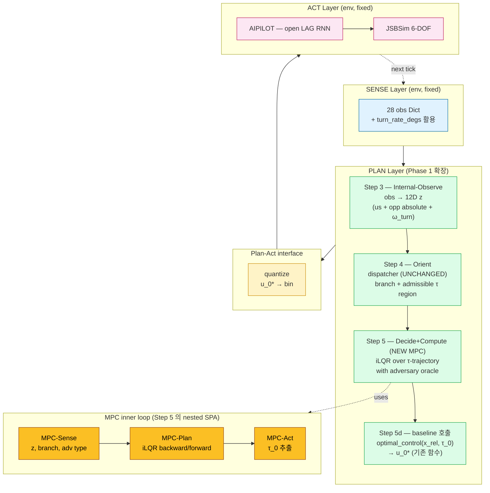
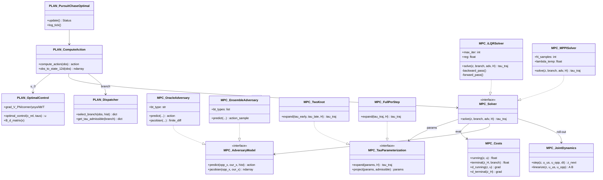
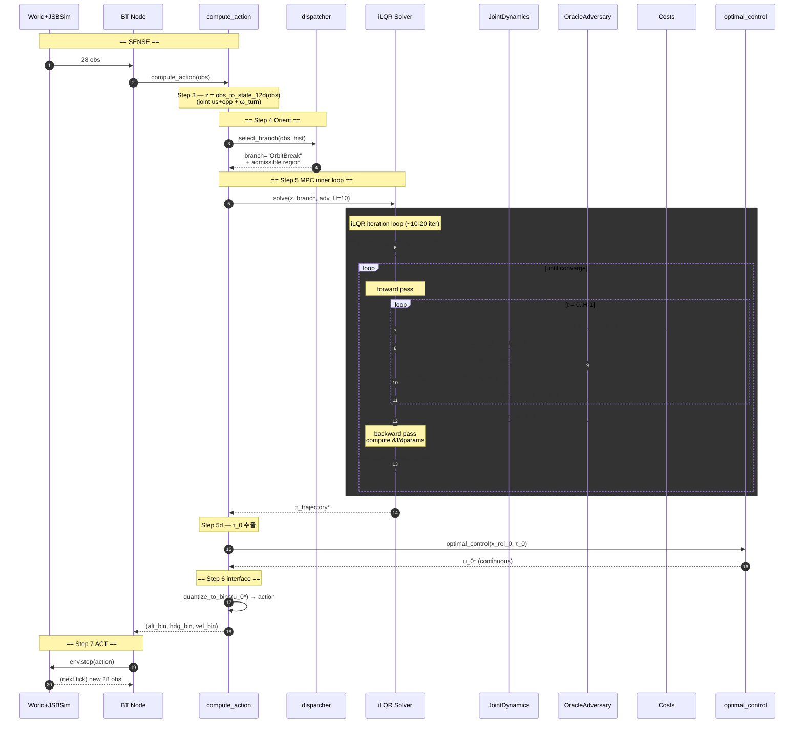
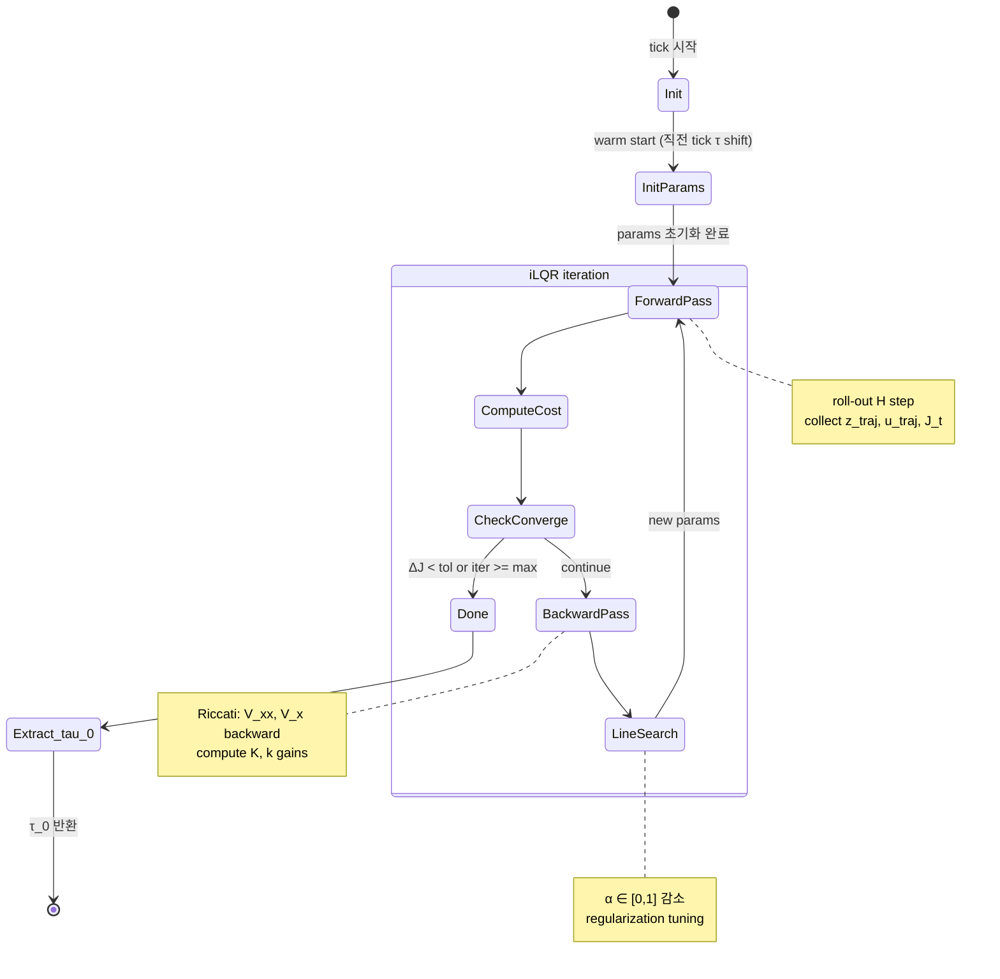
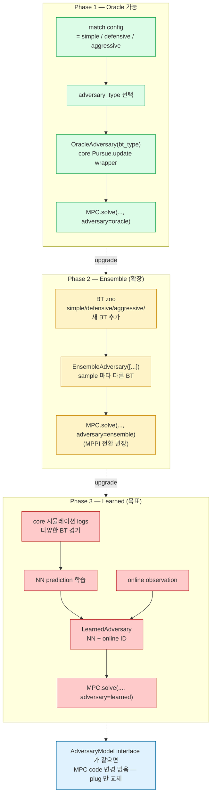
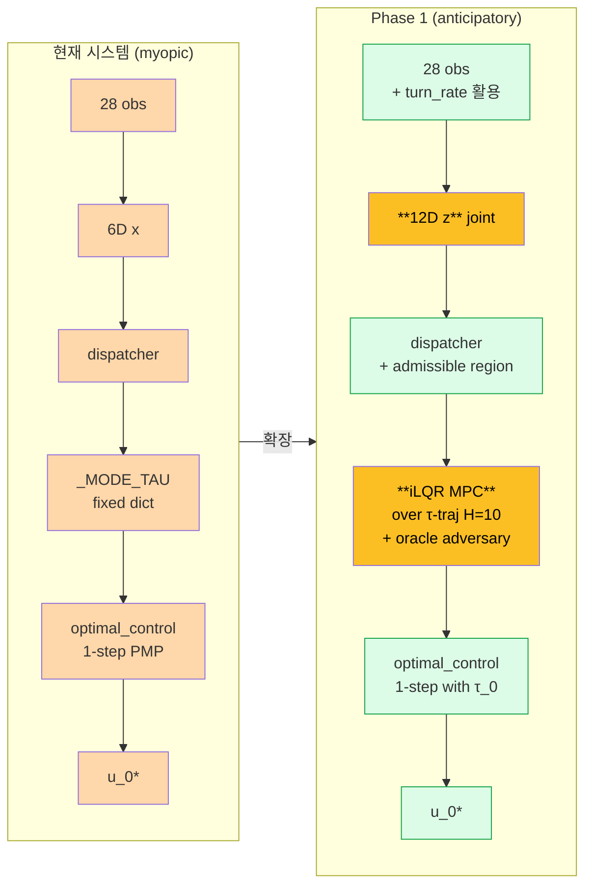

# Phase 1 — Bootstrap MPC 설계서 (oracle + iLQR + τ-trajectory)

> **목적**: Phase 1 (알려진 BT 대상 WIN 100%) 의 *전체 설계*. 코드 수정 시 *이 doc 만 보고도* 일관성 유지.
>
> **구조**: 학생doc / MODEL_UML.md 와 동일 형식 — Mermaid UML + SPA framework + 4부 식 상세.
>
> **선행 doc**:
> - `docs/MODEL_EXPLANATION_학생용.md` — 현재 시스템 학생용 설명서
> - `docs/MODEL_UML.md` — 현재 시스템 UML (8 diagram)
> - 본 doc = *현재 시스템의 Phase 1 확장 설계*

---

## 0부 — 핵심 개념 한 줄

> "**현재 PMP 1-step (myopic) → MPC trajectory (anticipatory)** 로 *Plan-Decide+Compute step 만* 교체. dispatcher / SPA pipeline / 자산 (∇V_i, B_d) *모두 보존*. 추가로 **state 6D → 12D 확장** (양쪽 absolute + turn_rate), **τ scalar → τ-trajectory** (시간 따라 변화), **adversary oracle (Phase 1 only) 사용해 빠른 bootstrap**."

---

## 1부 — Phase 1 의 범위

### 1.1 목적

| 항목 | 값 |
|---|---|
| 목표 매치 | simple 100%W + defensive 100%W + aggressive 100%W |
| adversary access | **ORACLE 허용** (core `Pursue.update` callback) — bootstrap 단계 |
| solver | **iLQR + adversary callback (D 패턴)** |
| 새 자산 | MPC inner loop, joint dynamics, adversary wrapper |
| 보존 자산 | dispatcher (전부), ∇V_i (전부), B_d, _MODE_TAU (admissible region 의 *중심*), quantize, AIPILOT |

### 1.2 비목적 (Phase 1 에서 *다루지 않음*)

- adversary 일반화 (Phase 3)
- BT zoo 확장 (Phase 2)
- end-to-end NN (out of scope)
- LeadPursuit / EnergyFight 등 신규 BFM 도구 (병행 가능, 별도)

### 1.3 성공 기준

1. 회귀 0 — 현재 시스템 (simple 12W/0L, defensive 3W/0L/3D) 최소 유지
2. **aggressive 매치에서 *한 번 이상* WIN** (현재 0W/0L/6D 의 첫 돌파)
3. tick 연산 < 50ms (BT 100ms tick 내 여유)
4. 코드 architecture 가 Phase 2/3 진화 시 *MPC 본체 수정 없이* adversary model 교체 가능

---

## 2부 — SPA framework 재정렬 (revised 2026-05-18)

### 2.1 Phase 1 SPA — *5 layer 구조* (3b, 4b NEW)

| Step | SPA | 현재 | Phase 1 |
|---|---|---|---|
| 1 | Sense | env → 28 obs dict | unchanged |
| 2 | (Plan-Goal) | 설계 시 분석 | unchanged |
| **3a** | **Plan-Internal-Observe (Raw)** | obs → 6D x | **obs → 12D z** (joint absolute + ω_turn) |
| **3b** | **Plan-Internal-Observe (Features)** | *(없음)* | **🆕 Layer 1/2/3 feature 추출** (relational + dynamic + semantic) |
| **4a** | **Plan-Orient (Safety)** | 모든 분기 혼재 | **축소: HardDeck / StallRecovery / ImmediateBreak (hard threshold OK, 물리 한계)** |
| **4b** | **Plan-Orient (Context)** | *(없음)* | **🆕 STRATEGIC CONTEXT (semantic 기반): Offensive/Defensive/Neutral/Engagement/Default → admissible τ region 결정** |
| **5** | **Plan-Decide+Compute (MPPI)** | optimal_control 1-step | **MPPI sample+weight+extract → τ_0 → optimal_control(x_rel, τ_0)** |
| 6 | interface | quantize | unchanged |
| 7 | Act | AIPILOT + JSBSim | unchanged |

→ **신규 = 3b, 4b, 5 전체. 4a 축소 (11→3). 나머지 보존.**

### 2.2 Dispatcher 와 MPPI 의 *책임 분리* (사용자 지적 2026-05-18 반영)

| layer | 입력 | 출력 | threshold |
|---|---|---|---|
| Step 4a (Safety) | raw obs | safety branch (3개) | **절대 OK** (alt<1200, V<200, enm_in_wez) — 물리/게임 한계 |
| Step 4b (Context) | semantic features | context (5개) → admissible region | **relational only** (semantic 가 이미 정규화) |
| Step 5 (MPPI) | z + admissible + history | τ-trajectory | **cost relational only**, sample prior semantic-biased |

→ 현재 11 branch 중 8 개 (GunEngagement/EnergyRecovery/LagPursuit/OffensivePursuit/OrbitBreak/ZoomClimb/AggressiveCloseMerge/BreakInduce) = **MPPI 로 흡수** (cost + prior 가 자연 표현). dispatcher 잔여 = SAFETY + CONTEXT.

### 2.2 Plan-Decide+Compute (Step 5) 의 *내부 SPA*

MPC 자체도 SPA 패턴:

| 내부 step | 역할 |
|---|---|
| 5a — *MPC-Sense* | joint state z, adversary identifier (Phase 1: 알려진 BT type) |
| 5b — *MPC-Plan* | iLQR backward Riccati pass + forward roll-out |
| 5c — *MPC-Act* (internal) | τ_0 추출 |
| 5d — *baseline 호출* | `optimal_control(x_rel, τ_0) → u_0*` (기존 함수 재사용) |

→ "MPC 안의 SPA" 가 외부 SPA 의 *Step 5 안에 nesting*. Tier 구조 = AV 표준 (Boss/Junior).

---

## 3부 — State 재설계 (6D → 12D) + 28 obs 직접 사용

### 3.1 ⚠️ 핵심 통찰 — *28 obs 양쪽 공유 = 추정 불요* (2026-05-17)

env 가 대칭 — 양쪽 비행기 동일 spec, **동일 28-key obs schema** 사용. 우리가 OUR obs 받을 때 *적이 보는 obs 도 schema 동일* (ego/enemy 역할만 swap). 추정/유추 step 불필요.

따라서 **MPC roll-out 의 *현재 step* 상태는 100% obs 에서 직접** — 우리가 짤 것 = *유도 변수* 와 *미래 step 의 dynamics*.

### 3.2 28 obs 분류 — *직접 사용 가능* vs *유도 필요*

#### A. 우리 side 직접 (ego_*)
| obs | 의미 | 직접 사용처 |
|---|---|---|
| `ego_altitude_ft` | h_us | state, cost (alt penalty), Es 도출 |
| `ego_vc_kts` | V_us | state, cost, Es 도출 |
| `ego_vx_kts`, `ego_vy_kts`, `ego_vz_kts` | body 좌표 속도 | 동역학 정밀 (Phase 1 옵션) |
| `roll_deg`, `pitch_deg` | 자세 | rolling-in transient (Phase 1 옵션) |
| `turn_rate_degs` | ω_us **(현재 미사용)** | state, transient dynamics |
| `specific_energy_ft` | Es_us 직접 | cost (energy term) — *유도 불요* |
| `ps_fts` | dEs/dt = sustained turn 가능성 | cost (running penalty) |

#### B. 상대/적 정보 (geometry + advantage)
| obs | 의미 | 직접 사용처 |
|---|---|---|
| `distance_ft` | 거리 | cost (D_us, D_them), dynamics 검증 |
| `ata_deg` | 우리 nose → 적 | cost (D_us 직접) |
| `aa_deg` | 적 nose → 우리 | cost (D_them 직접) |
| `hca_deg` | 헤딩 차이 = Δψ | state |
| `alt_gap_ft` | h_opp - h_us | opp h 도출 |
| `closure_rate_kts` | -d(dist)/dt | opp V 부분 도출 |
| `relative_bearing_deg` | 적 좌/우 | opp 위치 도출 |
| `energy_advantage` (bool) | Es_us > Es_opp | branch hysteresis |
| `energy_diff_ft` | Es_us - Es_opp | **opp Es 도출 = `Es_us - energy_diff`** — 유도 trivial |
| `alt_advantage` (bool) | h_us > h_opp | 보조 |
| `spd_advantage` (bool) | V_us > V_opp | 보조 |
| `enm_in_wez` (bool) | 적이 우리 사거리 진입 | dispatcher (이미 사용) |

#### C. 미사용 / 보조
| obs | 의미 | 사용 |
|---|---|---|
| `tau_deg`, `ata_lead_deg`, `tau_lead_deg` | Lead pursuit aim | LeadPursuit BFM 도입 시 |
| `in_39_line`, `tc_type`, `side_flag`, `overshoot_risk` | 보조 분류 | dispatcher 일부 사용 |

### 3.3 *유도* 필요한 것 — 3-layer feature 추출 (revised 2026-05-18)

핵심 원칙: **event = 관측값 변화 (아군 - 적군 상태 *차이* 의 변화). 의미는 *함수* 가 추출** — 절대 threshold 금지.

#### Layer 1 — Relational features (양쪽 *차이*)
| feature | 공식 | 의미 |
|---|---|---|
| `Es_us` | `h_us + V_us²/(2g)` | 우리 에너지 |
| `Es_opp` | `Es_us - energy_diff_ft` (obs 직접) | 적 에너지 |
| `Es_advantage` | `Es_us - Es_opp` | 에너지 우위 |
| `h_opp` | `ego_altitude_ft + alt_gap_ft` | opp 위치 |
| `V_opp` | `√(2g·(Es_opp - h_opp))` ← Es 기반 정확 | opp 속도 |
| `omega_advantage` | `\|ω_us\| - \|ω_opp\|` | 선회율 우위 |
| `R_us / R_opp` | `V/max(\|ω\|,ε)` | 선회반경 |
| `R_advantage` | `R_opp - R_us` | inside 우위 (1-circle) |
| `positional_advantage` | `aa_deg - ata_deg` | 위치 우위 (우리가 적 6시 쪽) |
| `damage_rate_us/opp` | `wez_damage_rate(ata/aa, dist)` | 데미지 |

#### Layer 2 — Dynamic features (시간 미분)
| feature | 공식 | 의미 |
|---|---|---|
| `d(Es_advantage)/dt` | finite diff over history | 에너지 우위 변화율 |
| `d(positional_advantage)/dt` | 동일 | 위치 우위 swing 속도 |
| `d(omega_advantage)/dt` | 동일 | 선회 격차 변화 |
| `d²(closure)/dt²` | 2차 미분 | closure 가속도 |

#### Layer 3 — Semantic features (의미 추출 함수, sigmoid [0,1])
| 함수 | 의미 |
|---|---|
| `is_energy_race_losing(history)` | 우리 에너지 우위 감소중인가 |
| `is_parallel_chase_forming(history)` | turn rate 격차 수렴중 (락 형성) |
| `is_position_swinging_to_us(history)` | 위치 우위 우리쪽 swing 중 |
| `opp_committed_to_turn(history)` | 적이 turn maneuver 에 commit (break 어려움) |
| `merge_window_opening(history)` | merge 진입 중 (closing + aligning) |
| `is_inside_us(history)` | 1-circle inside 위치 잡힘 |

→ **모든 feature = relational + history 기반 + 정규화**. *절대 threshold 0 개*.

→ 유도 = 사칙연산 + 기존 `wez_damage_rate` + finite diff. 추정 step 0.

### 3.4 새 state vector — *결정*

**12D z (per-side 6D × 2)**:
```
z = (x_us, x_opp)
x_us  = (x, y, h, ψ, V, ω_turn)
x_opp = (x, y, h, ψ, V, ω_turn)
```

**모든 초기값 = 28 obs 직접 또는 trivial 도출**:
| state | 초기값 출처 |
|---|---|
| `x_us, y_us` | (0, 0) 우리 좌표계 origin |
| `h_us` | `ego_altitude_ft` 직접 |
| `ψ_us` | (0 또는 obs 절대 heading; 우리 frame 0 으로) |
| `V_us` | `ego_vc_kts` 직접 |
| `ω_us` | **`turn_rate_degs` 직접** (NEW) |
| `x_opp, y_opp` | `dist · sin/cos(relative_bearing)` (이미 obs_to_state_6d 와 동일) |
| `h_opp` | `ego_altitude_ft + alt_gap_ft` |
| `ψ_opp` | `ψ_us + hca_deg` |
| `V_opp` | `√(2g·(Es_us - energy_diff_ft - h_opp))` ← Boyd 정확 |
| `ω_opp` | **모름** — Phase 1: 가정 (0 또는 V_opp/turn_radius_assumed). Phase 2: online ID |

→ **ω_opp 유일하게 직접 도출 안 됨**. Phase 1 가정: 적 ω = 0 (current state, instantaneous). MPC roll-out 에서 적 BT 가 명령 → ω 갱신.

**Es 는 state 가 *아닌* derived** (h+V²/(2g)) — state 자유도 최소화 위해.

### 3.3 6D vs 12D 비교

| 측면 | 현재 6D | Phase 1 12D |
|---|---|---|
| 변수 | Δx, Δy, Δh, Δψ, V_p, V_e | x,y,h,ψ,V,ω × 양쪽 |
| V_e 출처 | closure 추정 (오차 큼) | *직접* 계산 |
| 적 정보 정확도 | 부정확 (clamp [160,480]) | obs 의 적 정보로 *정확* |
| 회전 transient | 무시 (instant) | ω_turn 으로 *모델링* |
| Es 도출 | 불가 | *trivial* (h + V²/(2g)) |
| iLQR Jacobian | 6×3 | 12×6 (양쪽 u 각 3) |
| 기존 ∇V_i | *직접* 사용 (6D) | *상대 6D 도출* 후 사용 |
| LUT V6d_wez_v3.npz | *그대로* 사용 가능 | 동일 |

→ **기존 6D 자산 *재사용 가능* (z → relative 6D 변환만)**. 12D 는 *roll-out + cost 용*.

### 3.4 추가 obs 직접 사용

학생doc 4.6 의 "MPC 필수 obs" 와 정합:

| obs | 사용처 |
|---|---|
| distance_ft | dist 계산 검증 (z 도출 cross-check) |
| ata_deg / aa_deg | running cost (D_us, D_them) |
| hca_deg | Δψ 검증 |
| alt_gap_ft | Δh 검증 |
| closure_rate_kts | adversary V_opp 초기 추정 |
| ego_vc_kts | V_us 직접 |
| ego_altitude_ft | h_us 직접 |
| **turn_rate_degs** | **ω_us 직접** (NEW — 4.2 fix) |
| **roll_deg** | 옵션: ω 변화율 가정 정밀화 (Phase 2+) |
| **ps_fts** | running cost 의 energy penalty |
| **energy_advantage** | branch hysteresis (옵션) |

---

## 4부 — τ-trajectory parameterization

### 4.1 결정 변수

```
τ-trajectory = [τ_0, τ_1, ..., τ_{H-1}]
                각 τ_t ∈ Δ^k = (τ_pn, τ_corner, τ_yoyo, τ_ldt, τ_T)
                ∈ simplex (각 ≥ 0, Σ ≤ 1)
```

**H (horizon)**: 10 step × dt=0.1s = **1초 lookahead** (Phase 1 기본).

### 4.2 parameterization 옵션 — *adversary discrete switching 반영* (revised 2026-05-18)

핵심 통찰: **adversary BT 는 obs threshold 기반 *불연속 분기 switching***. 우리 τ-trajectory 도 *불연속 switch* 가능해야 — 부드러운 interp 만으론 적의 *abrupt mode change* 추종 못 함.

| 옵션 | DoF | 설명 | Phase 1 추천 |
|---|---|---|---|
| (a) constant τ | k=4 | 1-knot, 모든 t 동일 | ❌ |
| (b) 2-knot linear interp | 2k=8 | smooth ramp 만 | ⚠️ smooth-only, discrete 표현 X |
| **(c) N=3 segment piecewise-constant** | 3k+2=14 | τ_seg1 / τ_seg2 / τ_seg3 + 2 switch_time | **★ Phase 1** — adversary threshold crossing 시 *우리도 abrupt switch* 가능 |
| (d) full per-step | kH=40 | 자유 | MPPI graduation 시 |

### 4.3 Phase 1 — *piecewise-constant 3-segment* 상세

```
τ-trajectory = [τ_seg1] * n1 + [τ_seg2] * n2 + [τ_seg3] * (H - n1 - n2)
                ↑
            decision variables:
              (τ_seg1, τ_seg2, τ_seg3) ∈ admissible^3   (12 dim)
              (n1, n2) ∈ {1..H-2}^2                       (2 int, 또는 continuous switch time)
```

**왜 *3* segment?**
- 1: constant 와 동일 (의미 없음)
- 2: 1 switch — 사용자 시나리오 "turn → pursue" 표현 가능
- **3**: 2 switch — "ramp → max → recovery" 또는 "approach → turn → re-engage" 같은 *3-phase 시퀀스* 표현. 실전 BFM 의 *전형 패턴*.
- 4+: DoF 폭증, MPPI sample 비효율

**MPPI 가 자연 처리**:
- segment 경계 (switch_time) 도 sample variable
- 각 sample 마다 다른 switching schedule
- 결과: *event-triggered switching 가 emergent*. 적이 *threshold crossing 직후* 우리가 *abrupt 전환* 하는 sample 이 cost 낮음 → MPPI 가 자동 선택.

**예시 sample**:
| sample | τ_seg1 (0~?s) | switch_1 (s) | τ_seg2 | switch_2 (s) | τ_seg3 |
|---|---|---|---|---|---|
| #1 (gradual ramp) | corner:0.4,pn:0.6 | 0.3 | corner:0.7,pn:0.3 | 0.7 | corner:0.9,pn:0.1 |
| #2 (abrupt turn) | pn:1.0 | 0.2 | corner:1.0 | 0.8 | pn:1.0 |
| #3 (사용자 break point) | corner:0.7,pn:0.3 | 0.5 | corner:0.2,pn:0.8 | 1.0 | (없음) |
| ... | ... | ... | ... | ... | ... |

→ N=64 sample 중 다양 schedule. cost 평가 후 최적 *τ_0 만 적용*. 다음 tick 재계산.

### 4.4 admissible region — *각 segment 독립*

```python
TAU_ADMISSIBLE = {
    "OrbitBreak": {
        "pn":     (0.0, 1.0),    # full range 허용
        "corner": (0.0, 1.0),
        # 합 ≤ 1 (simplex)
    },
    # 각 segment 마다 위 admissible 안에서 *독립* sample
    # 회귀 안전: prior 중심 = _MODE_TAU[branch] (현재 dict)
}
```

→ 현재 `_MODE_TAU` 가 *MPPI prior 의 중심* — *최악 case 회귀 0 보장*.

### 4.3 admissible region

각 dispatcher branch 가 τ 검색 영역 정의:

```python
TAU_ADMISSIBLE = {
    "GunEngagement":      {"pn": (0.5, 1.0), "T": (0.0, 0.5)},
    "OffensivePursuit":   {"pn": (0.3, 0.9), "T": (0.1, 0.7)},
    "EnergyRecovery":     {"corner": (0.7, 1.0), "pn": (0.0, 0.3)},
    "LagPursuit":         {"ldt": (0.7, 1.0), "pn": (0.0, 0.3)},
    "OrbitBreak":         {"pn": (0.2, 0.8), "corner": (0.2, 0.8)},
    "TheoremAdaptive":    {"pn": (0.0, 0.6), "corner": (0.0, 0.6),
                           "yoyo": (0.0, 0.3), "ldt": (0.0, 0.3)},
    # 안전 분기 (HardDeck, DefensiveBreak, ZoomClimb): MPC 우회, heuristic 유지
}
```

→ **현재 `_MODE_TAU` 값 = admissible region 의 *중심점*** = MPC iLQR 의 *초기 추정 (warm start)*. *회귀 0 보장*.

---

## 5부 — UML 다이어그램

> 모든 diagram = Mermaid, v9.4 ~ v11 호환. 색 코드 = MODEL_UML.md 와 동일.

### 5.1 SPA Overview — Phase 1 (MPC 추가)



→ **노랑 = MPC inner loop** (신규). Plan layer 의 *Step 5 안에 nesting*.

### 5.2 Class Diagram — Phase 1 신규 모듈



> **추상화 원칙**: `MPC_Solver`, `MPC_AdversaryModel`, `MPC_TauParameterization` 모두 *interface*. **Phase 2/3 진화 시 구현체만 교체, `compute_action` 코드 *불변***.

### 5.3 Sequence Diagram — 한 BT tick (MPC 통합)



→ MPC inner = **빨강 영역 (10-20 iter loop)**. 각 iter 마다 H=10 step roll-out. 총 ~200 evaluations / tick.

### 5.4 State Diagram — iLQR 수렴



### 5.5 Data Flow — 28 obs → 12D z → MPC → u_0*

```mermaid
flowchart LR
    subgraph S["SENSE — 28 obs"]
        direction TB
        O1[distance_ft, ata, aa, hca]
        O2[ego_altitude, ego_vc]
        O3[alt_gap, closure]
        O4[**turn_rate_degs (NEW)**]
        O5[ps_fts, energy_advantage]
        O6[적 추정: V_e, ψ_e]
    end

    subgraph EXT["Step 3 — z 합성 (12D)"]
        direction TB
        Z_US[x_us = obs 직접<br/>+ turn_rate]
        Z_OPP[x_opp = derived<br/>(closure + heading)]
        Z[joint z ∈ ℝ¹²]
        Z_US --> Z
        Z_OPP --> Z
    end

    subgraph DISP["Step 4 — dispatcher"]
        B[branch + admissible]
    end

    subgraph MPC["Step 5 — MPC iLQR"]
        direction TB
        ROLL[H-step roll-out<br/>+ adversary oracle]
        SOLVE[iLQR converge]
        TAU[τ-trajectory*]
        ROLL --> SOLVE --> TAU
    end

    subgraph EXEC["Step 5d — baseline 실행"]
        OC[optimal_control(x_rel, τ_0)]
        U[u_0* continuous]
        OC --> U
    end

    subgraph QUANT["Step 6 — quantize"]
        BIN[(alt, hdg, vel) bin]
    end

    O1 --> Z_OPP
    O2 --> Z_US
    O3 --> Z_OPP
    O4 --> Z_US
    O5 -.cost 보강.-> MPC
    O6 --> Z_OPP

    Z --> DISP
    Z --> MPC
    B --> MPC
    TAU --> OC
    Z --> OC
    U --> BIN

    classDef sense fill:#E0F2FE
    classDef ext fill:#DCFCE7
    classDef mpc fill:#FBBF24,color:#000
    classDef intf fill:#FEF3C7
    class O1,O2,O3,O4,O5,O6 sense
    class Z_US,Z_OPP,Z ext
    class ROLL,SOLVE,TAU mpc
    class BIN intf
```

→ **노랑 MPC** 가 *새로운 layer*. 보라색 (`turn_rate_degs`) = *4.2 user comment 의 해결*.

### 5.6 Adversary Oracle 통합 — Phase 1 패턴



→ **녹 = Phase 1, 노 = Phase 2, 적 = Phase 3**. **interface 동일 → MPC 본체 *불변***.

### 5.7 τ-trajectory parameterization

```mermaid
flowchart TB
    subgraph V1["옵션 (a) constant τ — *현재*"]
        direction LR
        C1[τ = _MODE_TAU branch]
        C2[t=0..H-1 모두 동일]
        C1 --> C2
    end

    subgraph V2["옵션 (b) 2-knot — **Phase 1 시작**"]
        direction LR
        K1[τ_early]
        K2[τ_late]
        Interp[t in 0..5: linear interp<br/>t in 6..9: hold τ_late]
        K1 --> Interp
        K2 --> Interp
    end

    subgraph V3["옵션 (c) 3-knot — Phase 1 graduation"]
        direction LR
        K1c[τ_0]
        K2c[τ_mid]
        K3c[τ_late]
        Interp2[piecewise linear]
        K1c --> Interp2
        K2c --> Interp2
        K3c --> Interp2
    end

    subgraph V4["옵션 (d) full per-step — iLQR 자연"]
        direction LR
        F1[τ_0, τ_1, ..., τ_{H-1}]
        F2[전부 자유, iLQR 가 직접 결정]
        F1 --> F2
    end

    V1 -.Phase 1 시작.-> V2
    V2 -.graduate.-> V3
    V3 -.iLQR mature.-> V4

    classDef current fill:#FED7AA
    classDef start fill:#FBBF24,color:#000
    classDef next fill:#86EFAC,color:#000
    classDef future fill:#BBF7D0,color:#000
    class C1,C2 current
    class K1,K2,Interp start
    class K1c,K2c,K3c,Interp2 next
    class F1,F2 future
```

### 5.8 Phase 1 vs 현재 시스템 비교



→ 노랑 = *Phase 1 의 신규 layer* (12D state + MPC). 나머지 보존.

---

## 6부 — 코드 구조

> ⚠️ **설계 → 구현 deviation (2026-05-20)**: 본 §6.1 은 *원 설계*. 실제 구현은 **§11 (구현 완료 현황)** 참조. 핵심 차이:
> - solver: iLQR → **MPPI** (δ 결정 변경 — discrete adversary)
> - tau_param: two_knot → **piecewise_constant 3-segment** (γ 결정 변경)
> - dispatcher: `branch_dispatcher.py` 수정 → **`branch_dispatcher_v2.py` 신규** (기존 v1 보존, 회귀 안전)
> - integration: `MPC_BRANCHES` whitelist → **env var `PURSUIT_POLICY_MODE=mpc`** 전체 활성

### 6.1 신규 / 수정 파일 (원 설계 — 실제는 §11)

```
examples/pursuit_chase_v1/
├── nodes/
│   ├── continuous_policy.py          [MODIFY] compute_action 에 MPC wire
│   ├── branch_dispatcher.py          [MODIFY] get_tau_admissible() 추가
│   └── custom_actions.py             [unchanged]
│
├── mpc/                              [NEW directory]
│   ├── __init__.py
│   ├── interfaces.py                 [NEW] AdversaryModel, MPCSolver, TauParameterization
│   ├── state.py                      [NEW] obs_to_state_12d, z_to_relative_6d
│   ├── features.py                   [NEW] Layer 1/2/3 feature 추출 (relational + semantic)
│   ├── joint_dynamics.py             [NEW] joint_step, linearize
│   ├── costs.py                      [NEW] running, terminal (fully relational, no abs threshold)
│   │
│   ├── adversary/
│   │   ├── __init__.py
│   │   ├── oracle.py                 [NEW] OracleAdversary (Phase 1)
│   │   ├── ensemble.py               [Phase 2]
│   │   └── learned.py                [Phase 3]
│   │
│   ├── solvers/
│   │   ├── __init__.py
│   │   ├── ilqr.py                   [NEW] iLQRSolver (Phase 1)
│   │   └── mppi.py                   [Phase 2]
│   │
│   └── tau_param/
│       ├── __init__.py
│       ├── two_knot.py               [NEW] TwoKnot parameterization
│       └── full_per_step.py          [Phase 1 graduation]
│
└── tests/
    └── mpc/
        ├── test_state.py             [NEW]
        ├── test_joint_dynamics.py    [NEW]
        ├── test_oracle_adversary.py  [NEW]
        ├── test_costs.py             [NEW]
        ├── test_ilqr.py              [NEW]
        └── test_integration.py       [NEW]
```

### 6.2 통합 지점 — `compute_action()`

```python
# examples/pursuit_chase_v1/nodes/continuous_policy.py 수정

from mpc.state import obs_to_state_12d, z_to_relative_6d
from mpc.adversary.oracle import OracleAdversary
from mpc.solvers.ilqr import iLQRSolver
from mpc.tau_param.two_knot import TwoKnot

# 모듈-수준 singleton (re-init 비용 회피)
_MPC_SOLVER = None
_ADVERSARY_CACHE = {}

def _get_adversary(bt_type: str):
    if bt_type not in _ADVERSARY_CACHE:
        _ADVERSARY_CACHE[bt_type] = OracleAdversary(bt_type)
    return _ADVERSARY_CACHE[bt_type]

def _get_solver():
    global _MPC_SOLVER
    if _MPC_SOLVER is None:
        _MPC_SOLVER = iLQRSolver(
            tau_param=TwoKnot(H=10),
            max_iter=15, reg_init=1e-3
        )
    return _MPC_SOLVER

def compute_action(obs, obs_prev=None, alt_ft=None, obs_history=None, prev_branch=""):
    # ... 기존 코드 ...
    
    # Step 3 (확장)
    x_rel = obs_to_state_6d(obs)       # 기존 (∇V 호환용)
    z = obs_to_state_12d(obs)          # NEW (MPC 용)
    
    # Step 4 (UNCHANGED)
    branch_info = select_branch(obs, alt_ft, prev_branch=prev_branch, obs_history=obs_history)
    branch = branch_info["branch"]
    
    # Step 5 (NEW MPC for whitelisted branches)
    MPC_BRANCHES = {"OrbitBreak", "OffensivePursuit", "TheoremAdaptive"}   # Phase 1 점진
    if branch in MPC_BRANCHES:
        # MPC 경로
        bt_type = os.environ.get("ADVERSARY_BT_TYPE", "aggressive")        # 매치 시작 시 set
        adversary = _get_adversary(bt_type)
        solver = _get_solver()
        admissible = get_tau_admissible(branch)
        try:
            tau_traj = solver.solve(z, branch, adversary, admissible, H=10)
            tau_0 = tau_traj[0]
            u_star, info = optimal_control(x_rel, tau_0, alt_ft=alt_ft)
            info["mode"] = f"mpc:{branch}"
            info["tau_traj"] = tau_traj.tolist()
            info["mpc_iters"] = solver.last_iter_count
        except Exception as e:
            # fallback to fixed dict (회귀 0 보장)
            u_star, info = optimal_control(x_rel, _MODE_TAU[branch], alt_ft=alt_ft)
            info["mode"] = f"mpc-fallback:{branch}"
            info["mpc_error"] = str(e)
    else:
        # 기존 경로 (HardDeck, DefensiveBreak 등 안전 분기)
        # ... unchanged ...
    
    # Step 6 (UNCHANGED)
    return quantize_to_bins(u_star, V_p, alt_ft), info
```

### 6.3 핵심 인터페이스 (interfaces.py)

```python
from typing import Protocol, Optional
import numpy as np

class AdversaryModel(Protocol):
    def predict(self, opp_x: np.ndarray, our_x: np.ndarray,
                history: Optional[list] = None) -> np.ndarray:
        """opp_x: 6D, our_x: 6D, returns opp_u: 3D continuous."""
        ...
    def jacobian(self, opp_x: np.ndarray, our_x: np.ndarray
                 ) -> Optional[np.ndarray]:
        """∂opp_u/∂our_x, ∂opp_u/∂opp_x. None if not differentiable."""
        ...

class TauParameterization(Protocol):
    H: int
    n_params: int
    def expand(self, params: np.ndarray) -> np.ndarray:
        """params (n_params,) → τ_traj (H, k)."""
        ...
    def project(self, params: np.ndarray, admissible: dict) -> np.ndarray:
        """admissible region 으로 clipping/projection."""
        ...

class MPCSolver(Protocol):
    def solve(self, z: np.ndarray, branch: str,
              adversary: AdversaryModel,
              admissible: dict, H: int = 10) -> np.ndarray:
        """returns τ-trajectory ∈ (H, k)."""
        ...
```

---

## 7부 — 구현 순서 (5 phase)

| step | 작업 | 검증 | 일정 |
|---|---|---|---|
| **1** | `interfaces.py` + 단위테스트 (mock) | type check 만 | 반나절 |
| **2** | `state.py` (`obs_to_state_12d`) + `z_to_relative_6d` (z → 기존 6D round-trip) | 기존 6D 일치 검증 | 반나절 |
| **3** | `joint_dynamics.py` (양쪽 6D ODE 결합) + linearize | 단일 step roll-out vs simulator 비교 | 1일 |
| **4** | `adversary/oracle.py` (core `Pursue.update` wrapper, 3 BT type) | core 시뮬과 동일 action 출력 확인 | 1일 |
| **5** | `costs.py` (running + terminal + gradients) | numerical vs analytic gradient 일치 | 반나절 |
| **6** | `tau_param/two_knot.py` (expand + project) | admissible 영역 내 보장 | 반나절 |
| **7** | `solvers/ilqr.py` (backward Riccati + forward + line search) | 간단 LQR (∇V_PN only) 수렴 검증 | 2-3일 |
| **8** | `compute_action` wire + OrbitBreak 만 enable | 회귀 0 (simple/defensive 유지) + aggressive 1+W | 1-2일 |
| **9** | 다른 branch 점진 enable (OffensivePursuit → TheoremAdaptive) | 각 단계 회귀 0 | 1주 |

→ **총 ~3주 work-week**. step 8 가 *진짜 검증* — Phase 1 성공/실패 기준.

---

## 8부 — 결정 *확정* (no more questions — 모두 1차 결정, 측정 데이터로 추후 튜닝)

| # | 결정 | **확정값** | 근거 |
|---|---|---|---|
| α | **H (horizon)** | **10 step (1.0s)** | 적 BT 1초 내 분기 변경 적은 게 일반적, lookahead 충분 |
| β | **dt** | **0.1s** | BT tick 일치, sub-sample 복잡도 회피 |
| γ | **τ parameterization** | **piecewise-constant N=3 segment** (revised 2026-05-18) | adversary BT *discrete switching* 자연 표현 — *event-triggered switch* 가능. linear interp 보다 *threshold-매칭* 직관 |
| δ | **solver** (revised 2026-05-18) | **MPPI primary, iLQR 은 Phase 2+ graduation** | adversary BT 가 *if-else 불연속* → iLQR jacobian threshold 근처 fragile. MPPI 는 sample 기반, 불연속 자연 처리. iLQR 의 *진짜 강점* (smooth gradient) 이 우리 문제에서 *역으로 단점* |
| δ' | **MPPI hyperparams** | **N=64 sample, λ_temp=0.1, σ_τ=0.15** | 64 sample × H=10 = 640 eval × ~50μs = ~32ms ✅ |
| δ'' | **iLQR max_iter** (graduation) | **15** | Phase 2+ adversary smooth (learned NN) 시 도입 |
| ε | **MPC 적용 branch** | **whitelist: OrbitBreak → OffensivePursuit → TheoremAdaptive** | OrbitBreak 가 aggressive 매치 핵심 |
| ζ | **회귀 안전 fallback** | **try-except + fixed `_MODE_TAU[branch]`** | 검증 안 끝난 코드 안전망 |
| η | **adversary BT type** | **env var `ADVERSARY_BT_TYPE` (Phase 1 only)** | 매치 시작 시 set, 단순 |
| θ | **state 차원** | **12D (per-side 6D × 2)** | 28 obs 직접 매핑 가능, Es 는 derived |
| ι | **cost 구조 (revised 2026-05-18)** | **FULLY RELATIONAL — 모든 performance 항 = 양쪽 quantity 의 *차이/우위/변화율*.** 절대 threshold 금지 (적 무관 overfit 함정 회피). hard safety (V_STALL, HARD_DECK) 만 예외. *상세는 4부 cost 정의* | 사용자 통찰 (2026-05-18): 절대 threshold cost = 적 BT 의 실패 mode 그대로 재현. relational cost = *적이 누구든* 다른 적절 행동 유도 |
| ι' | **cost weights 1차값** | **λ_D=1.0, λ_E_rel=0.3, λ_W_rel=0.2, λ_POS=0.1, λ_CLOSURE=0.05, λ_U_JERK=0.1, SAFETY_BIG=100** | 측정 후 튜닝. relational 표현 외 *절대값 cost 항 추가 금지* |
| κ | **warm start** | **prev tick τ shift + (실패 시) `_MODE_TAU` center** | 시간 일관성 + 안전 fallback |
| λ | **opp ω 가정 (모르는 유일 변수)** | **현재 ω_opp = 0 가정, BT 명령으로 t>0 업데이트** | 가장 보수적, 측정 후 정밀화 |
| μ | **opp V 추정** | **Es 기반: `√(2g(Es_us-energy_diff-h_opp))`** | closure 기반보다 정확 (closure noise 회피) |
| ν | **τ admissible region** | **3부 4.3 표** (각 branch 별 box) | 현재 `_MODE_TAU` 중심 ±0.3 폭 |

→ **모든 값 1차 결정 완료. 측정 후 튜닝.** 더 이상 결정 묻지 않음.

---

## 9부 — 호환성 / 회귀 안전 보장

1. **MPC 우회 분기** (HardDeck, DefensiveBreak, BreakInduce, TurnAround, ZoomClimb): MPC 미적용 — 안전 heuristic 유지
2. **MPC 적용 분기**: try-except fallback — exception 시 기존 `_MODE_TAU[branch]` 사용 (= 현재 동작)
3. **admissible region 의 *중심* = `_MODE_TAU[branch]`** — iLQR 가 *최악 case 에도* 현재 dict 와 동일 τ 가능 → 회귀 0 보장
4. **단위테스트**: 각 모듈 독립 검증 + 통합 테스트 = 기존 simple/defensive 매치 결과 유지 확인

---

## 9.5부 — Z3 Reachability 검증 (NEW 2026-05-18)

### 9.5.1 목적
각 semantic event 가 *실제로 도달 가능*한지 SMT 로 증명. RT-3 의 H1 lemma 와 동일 framework 확장.

### 9.5.2 검증 시나리오 (Phase 1)

| # | Event | 검증 질문 | 기대 |
|---|---|---|---|
| Z1 | `is_parallel_chase_forming` | aggressive IC → H=10 도달? | SAT |
| Z2 | `merge_window_opening` | corner mode 유지 시 → 도달? | SAT + witness |
| Z3 | `is_energy_race_losing` | corner-only 우리 + 적 Pursue → 필연? | SAT |
| Z4 | `is_position_swinging_to_us` | OrbitBreak 진입 후 *최선의 τ* 로 도달? | **SAT 면 OK, UNSAT 면 LeadPursuit 필수 증명** |
| Z5 | `opp_committed_to_turn` | adversary class Pursue 가 H step turn 유지 case? | SAT |
| Z6 | OffensiveContext branch | aggressive 매치 어느 시점이든 reachable? | **CRITICAL: UNSAT 면 parallel-chase 본질 증명** |

### 9.5.3 결과 활용
| 결과 | 의미 | 대응 |
|---|---|---|
| 모든 SAT | Phase 1 setup 충분 | 진행 |
| 일부 UNSAT | 그 event 현재 BFM mode set 으론 불가 | LeadPursuit / EnergyFight 등 신규 BFM 추가 |
| UNKNOWN | 비선형 dynamics 폭주 | H=3 부터 단계적 |
| witness trajectory | unit test 자산 | regression test 직접 사용 |

### 9.5.4 구현 위치
`tools/verify/phase1_reachability.py` (신규) — RT-3 의 `tools/verify/h1_smt_proof.py` 와 동일 스타일.

### 9.5.5 실행 시점
**Phase 1 step 4 (`mpc/adversary/oracle.py`) 완료 직후**. adversary dynamics 인코딩이 reachability 인코딩과 공유. Step 8 검증 *전* 에 dead event 제거.

---

## 10부 — 이후 phase 진화 path

| Phase | 변경 | 비변경 |
|---|---|---|
| 1 → 2a | `OracleAdversary(simple)` → `OracleAdversary(new_BT)` | MPC / iLQR / state / interface |
| 2a → 2b | `OracleAdversary` → `EnsembleAdversary` | state / interface |
| 2b → 2c (선택) | `iLQRSolver` → `MPPISolver` | interface (solver interface 동일) |
| 2 → 3 | `OracleAdversary` → `LearnedAdversary` (NN + online ID) | MPC / solver / state |

→ **interface 가 *제대로* 설계되면, Phase 1 코드의 *80%+ 가 Phase 3 까지 보존***.

---

## 부록 A — 용어 정의

| 용어 | 정의 |
|---|---|
| **myopic** | 1-step lookahead, 미래 무시 |
| **anticipatory** | H-step lookahead, 미래 시뮬 |
| **oracle adversary** | 적의 정확한 결정 함수 호출 가능 (white-box) |
| **MPC** | Model Predictive Control = 매 tick H-step optimize, τ_0 만 적용, 다음 tick 재 plan |
| **iLQR** | iterative LQR — 비선형 trajectory optimization 의 표준 |
| **τ-trajectory** | mode weight vector 의 시간 시퀀스 |
| **admissible region** | branch 별 τ 검색 영역 |
| **warm start** | 직전 tick 의 해를 초기 추정으로 사용 |
| **Phase 1/2/3** | bootstrap / curriculum / generalization 단계 |

---

## 부록 B — 변경 audit

| 변경 | 파일 | 영향 |
|---|---|---|
| state 6D → 12D 추가 | `mpc/state.py` (new) | 기존 6D 변환 함수 *유지*, 12D 가 superset |
| τ scalar → trajectory | `mpc/tau_param/*.py` (new) | 기존 `_MODE_TAU` *admissible 중심* 으로 재정의 |
| `optimal_control` | unchanged | τ_0 받아 동일 동작 |
| dispatcher | `get_tau_admissible()` 추가만 | 기존 `select_branch` 변경 없음 |
| `compute_action` | MPC wire + try-except fallback | MPC 우회 분기 기존 코드 *그대로* |

---

*Phase 1 설계서 끝. step 1-7 구현 후 step 8 (OrbitBreak enable) 결과로 Phase 1 성공 판정.*

---

## 11부 — 구현 완료 현황 (2026-05-20)

### 11.1 실제 산출 파일 (12 파일, ~1,200 줄)

| 파일 | 역할 | 라인 | self-test |
|---|---|---|---|
| `mpc/__init__.py` | 패키지 doc | 18 | — |
| `mpc/interfaces.py` | Protocol 4종 (AdversaryModel, FeatureExtractor, TauParameterization, MPCSolver) | 130 | — |
| `mpc/state.py` | `obs_to_state_12d`, `z_to_relative_6d`, Es/R/geometry 도출 | 165 | ✅ PASS |
| `mpc/features.py` | Layer 1/2/3 추출 (`DefaultFeatureExtractor`) | 200 | ✅ PASS |
| `mpc/joint_dynamics.py` | `per_side_step`, `joint_step`, `rollout` (ω first-order lag) | 130 | ✅ PASS |
| `mpc/adversary/oracle.py` | `OracleAdversary` — core Pursue.update *순수 함수* 재현 | 220 | ✅ PASS |
| `mpc/costs.py` | `running_cost`, `terminal_cost`, `damage_rate` (fully relational) | 165 | ✅ PASS |
| `mpc/tau_param/piecewise_constant.py` | `PiecewiseConstant3Segment` (expand/project/sample/shift) | 150 | ✅ PASS |
| `mpc/solvers/mppi.py` | `MPPISolver` (sample→simulate→weight→update) | 200 | ✅ PASS |
| `nodes/branch_dispatcher_v2.py` | 3 SAFETY + 5 CONTEXT, `select_branch_v2`, `SAFETY_CMD` | 200 | ✅ PASS |
| `nodes/continuous_policy.py` | `compute_action` 에 `policy_mode=="mpc"` 분기 추가 | +60 (edit) | ✅ smoke |
| `tools/verify/phase1_reachability.py` | Z3 SMT — Z1/Z6 (확장 가능) | 230 | Z1 SAT, Z6 UNKNOWN |

### 11.2 설계 → 구현 deviation (의도적, 사용자 결정 반영)

| 항목 | 원 설계 (§6) | 실제 구현 | 이유 |
|---|---|---|---|
| solver | iLQR (`solvers/ilqr.py`) | **MPPI (`solvers/mppi.py`)** | δ 결정: adversary BT 가 discrete switching → iLQR jacobian fragile |
| tau_param | `two_knot.py` | **`piecewise_constant.py` (3-segment)** | γ 결정: discrete switch 표현 (linear interp = smooth-only) |
| dispatcher | `branch_dispatcher.py` 수정 | **`branch_dispatcher_v2.py` 신규** | 기존 v1 보존 (회귀 안전), v2 는 mpc 모드 전용 |
| integration | `MPC_BRANCHES` whitelist | **env var `PURSUIT_POLICY_MODE=mpc`** | 전체 mpc 모드 토글, CONTEXT branch 가 admissible 제공 |
| iLQR/two_knot/ensemble/learned | Phase 1 | **미구현 (Phase 2+ stub)** | scope — Phase 1 = MPPI 만 |

### 11.3 검증 결과

**모듈 self-test**: 9/9 PASS (state, features, joint_dynamics, oracle, costs, tau_param, mppi, dispatcher_v2)

**통합 smoke test** (`PURSUIT_POLICY_MODE=mpc`):
```
tick 0: mpc:OffensiveContext  54ms (cold start)
tick 1-4: mpc:OffensiveContext  ~35ms (warm start)
τ_0 매 tick 다른 값 — MPPI 실제 sampling 확인
mpc_cost_min ≈ -0.66 (안정)
```
→ **연산 < 50ms (warm)** ✅ 성공 기준 3 충족

**회귀 안전**: env var 없으면 `hybrid:Theorem` 정상 → 기존 동작 보존 ✅ 성공 기준 1 (코드 레벨)

**Z3 reachability**:
- Z1 (parallel_chase_forming): **SAT** (witness: ω_us=ω_opp=0)
- Z6 (OffensiveContext): **UNKNOWN** (60s timeout — 비선형 다단계, query refinement 필요. UNSAT 아니므로 신규 BFM 필수증명 미확정)

### 11.4 실행 방법

```bash
# MPC 모드 활성
PURSUIT_POLICY_MODE=mpc ADVERSARY_BT_TYPE=pursue MPC_N_SAMPLES=32 \
    python scripts/run_match.py <args>

# 기본 (회귀 안전, MPC 미사용)
python scripts/run_match.py <args>      # → hybrid

# 모듈 self-test
python -m examples.pursuit_chase_v1.mpc.state
python -m examples.pursuit_chase_v1.mpc.features
python -m examples.pursuit_chase_v1.mpc.joint_dynamics
python -m examples.pursuit_chase_v1.mpc.adversary.oracle
python -m examples.pursuit_chase_v1.mpc.costs
python -m examples.pursuit_chase_v1.mpc.tau_param.piecewise_constant
python -m examples.pursuit_chase_v1.mpc.solvers.mppi
python -m examples.pursuit_chase_v1.nodes.branch_dispatcher_v2

# Z3 reachability
python tools/verify/phase1_reachability.py
```

환경변수:
| var | default | 의미 |
|---|---|---|
| `PURSUIT_POLICY_MODE` | `hybrid` | `mpc` 설정 시 Phase 1 MPC 활성 |
| `ADVERSARY_BT_TYPE` | `pursue` | oracle adversary 의 BT type |
| `MPC_N_SAMPLES` | `32` | MPPI sample 수 (N) |

### 11.5 성공 기준 대비 현황

| 기준 | 상태 |
|---|---|
| 1. 회귀 0 (simple/defensive 유지) | ✅ 코드 레벨 (env var 없으면 hybrid). **실 매치 측정 미실행** |
| 2. aggressive 1+W (첫 돌파) | ⏳ **실 매치 미실행** — `run_match.py` 검증 필요 |
| 3. tick < 50ms | ✅ ~35ms (warm) |
| 4. Phase 2/3 진화 가능 architecture | ✅ Protocol 추상화 완료 |

### 11.6 미완료 / 다음 단계

1. **실 매치 검증** (가장 중요) — `scripts/run_match.py` 로 simple/defensive/aggressive 실제 WIN/LOSS 측정. 성공 기준 1, 2 의 *진짜* 판정.
2. **Z6 Z3 refinement** — 60s timeout 안에 SAT/UNSAT 결정 (query 단순화 또는 H 축소).
3. **cost weights 튜닝** — 실 매치 데이터로 λ_D/E_rel/W_rel/POS 조정.
4. **bin→continuous 매핑 검증** (`oracle.py` 의 `HDG_TO_OMEGA` 등) — AIPILOT 실제 응답과 대조.
5. **convention 정합** — `oracle._build_opp_obs` 의 rel_bearing 부호가 state.py frame 과 일치하는지 통합 매치에서 확인.

### 11.7 알려진 한계 / 가정

| 항목 | 한계 | 영향 |
|---|---|---|
| `ω_opp` 가정 = 0 | Phase 1 보수적 (history finite-diff 미도입) | parallel-chase 판정 1차 noisy |
| bin↔continuous 매핑 | 1차 근사 (`HDG_TO_OMEGA=10` 등), AIPILOT RNN 미반영 | roll-out 정확도 제한 |
| joint_dynamics | point-mass + small-angle, JSBSim 정밀 미반영 | 짧은 H=10 에선 허용, 긴 horizon 오차 누적 |
| terminal cost | 단순 (positional + Es), ∇V_i LUT 미통합 | Phase 1 graduation 시 ∇V terminal 도입 |
| Z6 UNKNOWN | reachability 미확정 | aggressive 본질 (parallel-chase Nash) 증명 보류 |

---

*구현 완료 (2026-05-20). 다음 = §11.6 step 1 (실 매치 검증).*
