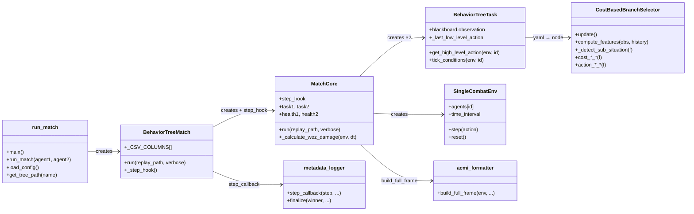
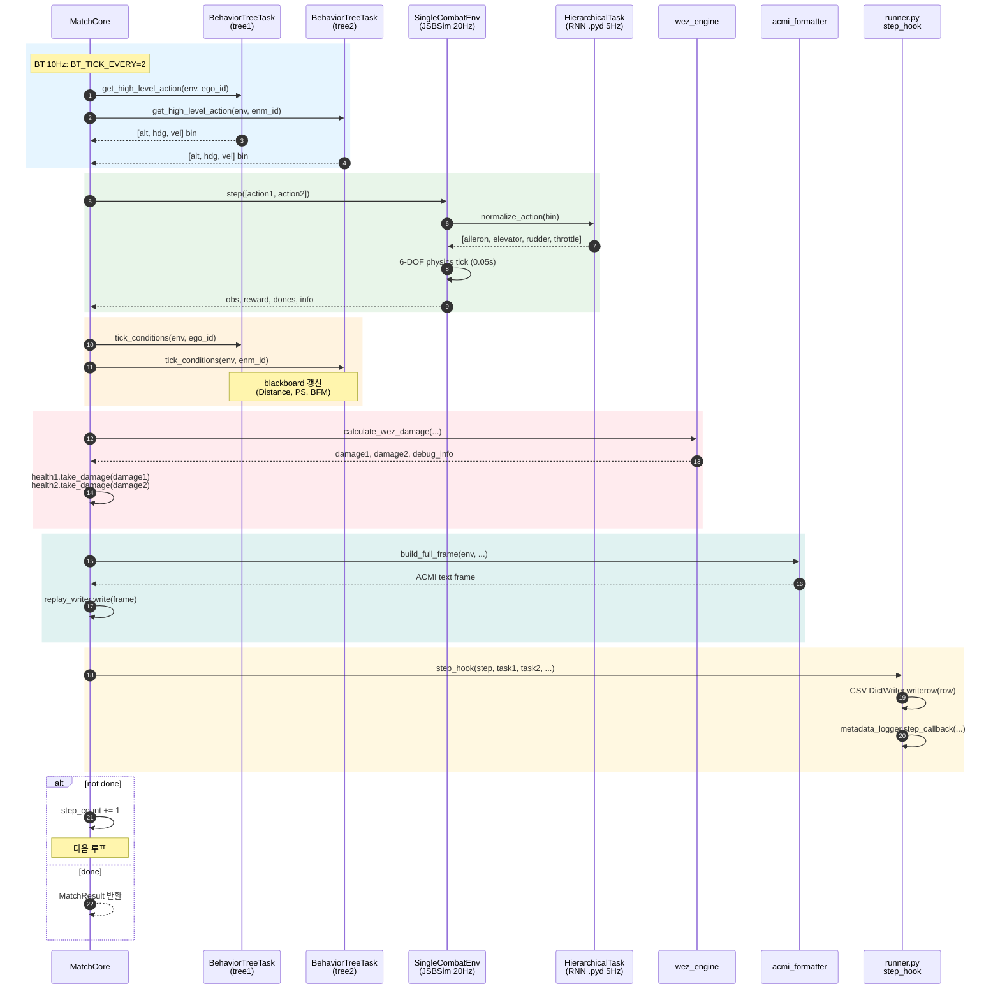
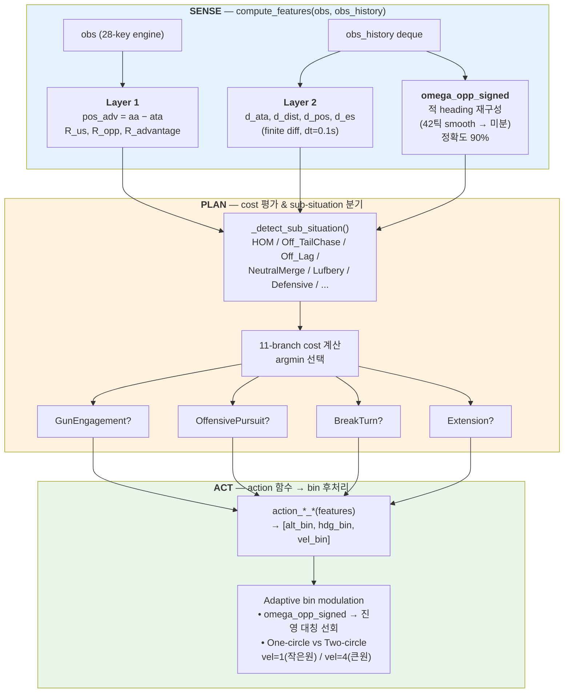
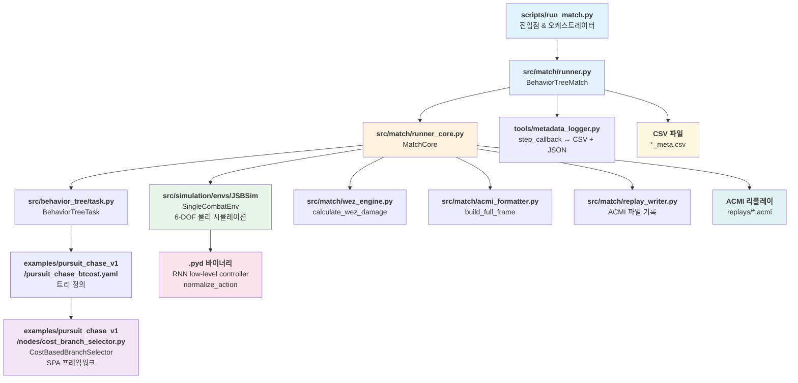

# pursuit_chase_btcost.yaml → run_match.py 실행 흐름 상세 분석

> **목적**: `examples/pursuit_chase_v1/pursuit_chase_btcost.yaml` 행동트리가 `scripts/run_match.py`를 통해 실행되어 ACMI 리플레이와 CSV 메타데이터가 생성되기까지의 **전체 파이프라인**을 코드 수준에서 추적한다.
>
> **참조 시점**: 2026-06-02 기준 (새 엔진 v0.11, `metadata_logger.py` 각도 스케일 버그 수정 후).

---

## 1. 전체 흐름 요약 (10,000ft 뷰)

```mermaid
flowchart TD
    CLI["<b>CLI</b><br/>python run_match.py<br/>--agent1 pursuit_chase_btcost<br/>--agent2 defensive"] --> RUN["<b>run_match.py</b><br/>① 설정 로드<br/>② 트리 파일 탐색<br/>③ BehaviorTreeMatch 생성"]
    RUN --> RUNNER["<b>runner.py</b><br/>CSV/콜백 레이어 준비<br/>MatchCore에 step_hook 주입"]
    RUNNER --> CORE["<b>runner_core.py</b><br/>JSBSim 환경 초기화<br/>BehaviorTreeTask ×2 생성<br/>시뮬레이션 루프"]
    CORE --> CB["<b>cost_branch_selector.py</b><br/>매 100ms(10Hz) BT tick<br/>11-branch cost 평가 → argmin<br/>→ action bin"]
    CB --> TASK["<b>task.py / .pyd</b><br/>BT action bin → RNN<br/>low-level controller<br/>→ [aileron, elevator, rudder, throttle]"]
    TASK --> JSB["<b>JSBSim</b><br/>6-DOF 물리 시뮬레이션 (20Hz)<br/>state_var 갱신"]
    JSB --> WEZ["<b>wez_engine.py</b><br/>Gun WEZ 체크<br/>(ATA<12°, 500~3000ft)<br/>→ 데미지 계산"]
    WEZ --> ACMI["<b>acmi_formatter.py</b><br/>프레임 생성 → ACMI 리플레이<br/>+ 실시간 텔레메트리"]
    ACMI --> HOOK["<b>runner.py step_hook</b><br/>CSV 행 기록<br/>+ metadata_logger 콜백"]
    HOOK --> RES["<b>result.py</b><br/>MatchResult 반환"]
    RES --> OUT["<b>run_match.py</b><br/>승패 요약 출력"]

    style CLI fill:#e1f5fe
    style CB fill:#fff3e0
    style TASK fill:#f3e5f5
    style JSB fill:#e8f5e9
    style WEZ fill:#ffebee
    style ACMI fill:#e0f2f1
    style HOOK fill:#fff8e1
    style RES fill:#fce4ec
    style OUT fill:#e1f5fe
```



---

## 2. 모듈별 설명 및 관계



### 2.1 `run_match.py` — 진입점 & 오케스트레이터

**역할**: 사용자 CLI 인자를 받아 설정을 로드하고, 트리 파일을 탐색하며, 최종적으로 `BehaviorTreeMatch.run()`을 호출한다. 단순 진입점이지만 **결정성 제어(`MATCH_SEED`)**와 **라운드 반복**, **CSV 로그 경로 자동 생성**을 담당한다.

**세부 코드** (`scripts/run_match.py:281-338`):

```python
def main():
    _seed = _os.environ.get("MATCH_SEED", "")
    if _seed != "":
        _torch.manual_seed(int(_seed))
        _np.random.seed(int(_seed))
        _rnd.seed(int(_seed))
```

- **근거**: `singlecombat_env.py:61`의 `self.np_random.shuffle(init_states)`로 인해 env 자체 난수가 별도로 존재한다. `torch/np seed`만으로는 매치가 비결정적이므로 **env.seed()까지 고정**해야 deterministic해진다 (`runner_core.py:95-109`).

**트리 경로 탐색** (`scripts/run_match.py:74-119`):

탐색 순서가 중요하다:

1. 직접 경로 (`/` 또는 `\` 포함 시)
2. `submissions/{name}/{name}.yaml`
3. `submissions/{name}.yaml`
4. `examples/{name}.yaml`
5. `examples/{name}/{name}.yaml`

`pursuit_chase_btcost`는 `examples/pursuit_chase_v1/pursuit_chase_btcost.yaml`에 위치하므로, **탐색 순서 4번 또는 5번**에 의해 발견된다.

**관계**: `run_match.py`는 **상위 오케스트레이터**로서 `runner.py`의 `BehaviorTreeMatch`를 생성·호출한다. 직접 시뮬레이션 로직은 전혀 포함하지 않는다.

---

### 2.2 `pursuit_chase_btcost.yaml` — 행동트리 정의

**역할**: 단일 `Selector` 노드(`CostBasedRoot`) 아래 **하나의 Action 노드**(`CostBasedBranchSelector`)만을 둔 **최소 구조 트리**다. 실제 전투 로직은 YAML이 아닌 **Python 노드 구현체**(`cost_branch_selector.py`)에 있다.

```yaml
# examples/pursuit_chase_v1/pursuit_chase_btcost.yaml
tree:
  type: Selector
  name: CostBasedRoot
  children:
    - type: Action
      name: CostBasedBranchSelector
      params:
        hard_deck_threshold_ft: 1500
```

**핵심 설계 의도** (YAML 주석):

> "기존의 if-then 구조에 threshold 대신 cost 함수가 되도록"

- `py_trees.Selector`는 자식을 **순서대로 평가**하며, 첫 번째 `SUCCESS`를 반환하면 중단한다.
- 하지만 여기서는 자식이 **단 1개**뿐이므로 Selector는 사실상 **패스스루**다. 모든 의사결정은 `CostBasedBranchSelector` 내부의 `update()` 메서드에서 이루어진다.
- `hard_deck_threshold_ft: 1500`은 노드 파라미터로 전달되나, 실제 코드 상 `HARD_DECK_FT = 1000`이 별도 상수로 하드코딩되어 있어 **1500은 데드 파라미터**로 보인다.

**관계**: YAML은 `BehaviorTreeTask` 생성 시 `py_trees.composites.Selector` 객체 트리를 구성하는 **선언적 템플릿**이다. 런타임에는 `cost_branch_selector.py`의 클래스 인스턴스가 이 Action 노드의 `update()`를 구현한다.

---

### 2.3 `runner.py` — CSV/콜백 레이어 (`BehaviorTreeMatch`)

**역할**: `MatchCore`에 **step_hook 클로저**를 주입하여, 매 시뮬레이션 스텝마다 CSV 파일 기록과 사용자 콜백 호출을 수행한다. 핵심 로직은 없고 **데이터 수집 인프라**다.

**세부 코드** (`src/match/runner.py:157-262`):

```python
def _step_hook(step, task1, task2, health1, health2, ...):
    for i, (task_i, agent_id_i, ...) in enumerate([
        (task1, env.ego_ids[0], action1, reward1, health1, health2),
        (task2, env.enm_ids[0], action2, reward2, health2, health1),
    ]):
        obs_i = task_i.blackboard.observation
        ll_act = getattr(task_i, '_last_low_level_action', ...)
        active_nodes_i = task_i.get_last_active_nodes()
```

- **CSV 컬럼**: `_CSV_COLUMNS`에 정의된 46개 필드를 기록. 핵심은 `action_altitude/action_heading/action_velocity`(BT 고수준), `aileron/elevator/rudder/throttle`(RNN 저수준), `servo_aileron/elevator/rudder`(JSBSim 실제 서보 위치)의 **3계층 제어 명령**을 동시에 기록한다는 점이다.
- **ATA 버그 수정**: `obs_i.get("ata_deg")` 대신 `debug_info['ata1' if i==0 else 'ata2']`를 사용. 왜냐하면 `blackboard.observation`은 **global 키**로 last-writer-wins → 양 에이전트가 동일한 `ata_deg`를 읽는 버그가 있었기 때문이다 (`runner.py:203-207`).
- **step_callback**: `metadata_logger.step_callback` 또는 사용자 정의 콜백을 호출한다.

**관계**: `runner.py`는 `MatchCore`(시뮬레이션)와 `metadata_logger`(메타데이터 저장) 사이의 **어댑터**다. `MatchCore`가 루프를 돌 때마다 `_step_hook`을 호출하면, `runner.py`는 이를 CSV 행으로 직렬화한다.

---

### 2.4 `runner_core.py` — 시뮬레이션 핵심 (`MatchCore`)

**역할**: 실제 **물리 시뮬레이션 루프**를 실행한다. JSBSim 환경 초기화, BehaviorTreeTask 생성, BT-RNN-JSBSim 통합, WEZ 데미지 계산, ACMI 리플레이 기록을 모두 담당한다.

#### 2.4.1 초기화 흐름 (`runner_core.py:82-145`)

```python
env = SingleCombatEnv(self.config_name)
self.task1 = BehaviorTreeTask(env.config, tree_file=self.tree1_file)
self.task2 = BehaviorTreeTask(env.config, tree_file=self.tree2_file)
self.health1 = HealthGauge(initial_health=100.0)
self.health2 = HealthGauge(initial_health=100.0)
obs = env.reset(seed=int(_ms)) if _ms != "" else env.reset()
```

- `BehaviorTreeTask`는 YAML 트리를 `py_trees` 객체로 파싱하고, `CostBasedBranchSelector` 같은 커스텀 노드를 **동적으로 등록**한다.
- `HealthGauge`는 engine의 `calculate_wez_damage`와 **별도**로 관리되는 체력 시스템이다. engine 내부에도 health가 있지만, `runner_core`는 **자체 HealthGauge**를 사용해 독립적으로 승패를 판정한다.

#### 2.4.2 메인 루프 (`runner_core.py:196-434`)

**BT 10Hz 분리** (`runner_core.py:191`):

```python
BT_TICK_EVERY = max(1, round(0.1 / float(env.time_interval)))
```

- `env.time_interval`은 보통 0.05s (20Hz). 따라서 `BT_TICK_EVERY = 2`.
- **매 2 스텝(=100ms)마다** BT가 고수준 action을 재결정한다. 나머지 1 스텝은 이전 action을 유지한다.
- 이는 **RNN 5Hz 캐시**(`HierarchicalSingleCombatTask.normalize_action`)와 연계된다. BT가 10Hz로 빈번히 바뀌어도 RNN은 5Hz로 저수준 명령을 부드럽게 전환한다.

**시뮬레이션 루프 시퀀스 다이어그램**:



**루프 단계 요약**:

| # | 단계 | 주요 코드/모듈 | 주기 |
|---|---|---|---|
| 1 | **BT tick** | `task1.get_high_level_action(env, ego_id)` → `[alt_bin, hdg_bin, vel_bin]` | 10Hz (100ms) |
| 2 | **env.step** | `np.array([action1, action2])` → JSBSim 1스텝 진행 (0.05s) | 20Hz (50ms) |
| 3 | **low-level action 동기화** | `env.task._lowlevel_action_cache` → `task1/2._last_low_level_action` 복사 | 20Hz |
| 4 | **condition subtick** | `task1.tick_conditions(env, ego_id)` — blackboard 갱신 (Distance, PS, BFM 등) | 20Hz |
| 5 | **WEZ damage** | `_calculate_wez_damage(env, dt)` — 거리/ATA/roll 기반 총알 데미지 | 20Hz |
| 6 | **승패 판정** | `health1.is_alive()` + `MatchJudge.judge()` (Hard Deck 위반) | 20Hz |
| 7 | **ACMI 프레임** | `build_full_frame()` → `replay_writer.write()` | 20Hz |
| 8 | **step_hook** | `runner.py`의 CSV/콜백 레이어 호출 | 20Hz |

**WEZ 데미지 계산** (`runner_core.py:486-508`):

```python
def _calculate_wez_damage(self, env, dt):
    result = calculate_wez_damage(
        ego_pos=[ep[0], ep[1], -ep[2]],  # NED → ENU: Z 반전
        enm_pos=[np_[0], np_[1], -np_[2]],
        ego_vel=[ev[0], ev[1], -ev[2]],
        enm_vel=[nv[0], nv[1], -nv[2]],
        ego_roll=float(ego_sim.get_rpy()[0]),
        enm_roll=float(enm_sim.get_rpy()[0]),
        dt=float(dt),
    )
```

- 좌표계 변환 주의: JSBSim은 **NED**(North-East-Down)를 사용하나, WEZ 엔진은 **ENU**(East-North-Up)를 가정하므로 Z축 부호를 반전한다.

**관계**: `runner_core.py`는 **시뮬레이션 엔진**이다. `BehaviorTreeTask`(BT)에게 obs를 제공하고, BT가 내놓은 action을 `env.step()`에 주입한다. 그 결과로 갱신된 물리 상태를 다시 BT에 전달하는 **폐쇄 루프**를 형성한다.

---

### 2.5 `cost_branch_selector.py` — 의사결정 핵심

**역할**: `pursuit_chase_btcost`의 유일한 Action 노드. **SPA(Sense-Plan-Act)** 프레임워크를 따르며, 매 BT tick마다 11개 branch의 multi-component cost를 평가해 **argmin**으로 branch를 선택하고, 해당 branch의 action 함수를 실행한다.

#### 2.5.1 Sense — Feature 추출 (`compute_features`)

```python
def compute_features(obs: dict, obs_history: deque) -> dict:
```

- **Layer 1(relational)**: `pos_adv = aa - ata`, `R_us_ft`, `R_opp_ft`, `R_advantage_ft`
- **Layer 2(dynamics)**: `d_ata`, `d_dist`, `d_pos`, `d_es` (finite diff, dt_proxy=0.1s)
- **적 선회방향 재구성** (`omega_opp_signed`): `obs_history` 42틱(4.2초)을 사용해 적의 절대 heading을 재구성 → smooth(window 20, 40) → 미분. **정확도 90%** (vs ACMI GT 상관 0.85). `docs/BT_RNN_CONTROLLER_ANALYSIS.md §16.4` 참조.

#### 2.5.2 Plan — Cost 평가 & Sub-situation

**8 BFM sub-situations** (`_detect_sub_situation`):

| 상황 | 조건 | 대응 |
|---|---|---|
| HOM | aa>150°, ata<30°, dist>2000ft | head-on gun |
| Defensive | pos_adv<-90°, dist<5000ft | escape |
| Off_TailChase | pos_adv>50°, ata<25° | gun_engagement |
| Off_Lag | pos_adv>50°, 25<ata<80° | lead_pursuit |
| NeutralMerge | \|pos_adv\|<50°, 2500<dist<5500, 60<ata/aa<120 | mild climb + soft lead |
| Lufbery | 60<aa/ata<120°, dist<4000ft | turning fight |

**Cost 함수 예시** (`cost_gun_tracking`):

```python
def cost_gun_tracking(f: dict) -> float:
    ata, dist, tca = f["ata"], f["dist"], f.get("tca", 999)
    if not (WEZ_MIN_FT <= dist <= WEZ_MAX_FT) or ata >= WEZ_ATA_MAX_DEG:
        return 4.0  # WEZ 밖 → 비활성
    if tca > GUN_TRACKING_TCA_MAX_DEG:
        return 4.0  # TCA 높음 → tracking 불가
    ata_q = _gauss(ata, 6.0)          # 0°에 가까울수록 1
    dist_q = _gauss(dist - 1750, 800) # 1750ft에 가까울수록 1
    tca_q = _gauss(tca, 25.0)         # 0°에 가까울수록 1
    return -GUN_TRACKING_WEIGHT * ata_q * dist_q * tca_q
```

- cost가 **음수**일수록 "좋은" branch다. `argmin` 선택.
- **WEZ envelope** (`cost_wez_envelope`): tracking(저TCA, saddled) vs snapshot(고TCA, transient) 두 모드를 `alpha(AOT)`로 보간 → Dirac 함정(단일 최적점에 갇힘) 탈출.

#### 2.5.3 Act — Action 함수 → Bin

선택된 branch는 `action_*()` 함수를 호출해 `[alt_bin, hdg_bin, vel_bin]`을 반환.

**예: `action_gun_engagement`**:

```python
def action_gun_engagement(f: dict) -> tuple:
    ata = f["ata"]; dist = f["dist"]; closure = f["closure_kts"]
    # PD control: ata → heading error, d_ata → rate
    hdg_err = -ata
    d_ata = f.get("d_ata", 0)
    hdg_cmd = PD_GUN_KP * hdg_err + PD_GUN_KD * (-d_ata)
    hdg_bin = max(0, min(8, 4 + int(round(hdg_cmd / 22.5))))
    # 거리 기반 velocity
    if dist > 2000:
        vel_bin = PD_GUN_VEL_APPROACH  # 3 (approach)
    elif dist < 1200 and closure > 50:
        vel_bin = PD_GUN_VEL_WEZ       # 1 (WEZ 내 감속)
    else:
        vel_bin = 2                    # hold
    alt_bin = 2  # level (gun 시 고도 유지)
    return (alt_bin, hdg_bin, vel_bin)
```

**Adaptive bin modulation** (후처리):

- `omega_opp_signed` 기반 **진영 대칭** 선회 방향 결정: 적이 우회전 중이면 우리도 우회전(two-circle), 좌회전 중이면 좌회전.
- **One-circle vs Two-circle**: 마지막에 도는 쪽이 fight 종류 결정. one-circle 시 `vel=1`(작은원), two-circle 시 `vel=4`(큰원 에너지 유지).

**SPA 프레임워크 플로우차트**:



**관계**: `cost_branch_selector.py`는 **BT 트리의 잎 노드**로서, `BehaviorTreeTask`에 의해 매 100ms마다 `update()`가 호출된다. 이 노드가 반환한 `SUCCESS/FAILURE`는 `py_trees.Selector`의 상태 기계를 타고 올라가나, 실제로는 항상 `SUCCESS`를 반환하여 트리가 활성 상태를 유지한다.

---

### 2.6 RNN 저수준 컨트롤러 (`.pyd` 바이너리)

**역할**: BT가 내놓은 이산 action bin `[alt, hdg, vel]`을 **연속 제어 명령** `[aileron, elevator, rudder, throttle]`으로 변환한다. SDK 내부 `.pyd` 바이너리로 배포되며 소스는 비공개다.

**데이터 흐름 다이어그램** (`docs/BT_RNN_CONTROLLER_ANALYSIS.md §15.1`):

```mermaid
flowchart LR
    subgraph RAW["<b>① JSBSim raw</b> (SI)"]
        R1["lon/lat(°)"]
        R2["alt(m), roll/pitch/yaw(rad)"]
        R3["v_n/e/d, vc(m/s)"]
    end

    subgraph NORM["<b>② norm_obs</b> (15-dim)<br/><i>BT action <span style='color:red'>미포함</span></i>"]
        N1["alt/5000"]
        N2["sin/cos(roll·pitch)"]
        N3["v_body/340, vc/340, Δvc/340"]
        N4["AO, TA, R/10000, side_flag"]
    end

    subgraph RNN["<b>③ RNN</b><br/>GRU 128-hidden<br/>5Hz 캐시"]
        RNN1["norm_obs → hidden state"]
        RNN2["→ action 인덱스 4개"]
    end

    subgraph OUT["<b>④ normalize_action</b>"]
        O1["aileron/elev/rudder<br/>idx/20 − 1  → [−1,1]"]
        O2["throttle<br/>idx/58 + 0.4 → [0.4,0.9]"]
    end

    RAW --> NORM
    NORM --> RNN
    RNN --> OUT

    style NORM fill:#ffebee
    style RNN fill:#e8f5e9
    style OUT fill:#e3f2fd
```



| 단계 | 설명 |
|---|---|
| **norm_obs** | alt/5000, sin/cos(roll·pitch), v_body/340, vc/340, Δvc/340, Δalt/1000, AO, TA, R/10000, side_flag. **BT action 미포함**. |
| **RNN 출력** | 이산 인덱스 → `idx/20−1` (aileron/elev/rudder, [−1,1]), `idx/58+0.4` (throttle). |
| **5Hz 캐시** | 동일한 BT action이 연속해서 들어오면 RNN 출력을 캐싱해 부드럽게 전환. |

**중요**: BT action은 RNN에 **직접 입력되지 않는다**. RNN은 **ego state만** 보고 저수준 제어를 결정하며, BT action은 간접적으로 `env.step(action)`을 통해 state 변화를 유도할 뿐이다. 이것이 **BT→RNN 병목**의 근원이다.

---

## 3. 관련 이론 설명

### 3.1 Behavior Tree (BT) 이론

`py_trees`는 **선택자(Selector)**, **시퀀스(Sequence)**, **액션(Action)** 의 계층적 상태 기계다. 핵심 원리:

- **Selector**: 자식을 **순서대로** 평가. `FAILURE`면 다음 자식으로, `SUCCESS`면 중단.
- **Sequence**: 모든 자식이 `SUCCESS`여야 본인도 `SUCCESS`.
- **Tick**: 트리 전체를 **매 프레임(여기서는 10Hz) 루트부터 재귀적으로 순회**한다.

`pursuit_chase_btcost.yaml`은 Selector 아래 Action 1개뿐이므로, 사실상 **플랫 상태 기계**다. 복잡한 전투 로직은 모두 `CostBasedBranchSelector.update()` 내부의 SPA 프레임워크가 담당한다.

### 3.2 WEZ (Weapon Engagement Zone) 이론

Gun WEZ는 ** ATA(Antenna Train Angle) < 12° ** 이고 **거리 500~3000ft**인 영역. 이 영역에 머무는 시간이 길수록 누적 데미지가 증가한다.

- **Tracking mode**: 저TCA(<40°), 적 비행경로를 따라가는 안정 추적. `cost_gun_tracking`.
- **Snapshot mode**: 고TCA(>60°), 순간 교차 사격. `cost_gun_snapshot`.
- **Lead pursuit**: 총알 비행시간(`t_TOF = R / V_bullet`) 동안 적의 이동을 예측해 pipper를 앞당긴다. `cost_lead_tof`.

### 3.3 에너지 기동 (Energy Maneuverability)

Specific Energy: `Es = h + V²/(2g)`. 단위: ft.

- **High Yo-Yo**: 에너지 열세 시 상승으로 속도를 잃고 고도를 얻어, 이후 강하하며 적을 추격. `cost_high_yoyo`.
- **Extension**: closure 불가 시 직진 가속해 거리를 벌린 뒤 재교전. `cost_extension`.
- **1-circle vs 2-circle**: 서로 반대 방향으로 선회하면 2-circle(비행경로가 교차), 같은 방향이면 1-circle(비행경로가 평행). 선회반경이 작은 쪽이 inside(유리).

---

## 4. 파일 간 의존성 다이어그램



---

## 5. 디버깅 / 추적 팁

1. **BT action bin 추적**: `runner.py` CSV의 `action_altitude/action_heading/action_velocity` 컬럼.
2. **RNN 저수준 명령**: 동일 CSV의 `aileron/elevator/rudder/throttle`.
3. **JSBSim 실제 서보 위치**: `servo_aileron/elevator/rudder`. 명령과 실제 위치가 다르면 **물리 지연** 또는 **saturation**.
4. **Active node**: `active_node` 컬럼이 항상 `"CostBasedBranchSelector"`인 것이 정상(트리가 1개 노드뿐이므로).
5. **Deterministic 재현**: `MATCH_SEED=0 python scripts/run_match.py ...` 필수. torch/np seed만으론 env의 `np_random.shuffle`이 안 잡힘.

---

*작성일: 2026-06-02*
*기준 엔진: ai-combat-sdk v0.11 (Python 3.14, JSBSim 20Hz, BT 10Hz, RNN 5Hz)*
